# HSM2Med – Herzschrittmacher-Auslesedaten (Abbott/St. Jude Merlin)

HSM2Med ist eine vollständig offline lauffähige Webanwendung, die Exportdateien aus dem
Abbott/St. Jude **Merlin**-Programmiergerät importiert, strukturiert darstellt, als
unveränderliche Berichte in MySQL speichert und daraus PDF-Berichte erzeugt – auch für
historische Auslesungen, ausschließlich aus der Datenbank.

> **Wichtig:** Die Anwendung führt **keine medizinische Bewertung** durch. Alle Werte werden
> exakt so angezeigt und gespeichert, wie sie in der Quelldatei stehen. Diagnose- und
> Therapieentscheidungen sind ausschließlich Aufgabe des ärztlichen Personals.

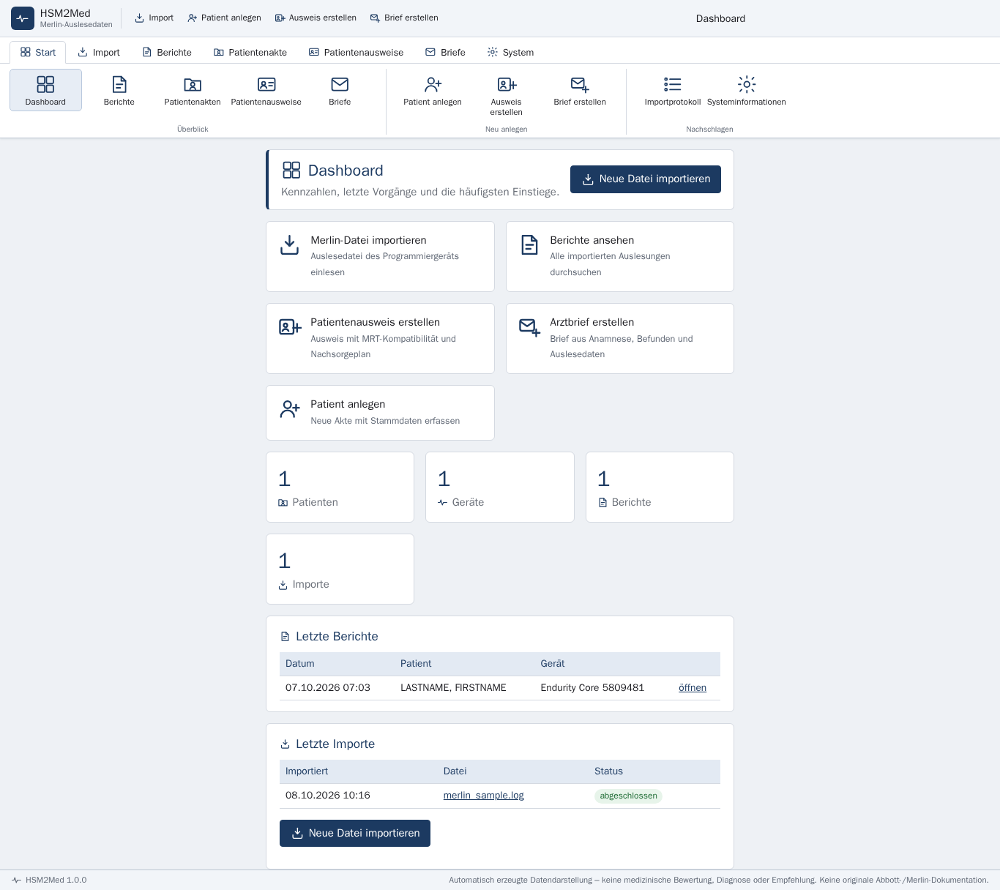

## Inhalt

1. [Funktionsumfang](#funktionsumfang)
2. [Installation](#installation)
3. [Konfiguration (.env)](#konfiguration-env)
4. [Start, Stopp, Aktualisierung](#start-stopp-aktualisierung)
5. [Offline-Betrieb](#offline-betrieb)
6. [Bedienung der Weboberfläche](#bedienung-der-weboberfläche)
7. [Patientenakte](#patientenakte)
8. [Patientenausweis erstellen](#patientenausweis-erstellen)
9. [Brief zur Schrittmacher-/ICD-Abfrage](#brief-zur-schrittmacher-icd-abfrage)
10. [Kommandozeile (CLI)](#kommandozeile-cli)
11. [Importformat](#importformat)
12. [Parserverhalten und Fehlerbehandlung](#parserverhalten-und-fehlerbehandlung)
13. [Datenmodell, Snapshots und Versionierung](#datenmodell-snapshots-und-versionierung)
14. [PDF-Berichte](#pdf-berichte)
15. [Parameterzuordnung erweitern](#parameterzuordnung-erweitern)
16. [Sicherheitskonzept](#sicherheitskonzept)
17. [Datenschutz](#datenschutz)
18. [Tests](#tests)
19. [Screenshots für die Dokumentation](#screenshots-für-die-dokumentation)
20. [Backup und Wiederherstellung](#backup-und-wiederherstellung)
21. [Fehlerbehebung](#fehlerbehebung)
22. [Projektstruktur](#projektstruktur)

## Funktionsumfang

- Upload von Merlin-Exportdateien (`.txt`/`.log`) mit Prüfung **vor** dem Speichern
  (Vorschau mit Patient, Gerät, Sonden, Kategorien, Warnungen und Fehlern).
- Verlustfreier Parser: Feldtrenner ist ausschließlich ASCII 0x1C (File Separator);
  Werte, leere Felder, Einheiten, Dezimalzahlen und Datumsangaben bleiben unverändert.
- Speicherung jedes Imports als **unveränderlicher Bericht** (Snapshot) in MySQL in
  einer einzigen Transaktion – bei Fehlern vollständiger Rollback.
- Dublettenerkennung per SHA-256 (erneuter Import nur nach expliziter Bestätigung).
- Berichtsübersicht mit Suche (Freitext, Patient, Patienten-ID, Seriennummer, Modell,
  Dateiname, Zeitraum), Importprotokoll und Systemstatus.
- PDF-Berichte (eigene, abhängigkeitsfreie PDF-Erzeugung) – optional mit
  Rohdatenanhang, jederzeit reproduzierbar aus der Datenbank.
- **Patientenakte**: Patienten lassen sich **vor** dem Import anlegen und pflegen. Anamnese,
  Vormedikation, Epikrise und Notiz sowie die **Schrittmacher-/ICD-Abfrage** werden als eigene,
  versionierte Bausteine am Patienten gespeichert – analog zu Berichten aus dem Import oder
  Patientenausweisen. Die Abfrage bildet den Wunschkatalog des ärztlichen Dienstes als
  geräteabhängiges Formular ab und lässt sich aus dem letzten Bericht vorbelegen.
- **Patientenausweis** (zwei Seiten DIN A4) aus einem importierten Bericht: Assistent in sechs
  Schritten, Identitätsprüfung über Nachname + Vorname + Geburtsdatum, Konfliktentscheidung je
  Feld, zwei ausdrückliche Bestätigungen, unveränderliche PDF-Snapshots und Historie. Seite 1
  nennt unter anderem die MRT-Tauglichkeit (Auswahlwert mit optionaler Zusatzangabe). Seite 2
  zeigt die Messwerte der aktuellen und der letzten sechs Untersuchungen anhand der Vorlage
  `config/patient_card_measurements.php`.
- Globale Stammdaten für den Ausweis (Logo, Nachsorgezentrum, Hinweis- und
  Flugsicherheitstexte) mit eigener Fassung je Ausweis.
- **Brief zur Schrittmacher-/ICD-Abfrage**: automatisch erzeugter Brief aus der Patientenakte.
  Er enthält Anamnese, Vormedikation und Epikrise als Textteile, den Befundteil
  „Schrittmacher-/ICD-Abfrage" (nur wenn ein Bericht zugeordnet wurde) und als Anhang die
  vollständige Tabelle der Schrittmacher-/ICD-Abfrage samt MRT-Tauglichkeit aus dem
  Patientenausweis. Assistent in sechs Schritten, zwei ausdrückliche Bestätigungen,
  unveränderlicher Snapshot mit SHA-256-geprüftem PDF. Der Brief darf mehrseitig sein –
  die Zwei-Seiten-Grenze gilt ausschließlich für den Patientenausweis. Briefe folgen
  **DIN 5008 (Form B)**. Empfänger per Checkbox: **Patient**, **Hausarzt** und
  **Überweisender Arzt** – je Empfänger entsteht ein eigener Brief mit dessen Anschrift.
- **Vorlageneditor für Briefe** (System → *Briefvorlage bearbeiten*, öffnet in neuem Tab):
  alle festen Texte bearbeiten, Bausteine per Drag and Drop anordnen, Live-Vorschau und
  PDF-Vorschau. Vorlagen werden **versioniert**; jeder Brief kann mit seiner ursprünglichen
  Vorlage reproduziert oder – auf ausdrücklichen Wunsch – mit der aktuellen Vorlage neu
  ausgefertigt werden. Technische Referenz: [docs/editor-referenz.md](docs/editor-referenz.md).
- CLI für Import, PDF-Export, Migrationen und Schema-Erzeugung.
- Keine externen Abhängigkeiten zur Laufzeit: kein CDN, keine Webfonts, keine Composer-Pakete.

Technik: PHP 8.5 (nativ, `strict_types`, PDO), MySQL 9.7, Apache, Docker Compose.

## Installation

Voraussetzungen: Docker Engine mit Docker Compose v2.

```sh
git clone <repository> hsm2med
cd hsm2med
cp .env.example .env          # danach Passwörter in .env ändern!
docker compose up -d --build
```

Die Oberfläche ist anschließend unter <http://127.0.0.1:8080> erreichbar
(standardmäßig **nur lokal**, siehe `WEB_BIND_ADDRESS`). Beim Start des Web-Containers
werden ausstehende Datenbankmigrationen automatisch ausgeführt.

Statusprüfung: `curl http://127.0.0.1:8080/health` → `{"status":"ok","database":"ok"}`.

Alternativ kann das Schema ohne Migrator eingespielt werden:
`docker compose exec -T db sh -c 'exec mysql -u root -p"$MYSQL_ROOT_PASSWORD" hsm2med' < database/schema.sql`.
`database/schema.sql` wird mit `php bin/build-schema.php` aus den Migrationen erzeugt
(ein Test stellt sicher, dass beide identisch sind).

## Konfiguration (.env)

| Variable | Standard | Bedeutung |
|---|---|---|
| `DB_HOST`, `DB_PORT` | `db`, `3306` | Datenbankserver |
| `DB_DATABASE`, `DB_USERNAME` | `hsm2med` | Datenbank und Anwendungsbenutzer |
| `DB_PASSWORD` | – (Pflicht) | Passwort des Anwendungsbenutzers |
| `DB_ROOT_PASSWORD` | – (Pflicht) | MySQL-Root-Passwort (Initialisierung, Backups) |
| `APP_ENV` | `production` | `production`, `development` oder `testing`; Fehlerdetails nur außerhalb von `production` |
| `APP_TIMEZONE` | `Europe/Berlin` | Zeitzone für Zeitstempel |
| `UPLOAD_MAX_SIZE` | `5M` | Maximale Uploadgröße (Bytes oder `K`/`M`/`G`); PHP-Limits werden beim Start daraus abgeleitet |
| `PDF_RAW_APPENDIX_DEFAULT` | `0` | Rohdatenanhang im PDF standardmäßig anfügen |
| `SESSION_SECURE_COOKIE` | `0` | `1` setzen, wenn ein HTTPS-Reverse-Proxy vorgeschaltet ist |
| `WEB_BIND_ADDRESS`, `WEB_PORT` | `127.0.0.1`, `8080` | Adresse/Port auf dem Host |

`.env` enthält Zugangsdaten und darf nicht eingecheckt werden (steht in `.gitignore`).

## Start, Stopp, Aktualisierung

```sh
docker compose up -d            # starten
docker compose ps               # Status (inkl. Healthcheck)
docker compose logs -f web      # Protokolle
docker compose down             # stoppen (Daten bleiben in den Volumes erhalten)
docker compose up -d --build    # nach einer Aktualisierung neu bauen; Migrationen laufen automatisch
```

Persistente Daten liegen in Docker-Volumes:

| Volume | Inhalt |
|---|---|
| `hsm2med_mysql_data` | MySQL-Datenbank (Berichte, Parameter, Importprotokoll) |
| `hsm2med_import_data` | Archiv der Originaldateien (`<sha256>.txt`, schreibgeschützt) |
| `hsm2med_application_data` | Anwendungsprotokoll, Sessions, zwischengespeicherte Uploads |

## Offline-Betrieb

Zur Laufzeit wird kein Internetzugang benötigt: Alle Assets (CSS/JS) liegen lokal, PDFs
nutzen die PDF-Standardschriften, es gibt keine externen Aufrufe. Das Datenbanknetz
(`backend`) ist als `internal` konfiguriert.

Installation auf einem Rechner ohne Internet:

```sh
# auf einem Rechner mit Internet
docker compose build
docker pull mysql:9.7
docker save -o hsm2med-images.tar hsm2med-web:latest mysql:9.7
# Datei und Projektverzeichnis auf den Zielrechner kopieren, dort:
docker load -i hsm2med-images.tar
cp .env.example .env   # Passwörter setzen
docker compose up -d   # ohne --build
```

## Bedienung der Weboberfläche

Die Oberfläche ist wie ein Office-Programm aufgebaut: oben ein **Funktionsband (Ribbon)**
mit Reitern, darunter der Arbeitsbereich der jeweiligen Seite und am unteren Rand eine
Statusleiste mit dem aktiven Patienten, dem Hinweis zur Verwendung der Daten und der
**Autoren-Info** (`HSM2Med by Daniel-André Reinelt`). Funktionsband und Statusleiste
bleiben am oberen bzw. unteren Bildschirmrand stehen und sind damit auch bei langen
Seiten ohne Scrollen sichtbar. Ein Klick auf die Autoren-Info öffnet
einen Hinweistext zu Anspruch und Entstehung der Anwendung; das Overlay lässt sich
ausschließlich über das Schließen-Kreuz oben rechts verlassen.

**Funktionsband (Ribbon)** – jeder Reiter bündelt die Funktionen eines Themas in Gruppen
mit großen Symbolen und Beschriftung:

| Reiter | Gruppen und Funktionen |
|---|---|
| **Start** | *Überblick* (Dashboard, Berichte, Patientenakten, Patientenausweise, Briefe); *Neu anlegen* (Patient anlegen, Ausweis erstellen, Brief erstellen); *Nachschlagen* (Importprotokoll, Systeminformationen) |
| **Import** | *Merlin-Export einlesen* (Datei importieren, Importprotokoll); *Weiter zur Auswertung* (Berichte ansehen, Patientenausweise) |
| **Berichte** | *Berichte* (Berichtsübersicht, Importprotokoll); *Aus dem Bericht erstellen* (Patientenausweis, Arztbrief) |
| **Patientenakte** | *Akten* (Patientenübersicht, Patient anlegen); *Weiterverarbeiten* (Ausweise und Nachsorge, Briefe); *Nachschlagen* (Importprotokoll) |
| **Patientenausweise** | *Ausweise* (Ausweisübersicht, Ausweis erstellen, Ausweis-Stammdaten); *Quellen* (Patientenakten, Berichte) |
| **Briefe** | *Briefe* (Briefübersicht, Brief erstellen); *Quellen* (Patientenakten, Berichte) |
| **System** | *Betrieb* (Systeminformationen, Importprotokoll); *Daten und Datenschutz* (Datenschutz, Berichte) |

Der jeweils aktuelle Reiter ist hervorgehoben; welcher Reiter zu einer Seite gehört, steuert
`src/Http/Ribbon.php` über den `$active`-Schlüssel der Seite.

Weitere Bedienelemente der Kopfzeile:

* **Schnellzugriff** – die vier häufigsten Aktionen (*Import*, *Patient anlegen*,
  *Ausweis erstellen*, *Brief erstellen*) sind zusätzlich oben rechts erreichbar.
* **Dokumenttitel** – zeigt den Namen der aktuellen Seite und, sofern sinnvoll, den
  Datensatz (z. B. Patient und Geburtsdatum).
* **Aktiver Patient** – zeigt links in der Titelleiste den aktiven Patienten
  (Name und Geburtsdatum) oder den Hinweis *Kein Patient gewählt*; siehe
  [Der Patientenvorgang ist führend](#der-patientenvorgang-ist-führend).
* **Datenschutz** – Schaltfläche zum Datenschutz-Abschnitt der Systemseite.

Das Dashboard zeigt zusätzlich fünf große **Einstiegskacheln** für die häufigsten
Arbeitsabläufe. Alle Symbole sind eingebettete SVG-Grafiken (`src/Http/Icon.php`); es werden
keine externen Ressourcen geladen. Das Funktionsband ist reine Navigation und funktioniert
auch ohne JavaScript. Beim Drucken werden Funktionsband, Statusleiste und Einstiegskacheln
automatisch ausgeblendet.

| Bereich | Beschreibung |
|---|---|
| **Dashboard** | Kennzahlen und zuletzt importierte Berichte |
| **Import** | Datei wählen → *Datei prüfen* → Vorschau → *Import endgültig speichern* oder *Verwerfen* |
| **Berichte** | Liste und Suche; Detailansicht mit Patient, Gerät, Sonden, Kategorien, Importprotokoll und Originaldaten |
| **Patienten** | Patientenakte: Patienten vor dem Import anlegen, Stammdaten pflegen, Anamnese/Vormedikation/Epikrise/Notiz und Schrittmacher-/ICD-Abfrage als versionierte Bausteine |
| **Briefe** | Brief zur Schrittmacher-/ICD-Abfrage aus der Akte erzeugen, durchsuchen und als unveränderliches PDF abrufen |
| **Importprotokoll** | Alle Importe inkl. fehlgeschlagener, mit Warnungen/Fehlern je Datensatz |
| **Systeminformationen** | Versionen, Datenbank- und Migrationsstatus, Limits |

### Der Patientenvorgang ist führend

Alle Vorgänge, die einen Patientenbezug herstellen, setzen einen **aktiven Patienten** voraus:
*Import*, *Ausweis erstellen* und *Brief erstellen*. Ohne Auswahl eines Patienten sind diese
Einträge im Funktionsband und im Schnellzugriff ausgegraut und nicht anklickbar; ein direkter
Aufruf der Adresse (`/import`, `/patient-cards/new`, `/letters/new`) leitet auf die
Patientenübersicht um und weist auf die fehlende Auswahl hin.

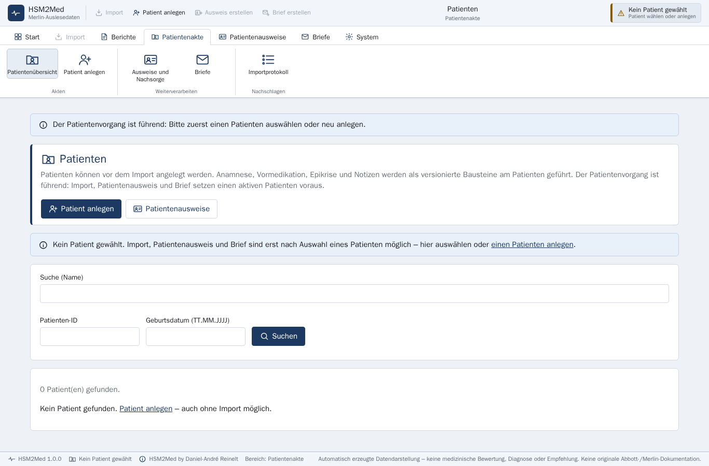

Der aktive Patient steht in der Titelleiste und in der Statusleiste. Ausgewählt wird er in der
Patientenübersicht über *Auswählen* oder in der Akte über *Als aktiven Patienten wählen*;
*Auswahl aufheben* entfernt die Zuordnung wieder. **Das Anlegen eines Patienten wählt ihn
automatisch als aktiven Patienten** – nach dem Anlegen kann der Import also sofort erfolgen.

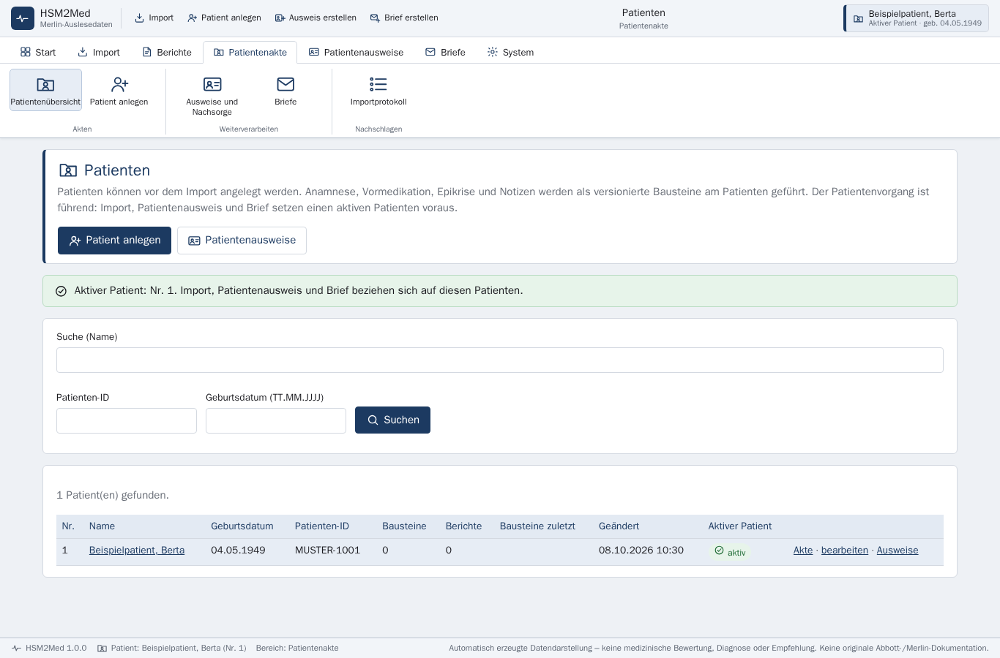

Die Auswahl gilt für die laufende Sitzung. Listen, Übersichten und Auswertungen
(Patientenübersicht, Berichte, Importprotokoll, Ausweis- und Briefübersichten,
Systeminformationen) bleiben auch ohne aktiven Patienten erreichbar, ebenso das Anlegen eines
Patienten unter `/patients/new`.

**1. Upload und Prüfung** – die Datei wird validiert und analysiert, aber noch nicht gespeichert:

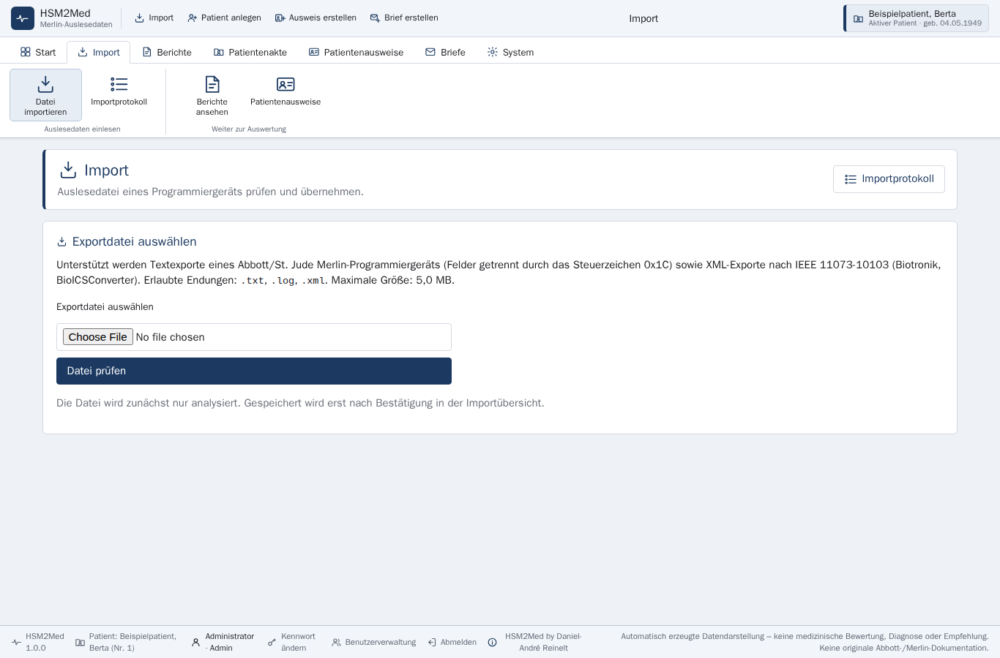

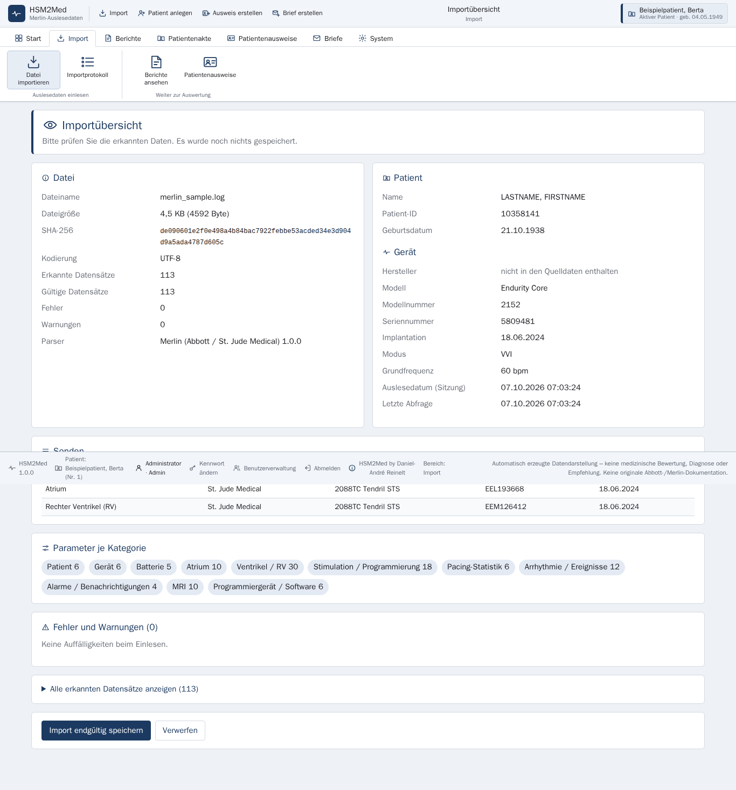

**2. Dubletten und ungültige Dateien** – eine bereits importierte Datei kann nur nach
ausdrücklicher Bestätigung erneut importiert werden; Dateien ohne Merlin-Format werden abgelehnt:

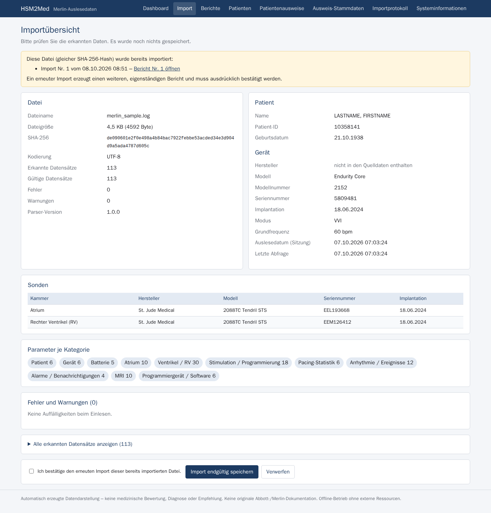

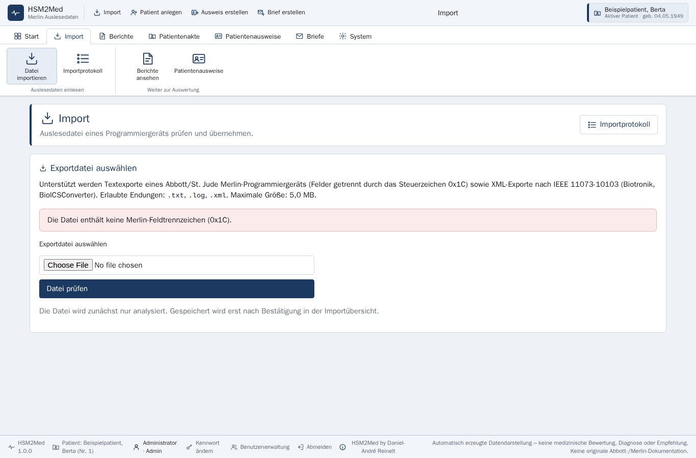

**3. Berichte** – Übersicht mit Suchfiltern und Detailansicht mit den Schaltflächen
*PDF anzeigen*, *PDF herunterladen* und *PDF mit Rohdatenanhang*:

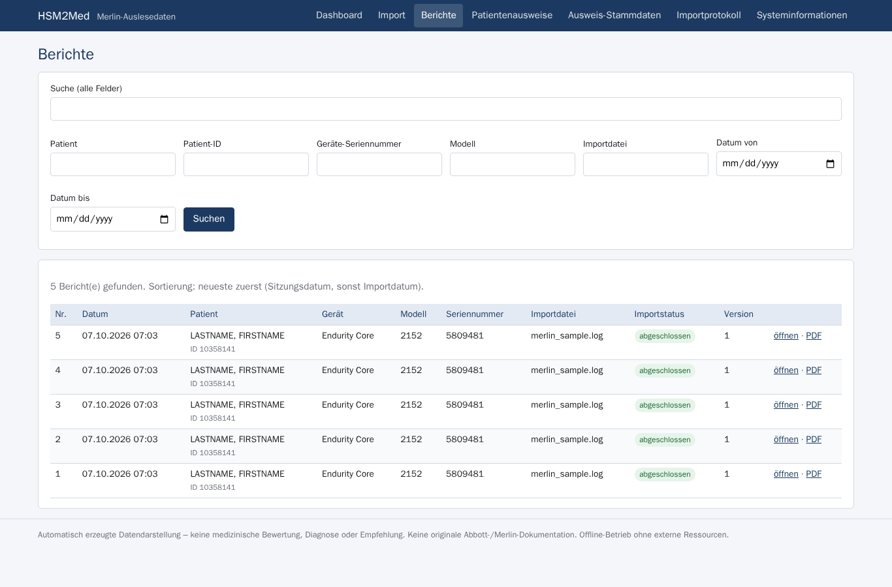

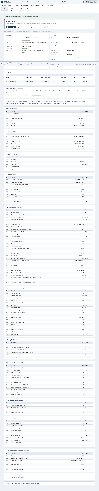

**4. Importprotokoll und Systemstatus:**

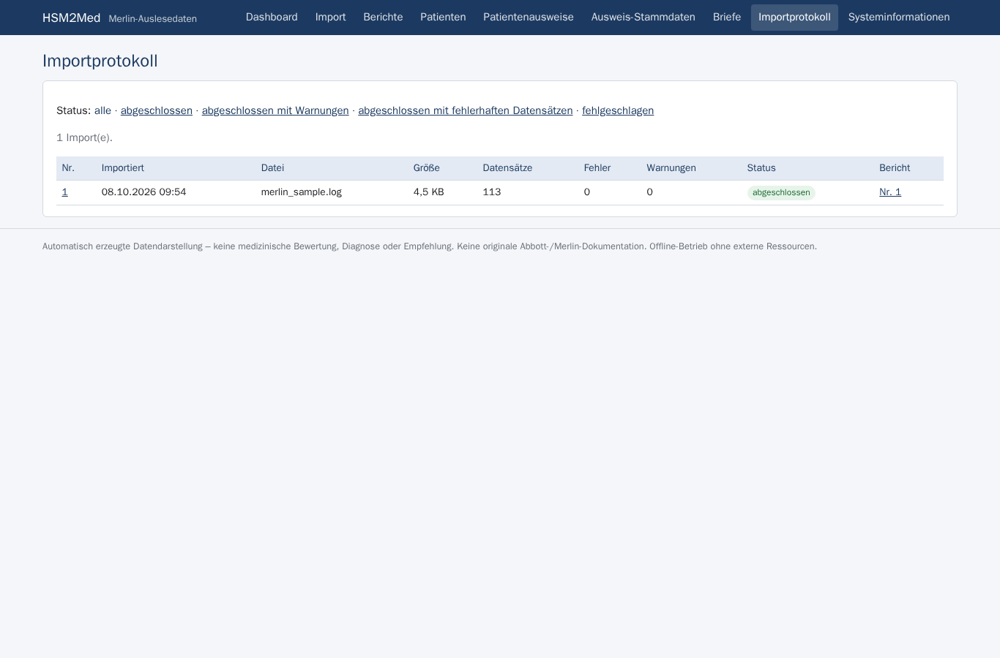

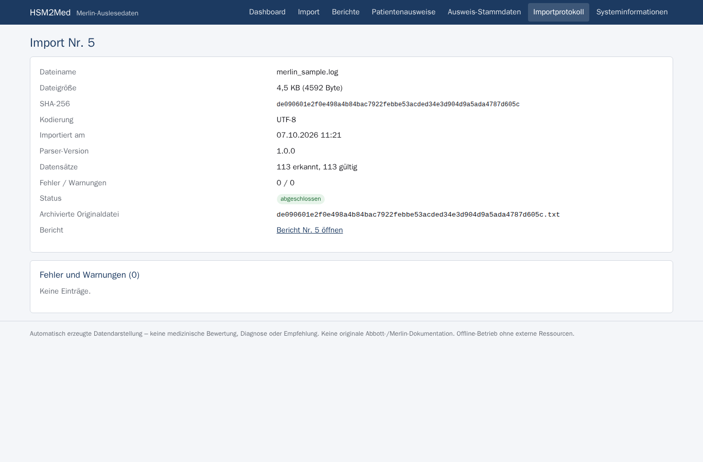

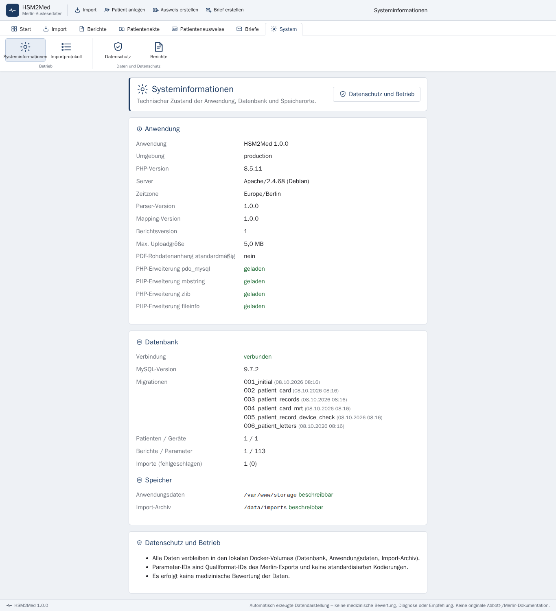

**5. Fehlerprotokoll** (`/system/logs`, Reiter „System"): zeigt die Einträge des
Anwendungsprotokolls (`storage/logs/app.log`), neueste zuerst, mit Suche nach Referenz (auch
Anfang der Referenz), Stufe und Text. Die Fehlerseite verlinkt direkt auf den Eintrag zu ihrer
Referenz; Ausnahme, Ort und Stacktrace stehen in den technischen Details. Durchsucht werden die
neuesten 8 MiB des Protokolls.

## Patientenakte

Patienten können **unabhängig von einem Import** angelegt werden. Damit sind Anamnese,
Vormedikation und Epikrise schon vor dem Importprozess erfassbar; der Import ordnet den
Bericht später über die Identität demselben Patienten zu. Die Akte selbst erzeugt keine
medizinischen Bewertungen: gespeichert wird ausschließlich, was eingegeben wurde. Aus diesen
Bausteinen erzeugt die Anwendung den [Brief zur
Schrittmacher-/ICD-Abfrage](#brief-zur-schrittmacher-icd-abfrage). Da der
[Patientenvorgang führend](#der-patientenvorgang-ist-führend) ist, wird ein neu angelegter
Patient automatisch als aktiver Patient gesetzt.

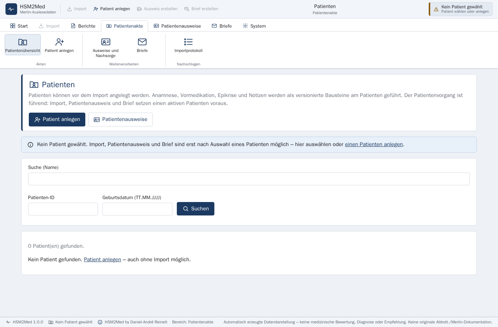

### Anlegen vor dem Import

**1. Patient anlegen** (`/patients/new`) – Pflichtfelder sind Nachname, Vorname und
Geburtsdatum; optional sind Patienten-ID, Anschrift, Telefon, Indikation sowie **Hausarzt** und
**Überweisender Arzt** (je Name, Praxis, Straße, PLZ, Ort, Telefon – die Anschriften der
Briefempfänger). Das Geburtsdatum
wird als `TT.MM.JJJJ` erfasst (zusätzlich erkannt: `JJJJ-MM-TT`, `TT/MM/JJJJ`, `TT-MM-JJJJ`) und
als ISO-Datum gespeichert; unplausible oder in der Zukunft liegende Daten werden abgelehnt.
Das Formular meldet Fehler je Feld mit HTTP 422 und behält die Eingaben. Nach dem Speichern
führt es auf die Akte; der neue Patient ist dort als aktiver Patient gekennzeichnet.

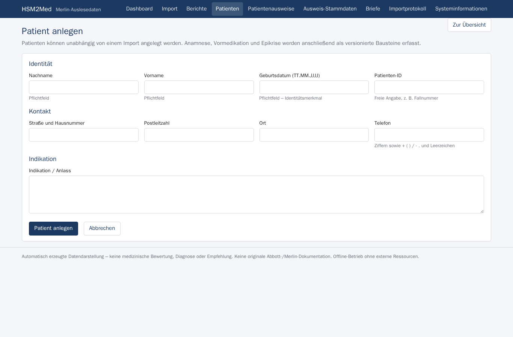

Über *Stammdaten bearbeiten* in der Akte werden Hausarzt und überweisender Arzt nachgetragen.
Die Hausarztangaben aus dem Patientenausweis-Assistenten stehen dort bereits:

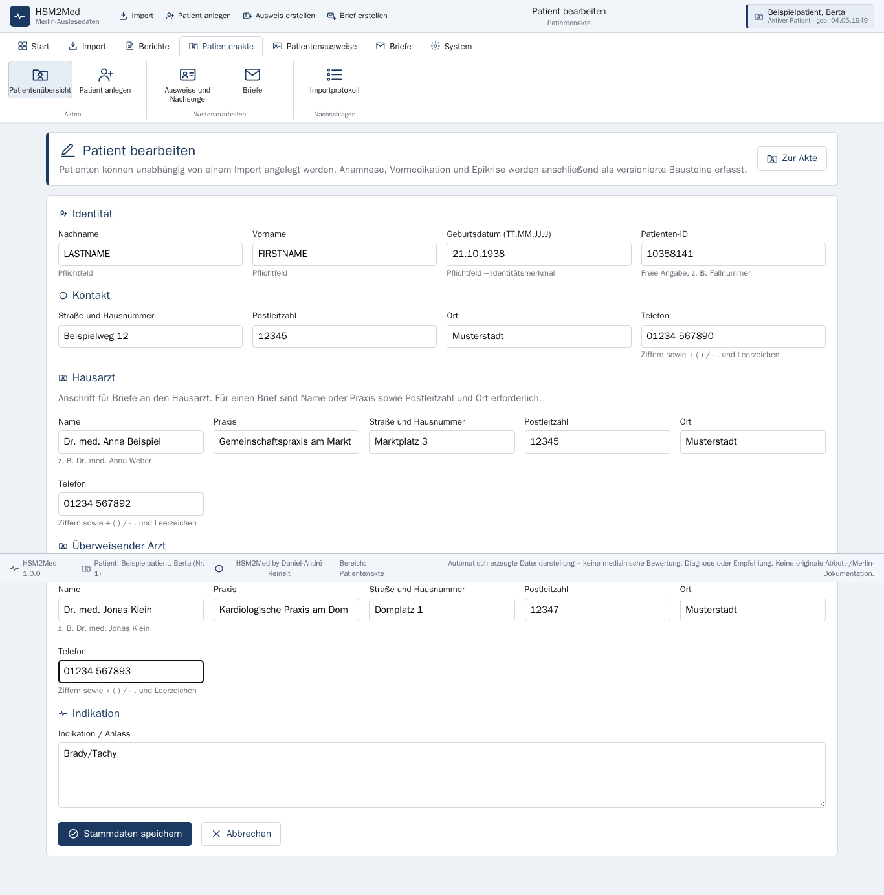

**2. Dublettenprüfung** – die Identität eines Patienten ist **Nachname + Vorname +
Geburtsdatum** (Groß-/Kleinschreibung und umgebende Leerzeichen bleiben ohne Bedeutung).
Existiert dazu bereits ein Patient, listet das Formular die Treffer auf und verlangt die
ausdrückliche Bestätigung *„Es handelt sich um einen anderen Patienten"*. Ohne diese
Bestätigung wird nichts gespeichert. Die Patienten-ID ist ebenfalls eindeutig: eine bereits
vergebene ID wird abgewiesen.

### Versionierte Bausteine

Ein Baustein ist ein benannter Teil der Akte, der als **unveränderliche Fassung** gespeichert
wird – analog zu den Berichten aus dem Import und zu den Patientenausweisen. Je Patient und
Bausteintyp existiert genau ein aktueller Stand, dazu die vollständige Historie.

| Baustein | Erfassung |
|---|---|
| **Anamnese** | Freitext (Beschwerden, Vorerkrankungen, Implantationsgrund) |
| **Vormedikation** | Tabelle (Wirkstoff, Dosis, Einheit, Einnahme, Grund, von, bis) mit ergänzendem Freitext |
| **Epikrise** | Freitext (Zusammenfassung des Verlaufs) |
| **Notiz** | Freitext (freie Anmerkung zur Akte) |
| **Schrittmacher-/ICD-Abfrage** | Geräteabhängiges Formular nach Vorlage `config/device_check_template.php` (siehe unten) |

Jede Speicherung erzeugt eine neue Fassung mit laufender Nummer, Zeitstempel und optionalem
Autor (`Fassung 2, vom 07.10.2026, erfasst von Dr. med. Anna Beispiel`). Inhaltsgleiche
Eingaben erzeugen **keine** neue Fassung; verglichen wird ein SHA-256 über den
normalisierten Inhalt. Freitext ist auf 20 000 Zeichen begrenzt, der Autor auf 255 Zeichen,
die Vormedikation auf 50 Zeilen. Datumsangaben in Medikamentenzeilen werden wie das
Geburtsdatum normalisiert gespeichert und in der Akte als `TT.MM.JJJJ` angezeigt; eine leere
Spalte *bis* bedeutet „fortlaufend".

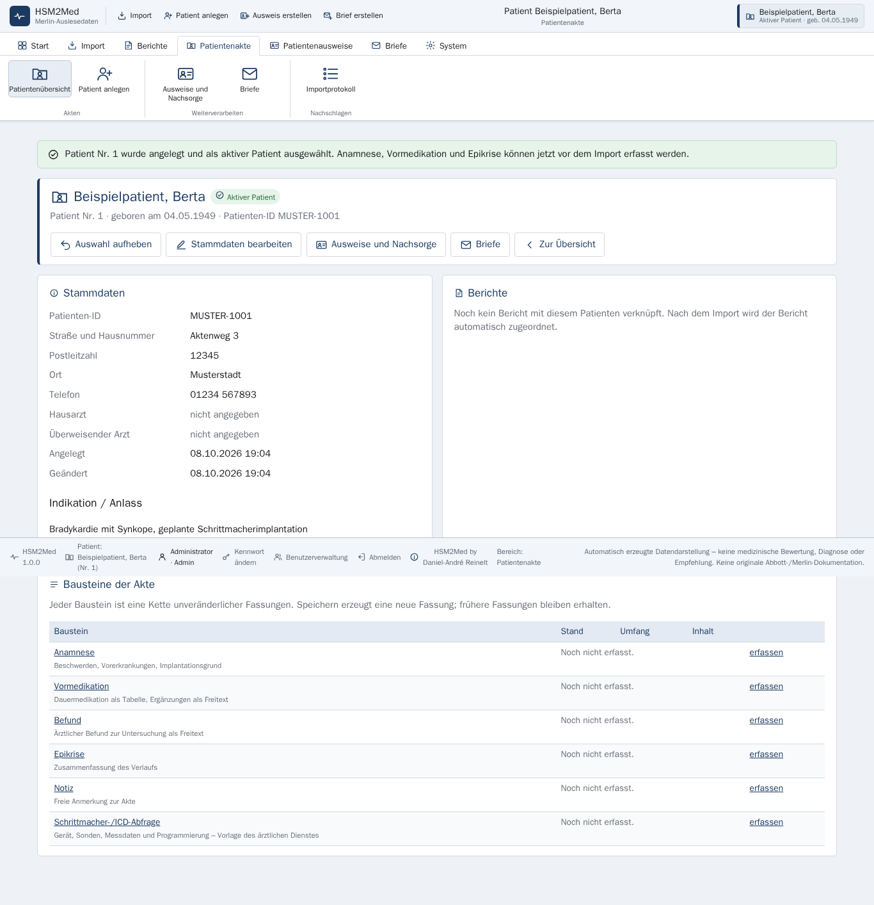

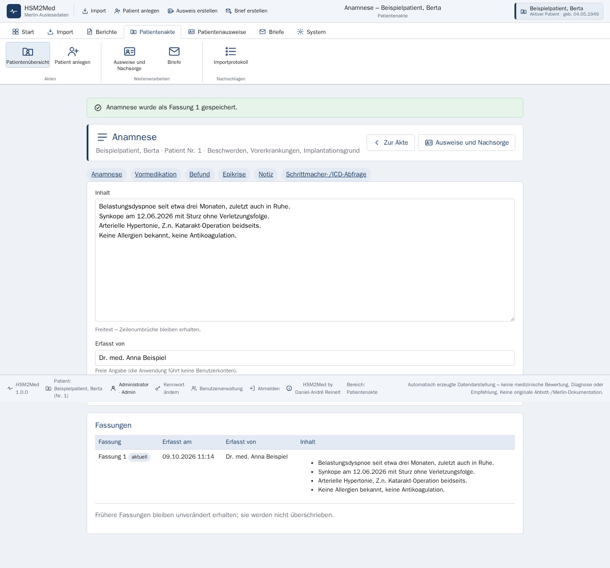

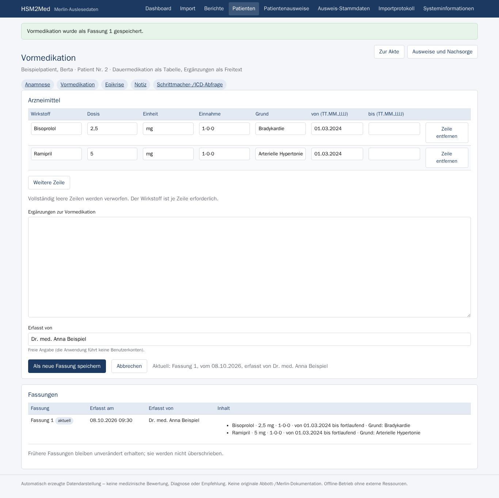

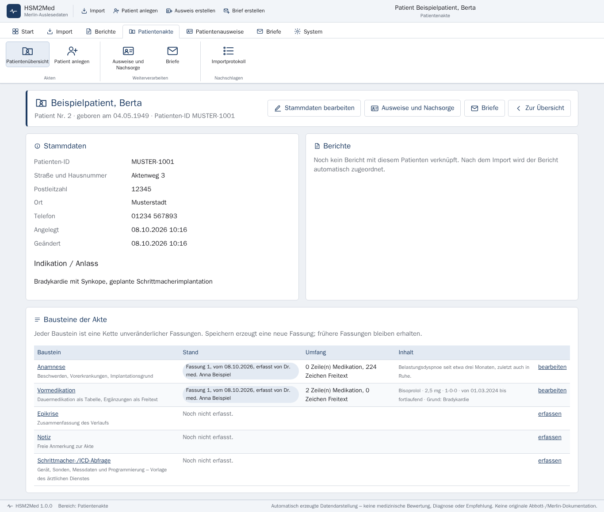

### Schrittmacher-/ICD-Abfrage

Der Baustein **Schrittmacher-/ICD-Abfrage** (`record_type = device_check`) setzt den
Wunschkatalog des ärztlichen Dienstes als eigenes, versioniertes Formular um. Vorlage ist
`config/device_check_template.php`; die Vorlagenfassung (`Vorlage 1.0.0`) wird mit jedem
gespeicherten Inhalt festgehalten, sodass ältere Abfragen unverändert bleiben. Alle Feldwerte
sind Freitext mit der Einheit in der Beschriftung (`Output (V/ms)` → `2,5/0,4`); es findet
**keine** Zahleninterpretation und keine medizinische Bewertung statt.

Die **Art des Geräts** steuert die sichtbaren Abschnitte und ist beim Speichern erforderlich:

| Abschnitt | Felder | Gilt für |
|---|---|---|
| **Gerät** | Hersteller, Modell, Seriennummer, Implantationsdatum, MRT-Tauglichkeit (mit Zusatzangabe) | alle |
| **Sonden (Elektroden)** | Modell, Lokalisation, Implantationsdatum, Impedanz, Wahrnehmung, Reizschwelle, Schockimpedanz | alle; Schockimpedanz nur ICD/CRT-D |
| **Batterie** | Status, verbleibende Laufzeit, Magnetfrequenz | alle |
| **Bradykardie** | Betriebsart, untere Grenzfrequenz, Hysteresefrequenz, max. Synch.frequenz, max. Sensorfrequenz, PMT-Intervention, R-Funktion | alle |
| **RA (Vorhofsonde)** | Output, Empfindlichkeit, Wahrnehmungs- und Stimulationspolarität, Ausblendzeit, Refraktärzeit, Refraktärzeit (PVARP) | alle |
| **RV (Ventrikelsonde)** | Output, Empfindlichkeit, Wahrnehmungs- und Stimulationspolarität, Ausblendzeit, Refraktärzeit | alle |
| **AV** | Stim. AV-Intervall, wahrg. AV-Intervall, AV-Suchhysterese, ModeSwitch Betriebsart, ModeSwitch Frequenz | alle |
| **LV (linksventrikuläre Sonde)** | Wahrnehmung, Reizschwelle, Impedanz, Output, Empfindlichkeit, Wahrnehmungs- und Stimulationspolarität | nur CRT-P/CRT-D |
| **Tachykardie** | je VT1, VT2, VF: Erkennung (Frequenz, Zykluslänge) und Therapie (Maßnahmen) | nur ICD/CRT-D |

Grenzen: bis zu 12 Sondenzeilen, 120 Zeichen je Feldwert, 4 000 Zeichen Bemerkungen. Vollständig
leere Sondenzeilen werden verworfen; nicht zum Gerätetyp passende Werte werden weder gespeichert
noch ausgegeben.

**Vorbelegung aus dem letzten Bericht:** die Schaltfläche *Werte aus dem letzten Bericht
übernehmen* füllt **nur leere Felder** aus dem neuesten importierten Bericht des Patienten
(z. B. Betriebsart, Grenzfrequenzen, Sondenmodell, Implantationsdatum, Polaritäten). Die
Zuordnung steht als `sources` (Parameter-IDs und Bezeichnungen aus dem Merlin-Quellformat) bzw.
`from_summary` (Zeilen der Berichtszusammenfassung) in der Vorlage; vorhandene Eingaben bleiben
erhalten, es gibt keinen Bericht → entsprechender Hinweis.

**Die MRT-Tauglichkeit führt der Patientenausweis.** Enthält der neueste Ausweis eine Angabe,
wird sie in der Abfrage nur lesend übernommen und dort gepflegt (Feld gesperrt, Wert wird
dennoch mitgesendet). Ohne Angabe im Ausweis bleibt das Feld in der Abfrage erfassbar. Auch beim
Speichern gilt der Ausweis: ein abweichender Wert aus dem Formular wird verworfen. Da der
Ausweis dauerhaft auf **zwei Seiten** begrenzt ist, bleibt die Zusatzangabe auf 120 Zeichen
beschränkt.

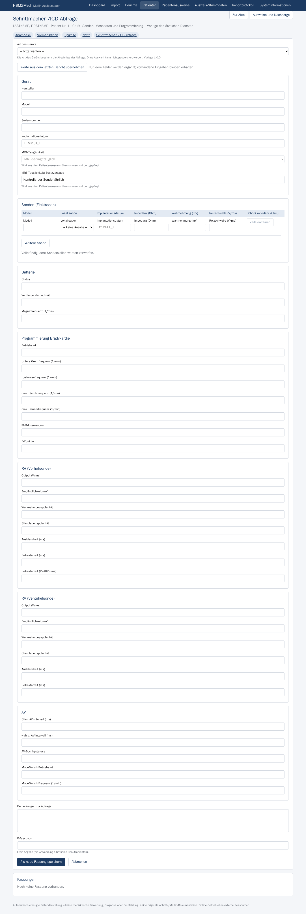

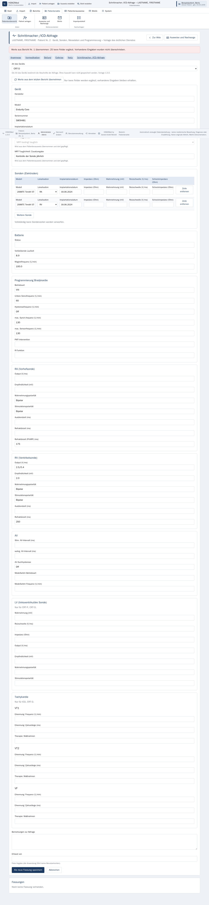

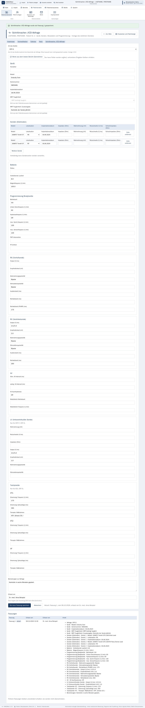

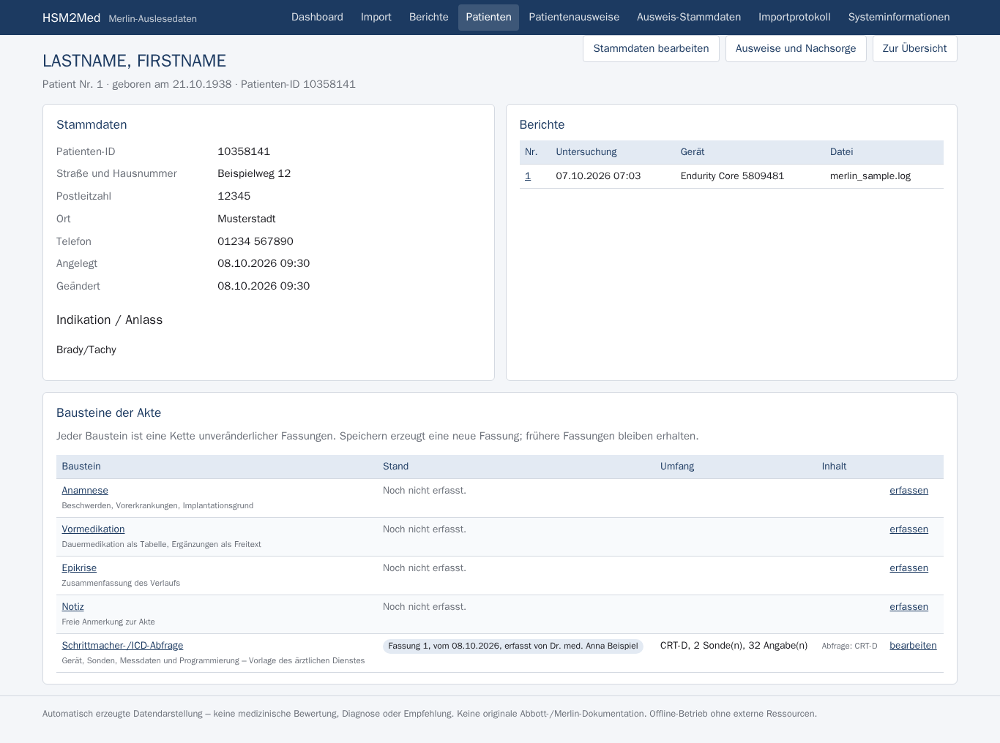

### Suche und Zuordnung

Die Übersicht (`/patients`) sucht nach Name (Freitext), Patienten-ID und Geburtsdatum
(`TT.MM.JJJJ`) und zeigt je Patient die Anzahl verknüpfter Berichte und Bausteine sowie den
Zeitpunkt der letzten Bausteinänderung. Ein Bericht aus dem Import wird über dieselbe
Identität zugeordnet; die Akte verlinkt auf die Ausweise und die Nachsorge des Patienten
(`/patient-cards/patients/{id}`).

### Routen

| Route | Zweck |
|---|---|
| `GET /patients` | Übersicht mit Suche und Seitenaufteilung |
| `GET /patients/new` | Formular für einen neuen Patienten |
| `POST /patients` | Patient anlegen (bei Dublette nur mit Bestätigung) |
| `GET /patients/{id}` | Akte mit Stammdaten, Bausteinen und Berichten |
| `GET /patients/{id}/edit` | Stammdaten bearbeiten |
| `POST /patients/{id}` | Stammdaten speichern |
| `GET /patients/{id}/records/{slug}` | Baustein bearbeiten (`anamnesis`, `premedication`, `epicrisis`, `note`, `device_check`) |
| `POST /patients/{id}/records/{slug}` | Baustein speichern (neue Fassung) |
| `POST /patients/{id}/records/device_check/prefill` | Leere Felder der Abfrage aus dem letzten Bericht vorbelegen |

## Patientenausweis erstellen

Der Patientenausweis ist ein zweiseitiges DIN-A4-PDF („Schrittmacher - Patientenausweis" /
„Patient Identification Card"), das aus einem bereits importierten Nachsorgebericht erzeugt
wird. Es werden **keine** medizinischen Bewertungen abgeleitet oder ergänzt: übernommen werden
nur Patient, Gerät, Sonden, Mess- und Nachsorgeangaben aus dem Bericht sowie die Angaben, die
im Assistenten erfasst werden.

### Ablauf

**1. Stammdaten pflegen** (`/patient-cards/settings`) – Logo (PNG/JPEG, max. 1 MiB und
2000 px Kantenlänge), Nachsorgezentrum mit Anschrift sowie die drei Texte (Hinweise,
Achtung Flugsicherheit auf Deutsch, Attention Airline Security auf Englisch). Jede Speicherung
erzeugt eine neue, unveränderliche Fassung; das Logo wird über seinen SHA-256 erkannt und nicht
mehrfach gespeichert. Die Texte sind nicht im PDF-Generator hinterlegt, sondern werden je
Ausweis mitgespeichert.

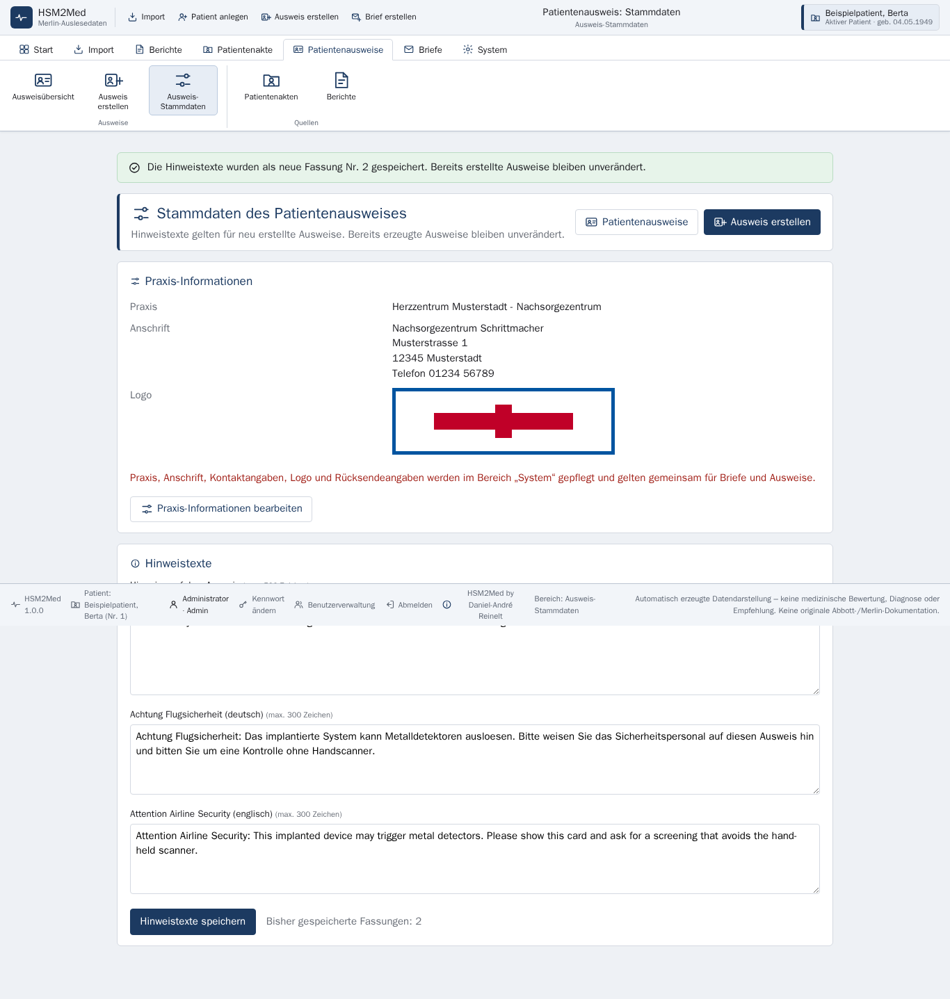

**2. Bericht wählen** (`/patient-cards/new` bzw. Schaltfläche *Patientenausweis erstellen* in
der Berichtsansicht):

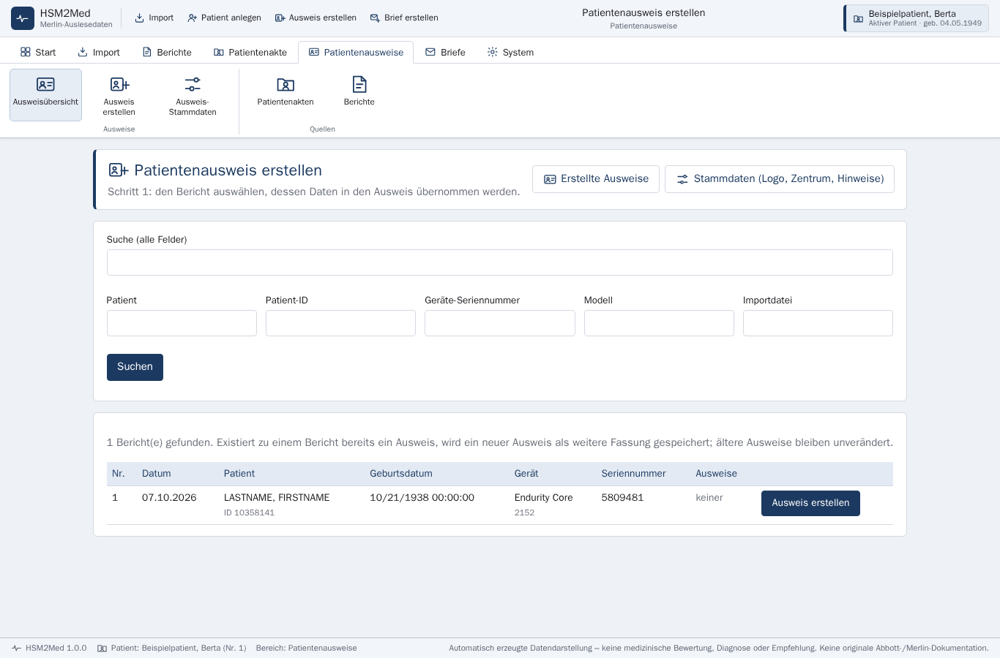

**3. Assistent in sechs Schritten** (`/patient-cards/reports/{id}`) – Schritt 1 Patient
identifizieren, 2 Patientendaten ergänzen, 3 Notfallkontakt, 4 Hausarzt, 5 Nachsorge und
Kontrolle, 6 Zusammenfassung und Bestätigung. In Schritt 2 stehen neben Adresse, Telefon und
Implantationsort auch die **MRT-Tauglichkeit** (Auswahl aus *MRT-tauglich*, *MRT-bedingt
tauglich*, *nicht MRT-tauglich*, *unbekannt* oder „nicht angegeben") und eine optionale
Zusatzangabe (max. 120 Zeichen) bereit; beide Angaben erscheinen auf Seite 1 des Ausweises:

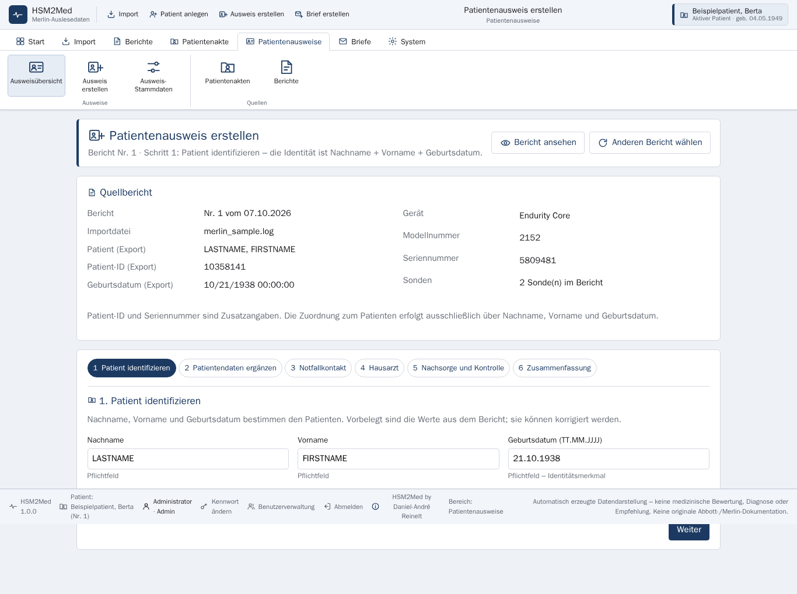

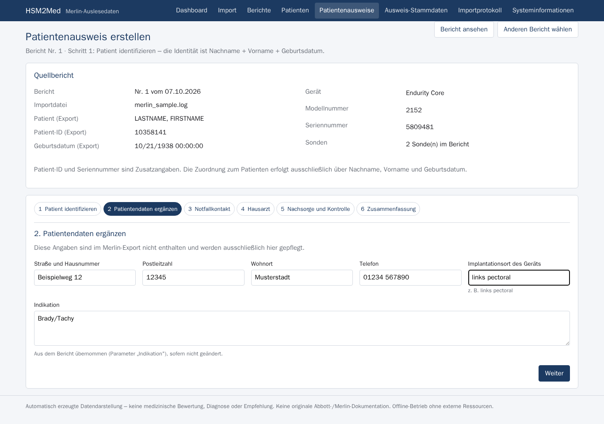

Ohne JavaScript sind alle sechs Abschnitte gleichzeitig sichtbar und absendbar; mit
JavaScript wird je Schritt umgeschaltet. Verbindlich ist immer die serverseitige Prüfung:
bei Fehlern antwortet der Server mit HTTP 422 und springt zu dem Schritt, in dem der erste
Fehler steht.

**4. Zusammenfassung und zwei Bestätigungen** – der Ausweis wird nur erzeugt, wenn beide
Häkchen ausdrücklich gesetzt sind („Ja, dies ist der richtige Patient." **und** „Ich
bestätige, dass die angezeigten Daten zum richtigen Patienten gehören und zusammengeführt
werden dürfen."):

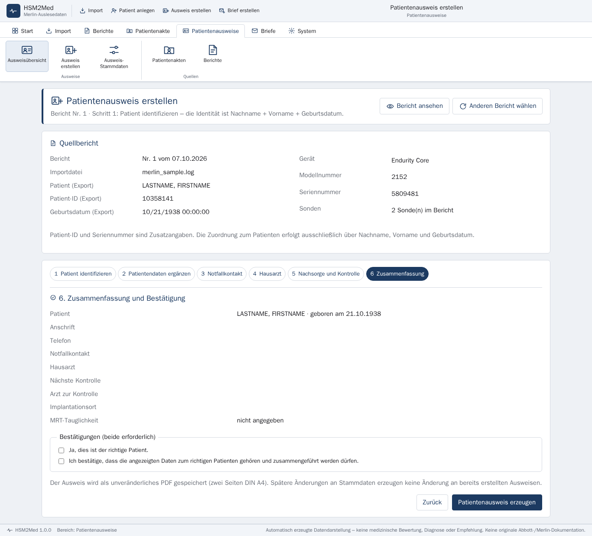

**5. Konflikte** – stimmen bereits gespeicherte Angaben nicht mit den neuen Eingaben überein,
zeigt der Assistent beide Werte nebeneinander und verlangt für **jedes** Feld eine
Entscheidung (*neuer Wert* oder *gespeicherter Wert*). Nichts wird stillschweigend
überschrieben; ohne Entscheidung wird nichts gespeichert:

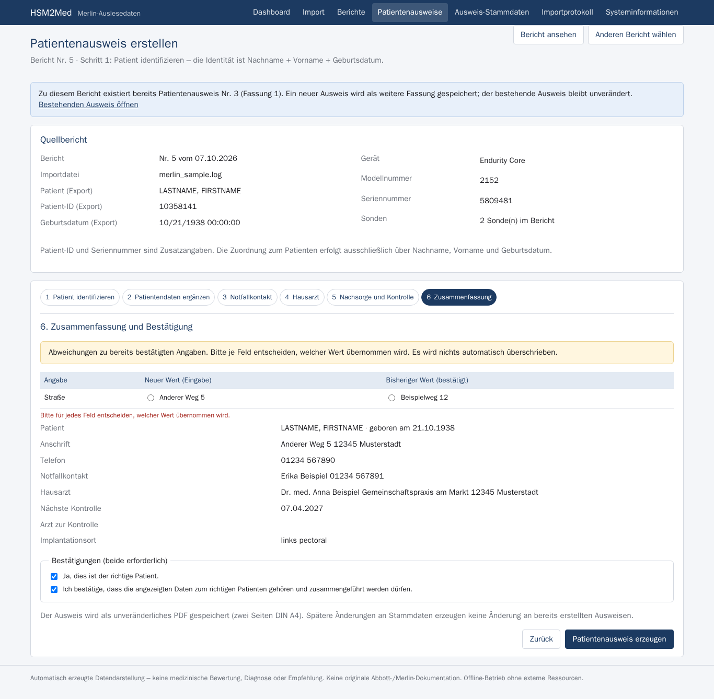

**6. Ergebnis** – Ausweisdetail mit Download von Ausweis-PDF und Ausgangsbericht, plus
Ausweisübersicht, Patientensicht und Ausweisübersicht am Bericht:

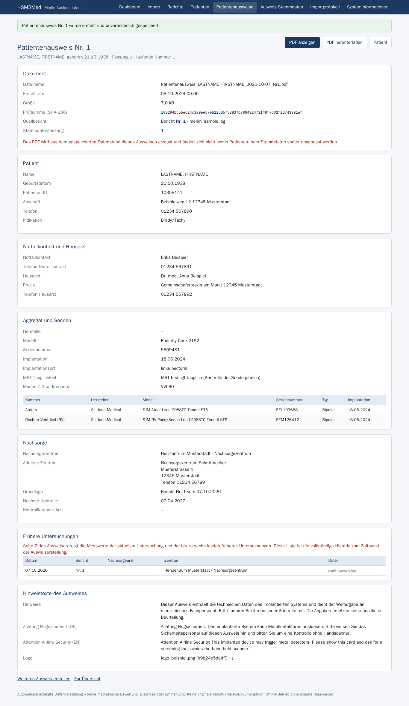

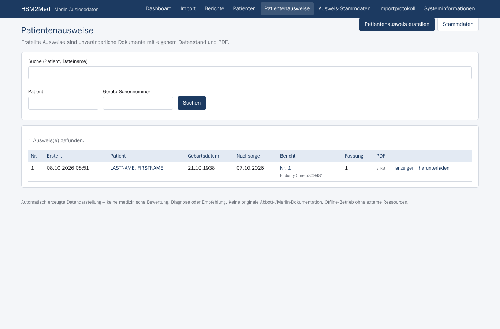

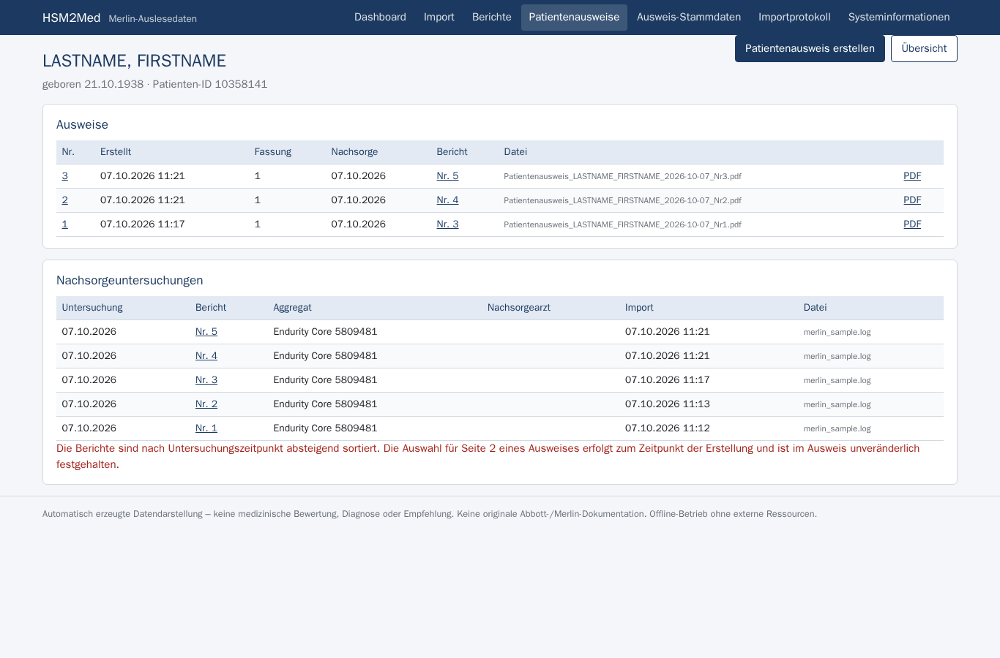

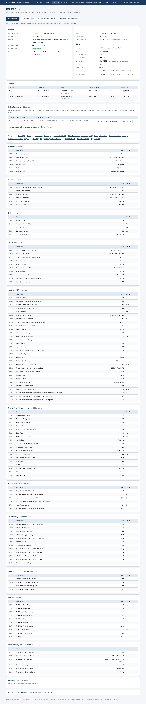

### Identität des Patienten

Ein Patient wird ausschließlich über **Nachname + Vorname + Geburtsdatum** zugeordnet
(`patients.identity_key`). Seriennummer, Patienten-ID, Import-ID oder Berichts-ID dienen nie
als alleiniges Merkmal. Ergebnis: kein Treffer → neuer Patient, ein Treffer → dieser Patient
wird verwendet, mehrere Treffer → der Benutzer muss den Patienten ausdrücklich auswählen.

### Unveränderliche Ausweise und Historie

- Das PDF wird als Blob mit SHA-256 und Größe im Datensatz gespeichert und danach nur noch
  ausgeliefert – es wird nie neu berechnet.
- Jeder Ausweis verweist auf die beim Erzeugen gültige Stammdatenfassung. Spätere Änderungen an
  Logo, Nachsorgezentrum, Hinweistexten, Patientendaten oder weiteren Importen verändern
  bestehende Ausweise nicht.
- Für jeden Bericht können mehrere Ausweisfassungen existieren (`card_version`); jede Fassung
  bleibt erhalten. Die Berichtsansicht listet alle Fassungen mit PDF-Link und Verlauf, die
  Patientensicht zusätzlich alle Nachsorgeuntersuchungen des Patienten (gespeist aus den
  unveränderlichen Bericht-Snapshots).
- Dateiname: `Patientenausweis_<Nachname>_<Vorname>_<Datum>[_Nr<laufende Nummer>].pdf`.

### Routen

| Methode | Pfad | Zweck |
|---|---|---|
| GET | `/patient-cards` | Übersicht mit Suche (Patient, Dateiname, Seriennummer) |
| GET | `/patient-cards/new` | Bericht für einen neuen Ausweis wählen |
| GET | `/patient-cards/reports/{id}` | Assistent (Schritt über `?step=1..6`) |
| POST | `/patient-cards/reports/{id}` | Ausweis erzeugen (CSRF, beide Bestätigungen) |
| GET | `/patient-cards/{id}` | Ausweisdetail mit Verlauf |
| GET | `/patient-cards/{id}/pdf` | Ausweis-PDF (inline, `?download=1` als Download) |
| GET | `/patient-cards/patients/{patient}` | Alle Ausweise und Nachsorgeuntersuchungen |
| GET | `/patient-cards/settings` | Stammdaten (Logo, Nachsorgezentrum, Texte) |
| POST | `/patient-cards/settings` | Stammdaten speichern (neue Fassung) |
| GET | `/patient-cards/settings/logo` | Hinterlegtes Logo ausliefern |

### PDF-Seiten

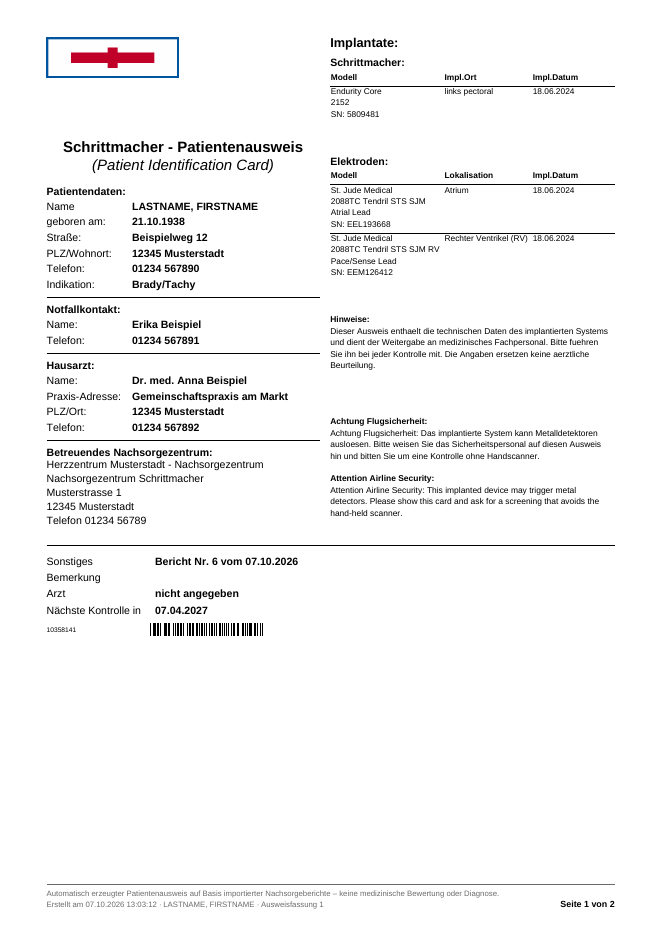

Seite 1: Kopfbereich mit Logo, Ausweistitel, Patientendaten (Identitätsangaben), Notfallkontakt,
Hausarzt, betreuendem Nachsorgezentrum, Implantate-/Elektroden-Tabellen (Modell, Impl.Ort bzw.
Lokalisation, Impl.Datum), **MRT-Tauglichkeit** (Auswahlwert, optional mit Zusatzangabe),
Hinweis- und Flugsicherheitstexten (deutsch/englisch) sowie dem
Abschlussblock „Sonstiges/Bemerkung/Arzt/Nächste Kontrolle in“ mit Code-39-Barcode der
Patient-ID. Aufbau, Reihenfolge und Beschriftungen folgen der Vorlage `.reference/idcard_ann.png`
(Schwarz auf Weiß, ohne rotes Achtung-Feld). Der Ausweis ist dauerhaft auf **zwei Seiten**
begrenzt: Seite 1 wird beim Erzeugen gegen die Seitengrenze geprüft, die MRT-Zusatzangabe wird
dafür bei Bedarf gekürzt; eine dritte Seite wird nie erzeugt.

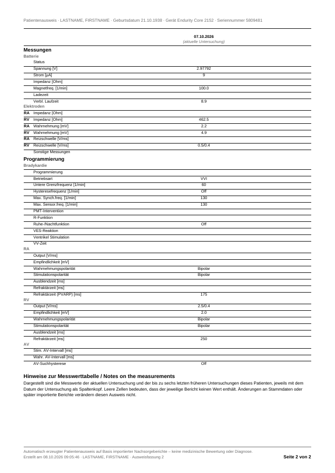

Seite 2: Messwerttabelle der aktuellen Untersuchung und der bis zu sechs letzten früheren
Untersuchungen desselben Patienten. Aufbau, Reihenfolge und Beschriftungen der Zeilen folgen
1:1 der Vorlage `config/patient_card_measurements.php`; jede Wertspalte ist mit dem Datum der
zugehörigen Untersuchung überschrieben, die aktuelle Untersuchung steht immer in der ersten
Spalte und ist als solche gekennzeichnet. Die Werte stammen aus den unveränderlichen
Bericht-Snapshots der jeweiligen Untersuchung; Zellen ohne Wert bleiben leer. Die Zuordnung
von Merlin-Parametern (IDs und Bezeichnungen) zu den Zeilen der Vorlage ist zentral in dieser
Konfigurationsdatei hinterlegt. Reicht der Platz nicht, bricht die Erzeugung mit einer klaren
Meldung ab, statt Inhalte abzuschneiden; die Ausgabe erfolgt ausschließlich über den eigenen,
abhängigkeitsfreien PDF-Writer.

## Brief zur Schrittmacher-/ICD-Abfrage

Der Brief wird **automatisch aus der Patientenakte** erzeugt – aus den versionierten
Bausteinen Anamnese, Vormedikation und Epikrise, dem Befundteil der gewählten Untersuchung
und der vollständigen Schrittmacher-/ICD-Abfrage als Anhang. Er enthält keine medizinische
Bewertung und keine Diagnose; übernommen wird ausschließlich, was erfasst wurde.

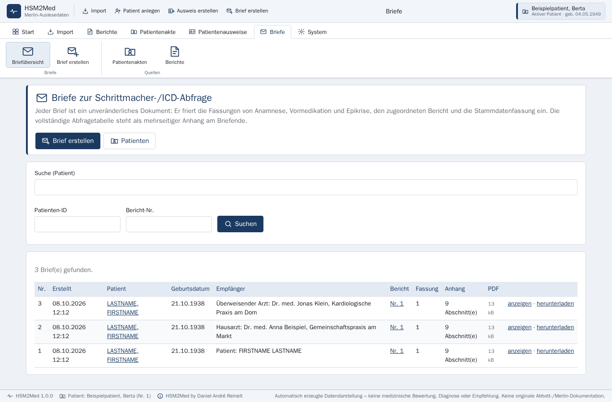

### Ablauf

**1. Patient wählen** (`/letters/new`) – gesucht wird in Nachname, Vorname und Anzeigename:

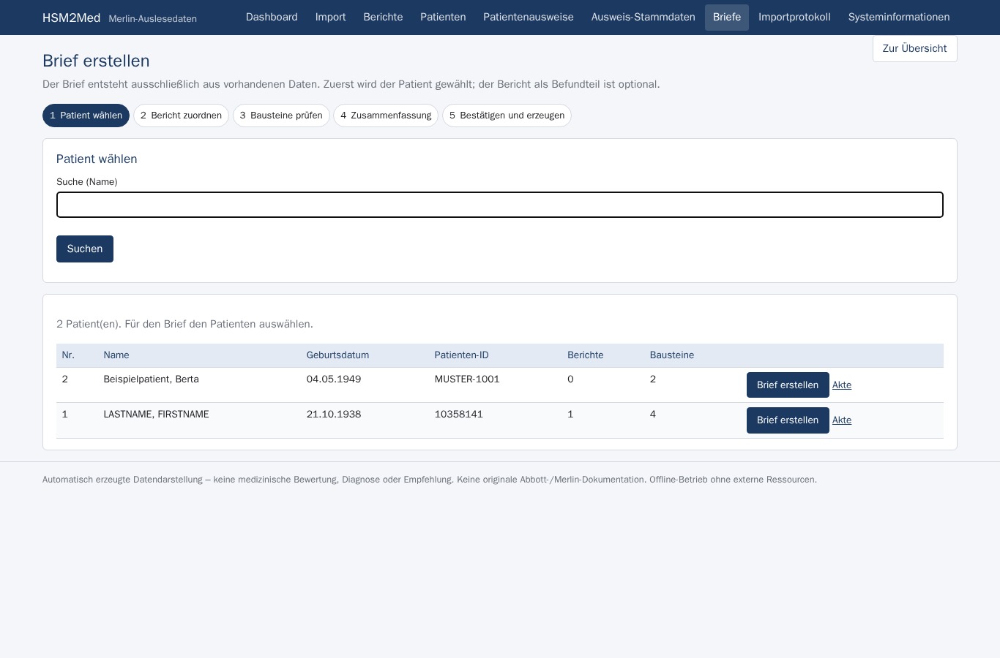

**2. Bericht zuordnen (optional)** – der Bericht liefert den Befundteil. Wird kein Bericht
gewählt, entfällt der Befundteil; der Brief wird trotzdem erzeugt. Der Assistent zeigt vorab,
welche Bausteine fehlen:

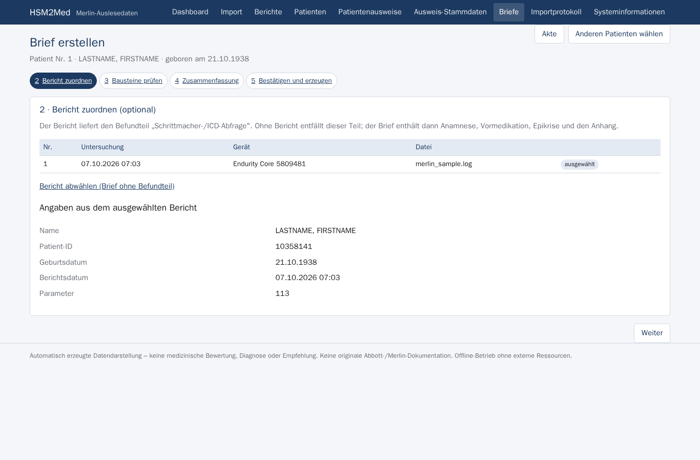

**3. Bausteine prüfen** – je Textbaustein die aktuelle Fassung mit Fassungsnummer,
erfassender Person und Zeitpunkt sowie die Hinweise, die der Brief enthalten wird:

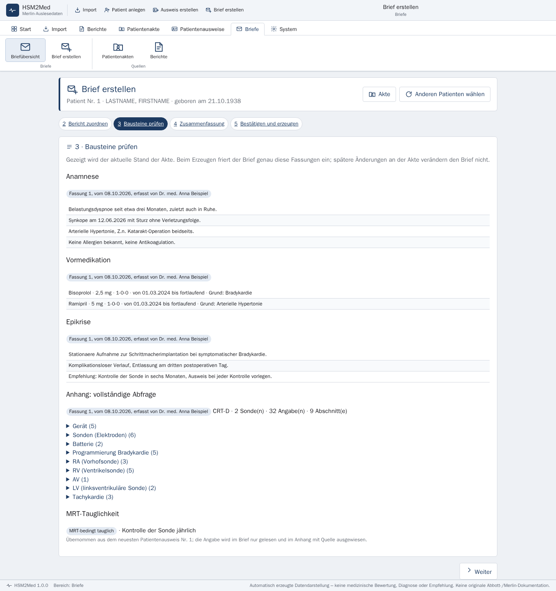

**4. Empfänger wählen** – Checkboxen für **Patient**, **Hausarzt** und **Überweisender Arzt**
mit der Anschrift aus den Stammdaten. Für **jeden** gewählten Empfänger entsteht ein eigener
Brief (eigene Briefnummer, Dokumentnummer und PDF) mit dessen Anschrift im Anschriftfeld;
Inhalt und Datengrundlage sind gleich. Wählbar ist ein Empfänger mit Name oder Praxis, PLZ und
Ort (die Straße ist optional); fehlt etwas, nennt der Assistent die fehlenden Angaben und
verlinkt die Stammdaten. Vorausgewählt sind die Ärzte mit vollständiger Anschrift, der
Patient nur auf Wunsch. Mindestens ein Empfänger ist Pflicht.

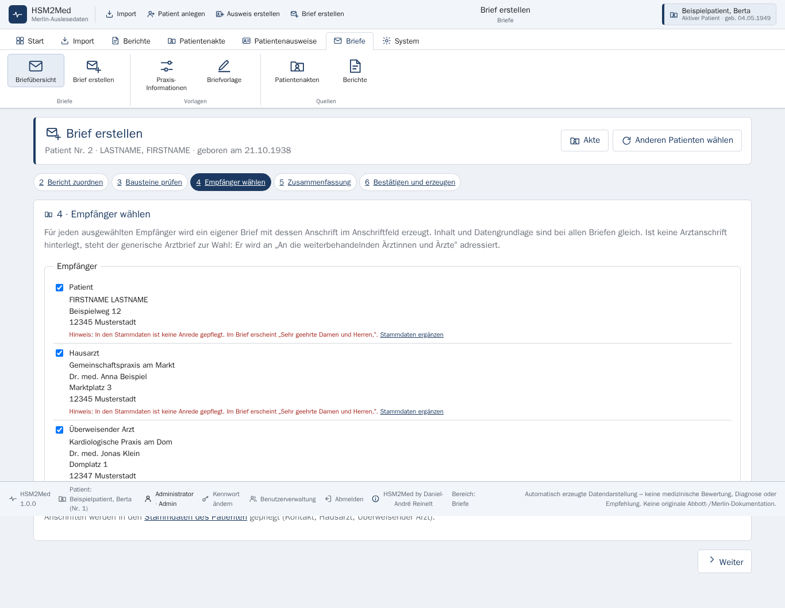

**5. Zusammenfassung** – Patient, Briefnummer(n), Empfänger, Befundteil, Textteile, Anhang und
MRT-Tauglichkeit vor dem Erzeugen:

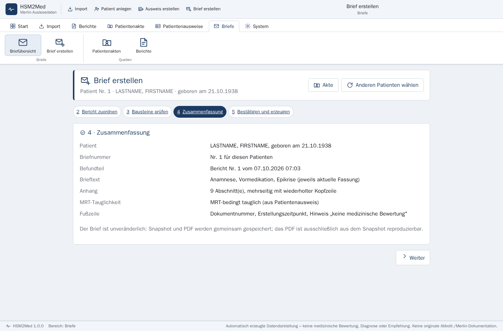

**6. Bestätigen und erzeugen** – ohne **beide** Bestätigungen wird kein Brief gespeichert.
Alle Briefe eines Vorgangs werden in einer Transaktion gespeichert; bei einem Brief führt die
Anwendung auf dessen Detailseite, bei mehreren auf die Briefe des Patienten.
Bei fehlender Bestätigung antwortet der Server mit HTTP 422 und zeigt die Meldungen am Feld:

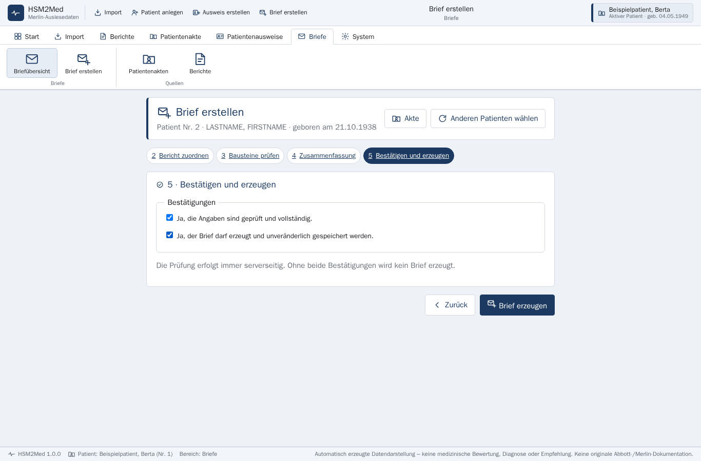

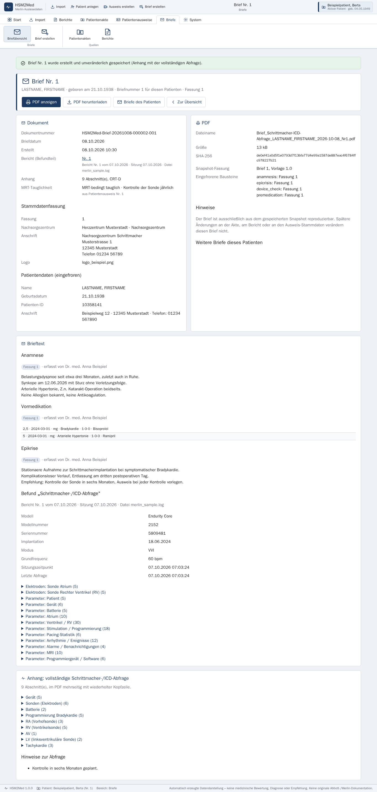

Die Detailansicht zeigt Dokumentnummer, Briefdatum, Erstellungszeitpunkt, den zugeordneten
Bericht, den Anhang, die eingefrorene Stammdaten- und Patientenfassung, Dateiname, Größe und
SHA-256 des PDF, die eingefrorenen Bausteinfassungen, den Brieftext, den Befundteil und die
vollständige Abfragetabelle. Der Brief ist **unveränderlich**: Snapshot und PDF werden in einer
Transaktion gespeichert und nie überschrieben; das PDF ist allein aus dem Snapshot
reproduzierbar.

Der Brief erscheint sowohl in der Briefübersicht als auch in der Akte des Patienten; die
Spalte *Empfänger* zeigt, an wen er gerichtet ist. Eine Neuausfertigung behält den Empfänger:

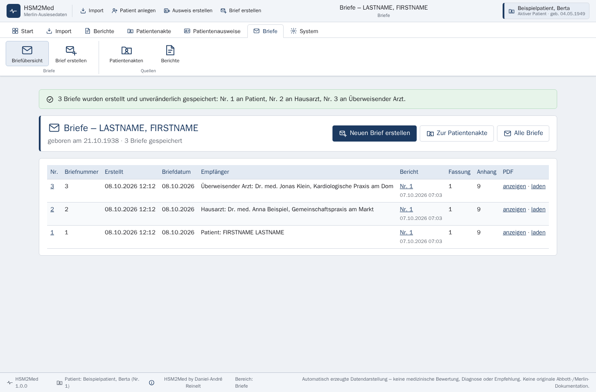

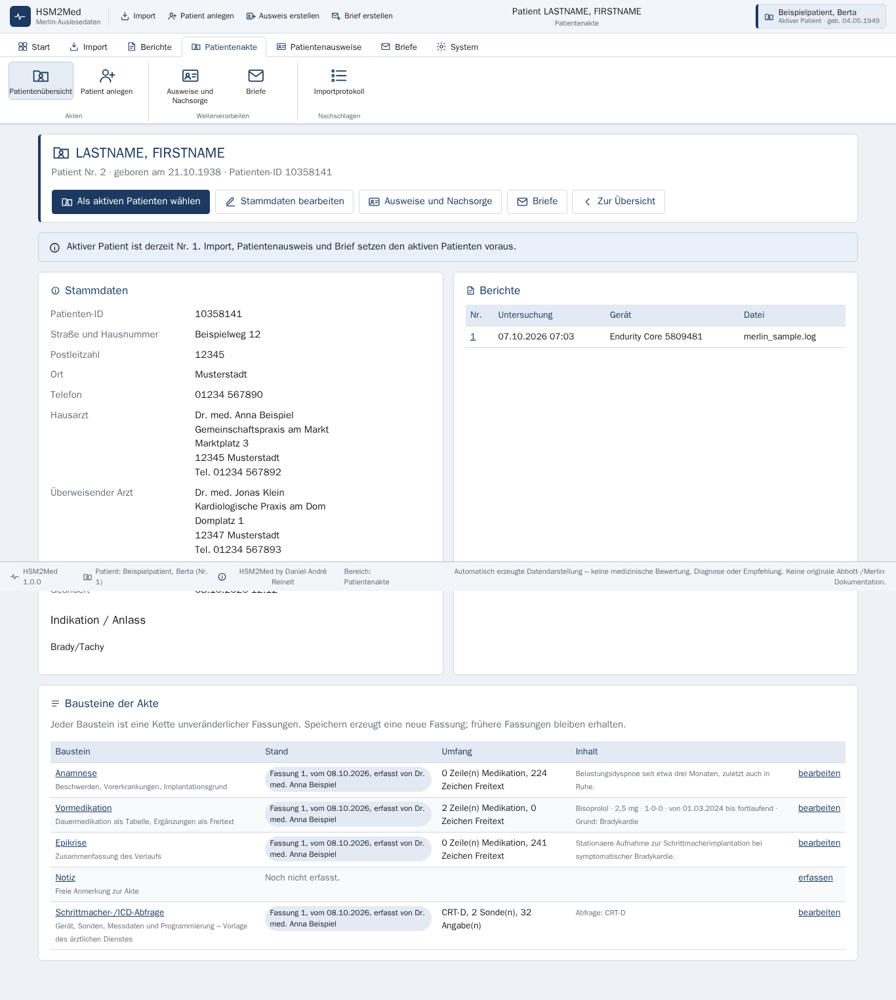

### Aufbau des Briefes (DIN 5008)

Briefe ab Fassung 2 werden nach **DIN 5008, Form B** gesetzt: Briefkopf 45 mm, Anschriftfeld
85 × 45 mm ab 45 mm von oben (Schrift ab 25 mm links) mit Rücksendeangabe in der Zusatz- und
Vermerkzone, Informationsblock ab 125 mm links und 50 mm oben (Unser Zeichen, Patient, Geburtsdatum, Patienten-ID,
Brief-Nr., Stammdatenfassung, Datum), Betreff fett ohne das Wort „Betreff", Anrede, Brieftext,
Grußformel; Falzmarken bei 105 mm und 210 mm sowie Lochmarke bei 148,5 mm; linker Rand
25 mm, rechter Rand 20 mm; Folgeseiten mit Kurzkopf und Seitenangabe. Inhalt, Reihenfolge und
alle festen Texte bestimmt die [Briefvorlage](#briefvorlage-und-vorlageneditor), deren
Fassung im Snapshot des Briefes eingefroren wird.

Briefe der Fassung 1 (vor Einführung der Vorlagen) behalten ihren damaligen Aufbau:

Seite 1: Kopfbereich mit Logo und Nachsorgezentrum, Titel „Brief zur Schrittmacher-/ICD-Abfrage",
Dokumentnummer, Briefdatum und Stammdatenfassung, Patientendaten (Name, Geburtsdatum,
Patienten-ID, Anschrift), Anrede, die Textteile **Anamnese**, **Vormedikation** und **Epikrise**
(jeweils mit Fassungsnummer, erfassender Person und Zeitpunkt), der Befundteil
„Schrittmacher-/ICD-Abfrage" und die Grußformel.

Ab Seite 2: Anhang „Schrittmacher-/ICD-Abfrage (vollständige Tabelle)" mit Kopfzeile auf jeder
Seite – Geräteart, Anzahl angegebener Werte und Herkunft der MRT-Tauglichkeit, danach die
Abschnitte Gerät, Messdaten (Batterie, Sonden mit Impedanz, Wahrnehmung, Reizschwelle und
Schockimpedanz), Programmierung (Bradykardie, RA, RV, AV, LV), bei ICD/CRT-D zusätzlich
Tachykardie (VT1, VT2, VF mit Erkennung und Therapie) sowie Bemerkungen. Die
MRT-Tauglichkeit stammt aus dem neuesten Patientenausweis; fehlt sie dort, wird die Angabe der
Abfrage gedruckt.

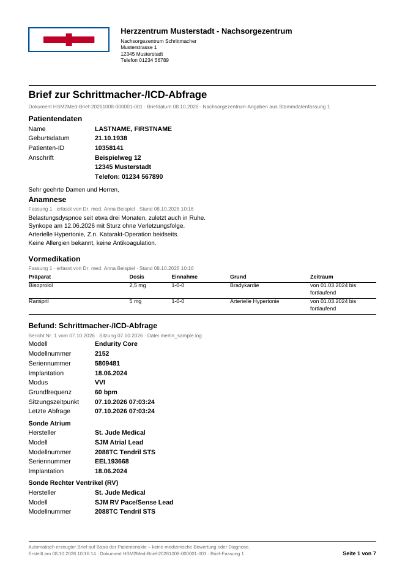


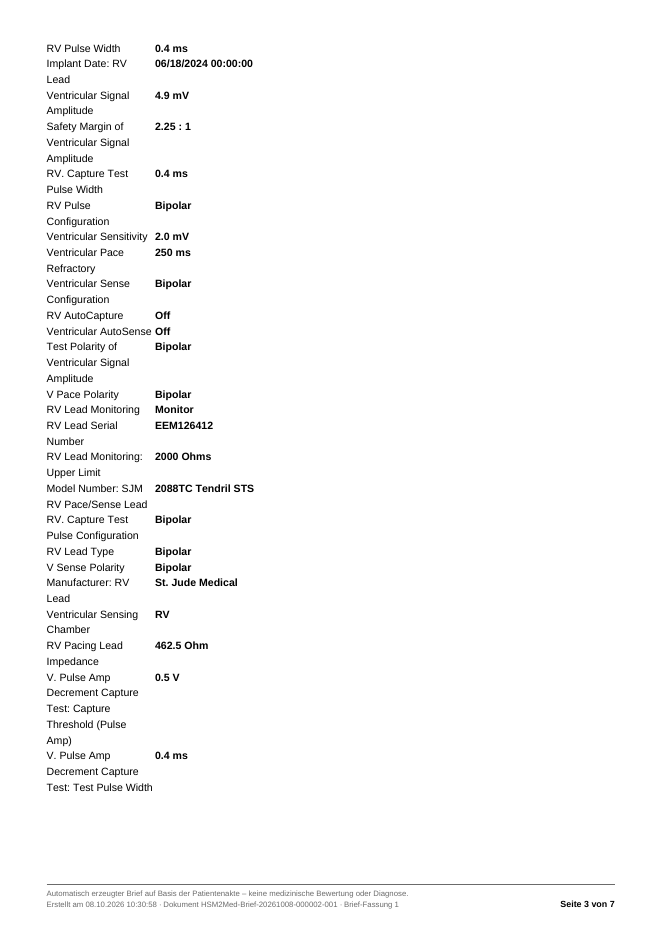

Jede Seite trägt die Fußzeile „Automatisch erzeugter Brief auf Basis der Patientenakte – keine
medizinische Bewertung oder Diagnose.", den Erstellungszeitpunkt mit Dokumentnummer und
Brief-Fassung sowie „Seite n von m". Die Dokumentnummer hat die Form
`HSM2Med-Brief-<JJJJMMTT>-<Patienten-ID>-<laufende Nummer>`.

### Routen

| Methode | Pfad | Zweck |
|---|---|---|
| GET | `/letters` | Übersicht mit Suche (Patient, Patienten-ID, Bericht-Nr.) |
| GET | `/letters/new` | Patient für einen neuen Brief wählen |
| GET | `/letters/new?patient={id}&report={id}` | Assistent (Schritte 2–6) |
| POST | `/letters` | Briefe erzeugen, je Eintrag in `recipients[]` (`patient`, `family_doctor`, `referring_physician`) einer (CSRF, beide Bestätigungen) |
| GET | `/letters/patients/{patient}` | Alle Briefe eines Patienten |
| GET | `/letters/{id}` | Briefdetail mit Snapshot |
| GET | `/letters/{id}/pdf` | Brief-PDF (inline, `?download=1` als Download) |
| GET | `/letters/{id}/reproduce` | PDF erneut aus dem Snapshot mit der damaligen Vorlage erzeugen (nichts wird gespeichert) |
| POST | `/letters/{id}/regenerate` | Neuausfertigung als neuer Brief: `template=original` oder `template=current` (nur mit `confirm_current_template=1`) |
| GET | `/system/letter-templates` | Vorlageneditor (eigener Tab) |
| POST | `/system/letter-templates` | Vorlage als neue Fassung speichern (JSON-Antwort, CSRF) |
| POST | `/system/letter-templates/preview` | PDF-Vorschau einer ungespeicherten Vorlage mit Beispieldaten |
| GET | `/system/letter-templates/versions/{id}` | Gespeicherte Fassung als JSON (zum Laden in den Editor) |

### Briefvorlage und Vorlageneditor

Der Editor öffnet sich über **System → Briefvorlage bearbeiten** in einem neuen Tab und folgt
der Office-Oberfläche der Anwendung (Menüband, Statusleiste):

- **Aufbau** (links): Name der Vorlage, feste Bereiche nach DIN 5008 (Briefkopf,
  Rücksendeangabe, Anschriftfeld, Informationsblock, Fußzeile und Seitenränder, Anhang) und die
  Bausteine des Brieftextes. Bausteine werden **per Drag and Drop** (am Griff, in der Liste oder
  direkt auf der Seitenvorschau), mit den Pfeil-Schaltflächen oder mit `Alt`+`↑`/`↓`
  verschoben und per Häkchen ein- oder ausgeblendet. Eigene Textbausteine (Überschrift + Text)
  lassen sich hinzufügen und löschen.
- **Seitenvorschau** (Mitte): maßstabsgetreue A4-Seite mit Beispieldaten; ein Klick wählt den
  Bereich bzw. Baustein.
- **Eigenschaften** (rechts): alle festen Texte des gewählten Bereichs bzw. Bausteins,
  Optionen (z. B. Falzmarken; Empfängertext für Briefe ohne Empfängerauswahl) und Platzhalter wie
  `{patient_name}`, `{date_of_birth}`, `{document_number}`, `{letter_date}`; `{page}` und
  `{pages}` nur in der Seitenangabe. „Standard" setzt einen Text zurück.

**Versionierung:** *Als neue Fassung speichern* legt eine neue, unveränderliche Fassung an
(optional mit Änderungsnotiz); neue Briefe verwenden ab dann diese Fassung. Unter *Fassungen*
lassen sich frühere Fassungen laden und als neue Fassung wiederherstellen. Gleichzeitige
Bearbeitung wird erkannt (Speichern auf veralteter Grundlage wird abgelehnt).

**Historische Briefe:** Jeder Brief speichert die vollständige Vorlage im Snapshot. In der
Briefdetailansicht kann das PDF jederzeit **mit der damaligen Vorlage reproduziert** werden
(identisch zum gespeicherten PDF). Eine **Neuausfertigung** erzeugt einen neuen Brief aus
derselben Datengrundlage – standardmäßig mit der ursprünglichen Vorlage, nur nach
ausdrücklicher Bestätigung (Opt-in) mit der aktuellen Vorlage. Der Ausgangsbrief bleibt
unverändert; die Neuausfertigung verweist im Informationsblock auf ihn.

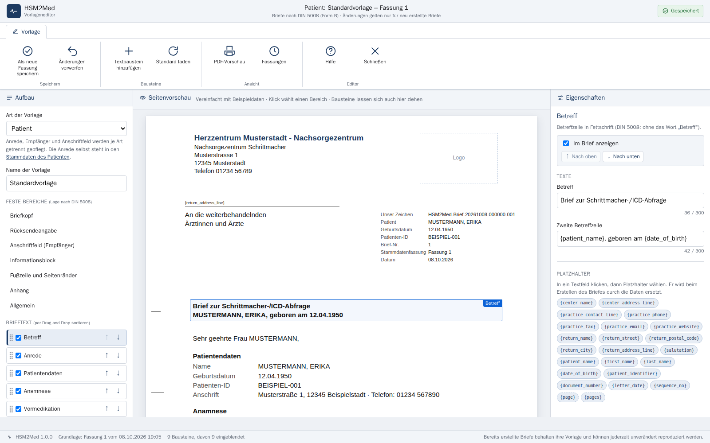

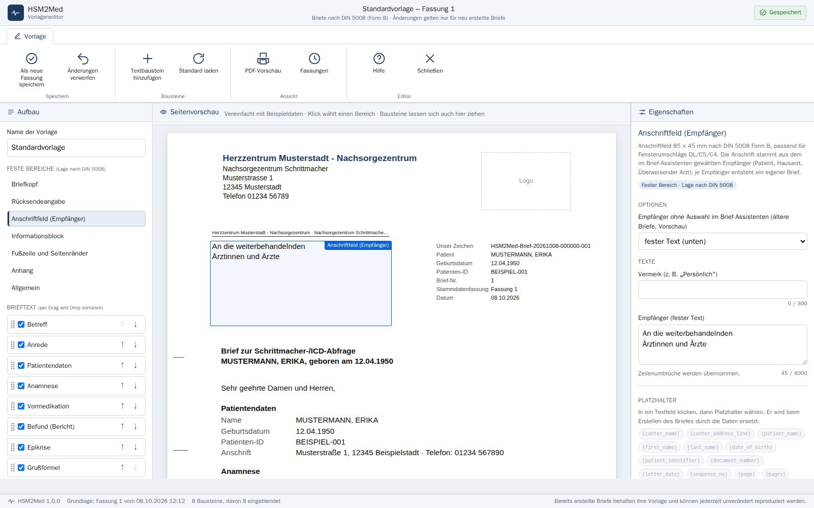

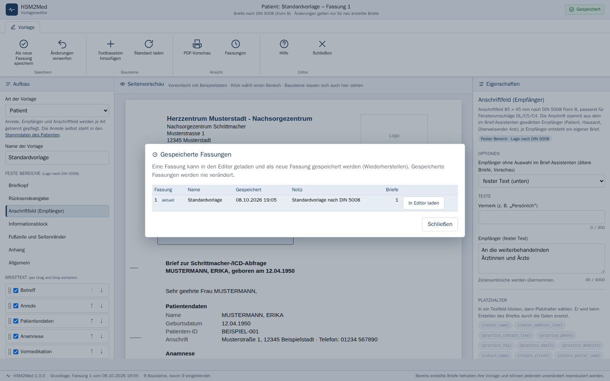

Aufbau, Datenmodell, Regeln und Erweiterungspunkte des Editors für Entwickler und Agenten:
[docs/editor-referenz.md](docs/editor-referenz.md).

## Kommandozeile (CLI)

Alle Befehle laufen im Web-Container. Als Benutzer `www-data` ausführen, damit Archiv- und
Protokolldateien die richtigen Eigentümer erhalten. Dateien müssen im Container liegen:

```sh
# Import (Datei zuerst in den Container kopieren)
docker compose cp ./MERLIN_export.log web:/tmp/export.log
docker compose exec -u www-data web php bin/import.php /tmp/export.log --dry-run   # nur prüfen
docker compose exec -u www-data web php bin/import.php /tmp/export.log             # importieren
docker compose exec -u www-data web php bin/import.php /tmp/export.log --force     # Dublette erzwingen

# PDF-Export eines gespeicherten Berichts (nur aus der Datenbank)
docker compose exec -u www-data web php bin/export-pdf.php 1 /tmp/bericht-1.pdf --raw
docker compose cp web:/tmp/bericht-1.pdf ./bericht-1.pdf

# Migrationen manuell ausführen
docker compose exec -u www-data web php bin/migrate.php
```

Exit-Codes `import.php`: `0` Erfolg, `1` Import fehlgeschlagen, `2` Aufruffehler, `3` Dublette.

## Importformat

Merlin-Exportdateien bestehen aus Datensätzen mit vier Feldern, die jeweils mit dem
Steuerzeichen **0x1C** (ASCII File Separator, „FS“) abgeschlossen werden:

```
<Parameter-ID>FS<Bezeichnung>FS<Wert>FS<Einheit>FS<Zeilenumbruch>
```

Beispiel (FS als `␜` dargestellt):

```
202␜Device Serial Number␜5809481␜␜
302␜Base Rate␜60␜bpm␜
2431␜Patient Date of Birth␜10/21/1938 00:00:00␜␜
```

- Parameter-IDs sind Ziffernfolgen des **Merlin-Quellformats**. Sie sind **keine**
  standardisierten Codes (z. B. IEEE 11073 oder LOINC); eine Zuordnung zu Standards wird
  nicht behauptet und nur bei expliziter Dokumentation in `standard_codes` hinterlegt.
- Datumswerte liegen im US-Format `MM/DD/YYYY hh:mm:ss` vor. Angezeigt wird zusätzlich
  `TT.MM.JJJJ`; gespeichert bleibt immer der Originaltext.
- Unterstützte Kodierungen: UTF-8 (mit/ohne BOM), UTF-16 mit BOM, sonst Windows-1252 bzw.
  ISO-8859-1 (Fallback mit Warnung). Zeilenumbrüche CRLF, LF und CR werden akzeptiert.

## Parserverhalten und Fehlerbehandlung

- Getrennt wird **ausschließlich** an 0x1C; Tabulatoren, Semikolons, Kommas usw. sind
  normale Zeichen. Werte werden nicht gerundet, konvertiert oder getrimmt (lediglich
  Zeilenumbrüche vor der ID werden entfernt).
- Leere Werte und Einheiten bleiben leere Zeichenketten (niemals `NULL` oder `0`).
- Unbekannte Parameter werden vollständig übernommen (Kategorie „Sonstige / Nicht kategorisiert“).
- Mehrfach vorkommende IDs werden alle gespeichert (Warnung `duplicate_parameter_id`).
- Fehlerhafte Datensätze werden protokolliert und übersprungen; gültige Datensätze werden
  importiert (Status `completed_with_errors`).

| Code | Art | Bedeutung |
|---|---|---|
| `empty_file` | Fehler (blockiert) | Datei ist leer |
| `no_separator` | Fehler (blockiert) | Kein 0x1C enthalten – kein Merlin-Export |
| `invalid_parameter_id` | Fehler | ID ist keine Ziffernfolge – Datensatz übersprungen |
| `incomplete_record` | Fehler | Datensatz hat weniger als vier Felder |
| `unterminated_record` | Fehler | Unvollständiger Rest am Dateiende |
| `missing_final_separator` | Warnung | Letzter Trenner fehlt |
| `empty_parameter_name` | Warnung | Leere Bezeichnung |
| `line_break_in_field`, `nul_in_field` | Warnung | Steuerzeichen im Feld |
| `encoding_fallback` | Warnung | Kein gültiges UTF-8, Fallback-Kodierung genutzt |
| `duplicate_parameter_id` | Warnung | ID mehrfach vorhanden |
| `missing_device_serial`, `missing_patient`, `unparsed_date` | Warnung | Stammdaten fehlen bzw. Datum nicht erkannt |

Importstatus: `completed`, `completed_with_warnings`, `completed_with_errors`, `failed`.
Fehlgeschlagene Importe werden mit Grund im Importprotokoll gespeichert.

## Datenmodell, Snapshots und Versionierung

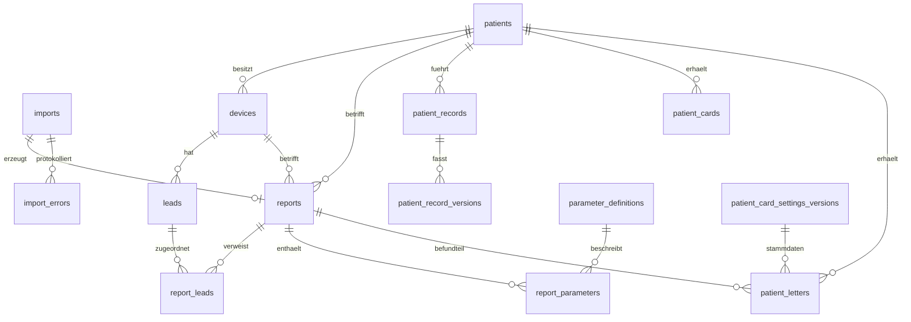
```mermaid
erDiagram
    imports ||--o| reports : erzeugt
    imports ||--o{ import_errors : protokolliert
    patients ||--o{ devices : besitzt
    patients ||--o{ reports : betrifft
    patients ||--o{ patient_records : fuehrt
    patient_records ||--o{ patient_record_versions : fasst
    devices ||--o{ leads : hat
    devices ||--o{ reports : betrifft
    reports ||--o{ report_leads : verweist
    leads ||--o{ report_leads : zugeordnet
    reports ||--o{ report_parameters : enthaelt
    parameter_definitions ||--o{ report_parameters : beschreibt
    patients ||--o{ patient_cards : erhaelt
    patients ||--o{ patient_letters : erhaelt
    reports ||--o{ patient_letters : befundteil
    patient_card_settings_versions ||--o{ patient_letters : stammdaten
```

- **reports** enthält Snapshots aller Kopfdaten (Patient, Gerät, Zeitstempel als Original
  und normalisiert) sowie `summary_snapshot` (JSON) mit Patienten-, Geräte- und Sondendaten
  zum Importzeitpunkt.
- **report_parameters** speichert jeden Datensatz unverändert (ID, Bezeichnung, Wert,
  Einheit, Rohdatensatz, Position) **inklusive** der Kategorie zum Importzeitpunkt.
- **patients/devices/leads** sind Stammdaten zur Verknüpfung; sie werden nur ergänzt,
  nie überschrieben. Historische Berichte verwenden ausschließlich ihre Snapshots.
- **patient_records** ist der Behälter je Patient und Bausteintyp (genau einer je
  Kombination, `UNIQUE (patient_id, record_type)`); der Inhalt liegt ausschließlich in
  **patient_record_versions**. Jede Änderung erzeugt dort eine neue Fassung mit
  fortlaufender `version`, `content` (JSON), `content_text` (Textfassung für Anzeige und
  spätere Verwendung) und `content_hash` (SHA-256 des kanonischen JSON, verhindert
  inhaltsgleiche neue Fassungen). Frühere Fassungen werden nie überschrieben oder gelöscht.
- Alle Fremdschlüssel verwenden `ON DELETE RESTRICT`; Berichte werden nicht gelöscht.
- Jeder Bericht speichert `report_version`, `parser_version` und `mapping_version`.
  Die PDF-Erzeugung wählt das Layout anhand der `report_version`. Eine Änderung der
  Zuordnung erzeugt eine neue `mapping_version` und betrifft nur künftige Importe.
- `parameter_count` wird beim Laden geprüft: Abweichungen führen zu einem Fehler statt
  zu einem unvollständigen Bericht.
- Schemaänderungen erfolgen ausschließlich über neue Dateien in `database/migrations/`
  (eine Prüfsumme verhindert nachträgliche Änderungen angewendeter Migrationen); danach
  `php bin/build-schema.php` ausführen.
- Ausweise speichern ihre Layoutfassung als `card_version` im Snapshot (aktuell 2). Die
  Messwerttabelle wird beim Erzeugen aus den Bericht-Snapshots aufgelöst und mitgespeichert;
  spätere Änderungen an `config/patient_card_measurements.php` betreffen nur neue Ausweise.
- **patient_letters** ist ein unveränderliches Dokument: `snapshot` (JSON) friert Patientendaten,
  die Fassung der globalen Stammdaten (`settings_version_id`), die Fassungen der Bausteine
  (Anamnese, Vormedikation, Epikrise, Schrittmacher-/ICD-Abfrage), die Befunddaten des
  gewählten Berichts und die aufgelösten Anhangsabschnitte ein. `pdf_content` (MEDIUMBLOB) und
  `pdf_sha256` werden gemeinsam mit dem Snapshot in einer Transaktion gespeichert und nie
  überschrieben; das PDF ist allein aus dem Snapshot reproduzierbar. `report_id` ist optional
  (`NULL` = kein Befundteil). `sequence_no` ist die laufende Nummer je Patient,
  `letter_version` die Fassung je Patient und Bericht (`UNIQUE (patient_id, sequence_no)`).

## PDF-Berichte

| Seite 1 | Seite 2 |
|---|---|
| 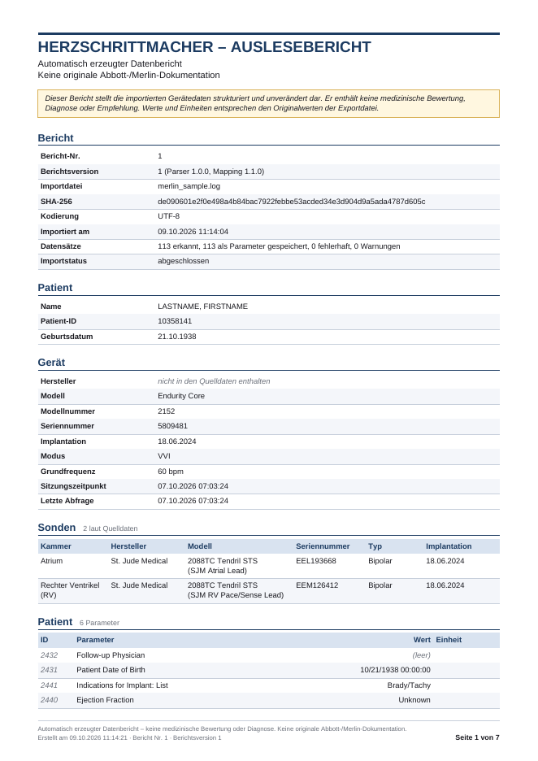 | 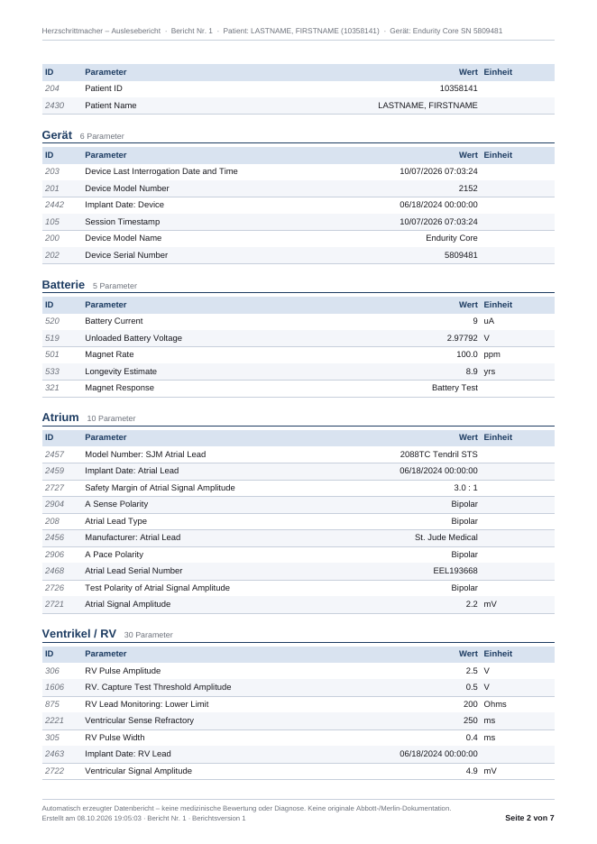 |

- Inhalt: Titel mit Hinweis „keine medizinische Bewertung“, Berichtsdaten, Patient, Gerät,
  Sonden, alle Parameter nach Kategorien (ID, Parameter, Wert, Einheit), Importprotokoll,
  optional Rohdatenanhang (Originaldatensätze in Dateireihenfolge, fehlerhafte markiert).
- Kopfzeile ab Seite 2 mit Bericht, Patient und Gerät; Fußzeile mit „Seite X von Y“,
  Erstellungszeitpunkt und Berichtsversion; Tabellenköpfe werden auf Folgeseiten wiederholt.
- Zeichen außerhalb von Windows-1252 werden als `[U+XXXX]`, Steuerzeichen als `[0xNN]`
  dargestellt – nichts wird stillschweigend entfernt.
- Erzeugung ausschließlich aus der Datenbank; die Originaldatei wird nicht benötigt.
- Dateiname: `Bericht_<Nr>_<Datum>_SN<Seriennummer>.pdf`.
- Aufruf: `/reports/<id>/pdf` (`?raw=1` mit Rohdatenanhang, `?download=1` als Download).

## Parameterzuordnung erweitern

Die Zuordnung steht in `config/parameter_mapping.php`:

- `categories` – Kategorien mit Bezeichnung und Sortierung.
- `by_id` – Zuordnung Merlin-ID → Kategorie (höchste Priorität).
- `by_name` / `name_patterns` – Zuordnung über Bezeichnung bzw. reguläre Ausdrücke.
- `fields` / `lead_fields` – welche IDs Kopf- und Sondendaten liefern.
- `standard_codes` – nur **explizit dokumentierte** Zuordnungen zu Standardcodes (leer).

Nach jeder inhaltlichen Änderung `version` erhöhen und den Web-Container neu bauen
(`docker compose up -d --build`). Bestehende Berichte bleiben unverändert.

## Messwerttabelle des Patientenausweises erweitern

Seite 2 des Ausweises zeigt die Messwerte der aktuellen Untersuchung und der bis zu sechs
letzten früheren Untersuchungen desselben Patienten. Aufbau, Reihenfolge und Beschriftungen
der Zeilen stehen 1:1 in `config/patient_card_measurements.php`:

- `version` – Fassung der Vorlage; bei inhaltlichen Änderungen erhöhen.
- `columns` – Anzahl der Spalten (7 = aktuelle Untersuchung + sechs frühere).
- `sections` → `groups` → `rows` – Abschnitte, Gruppen und Zeilen der Tabelle.
- `label` – Beschriftung der Zeile (Einheit in der Beschriftung, z. B. `Spannung [V]`).
- `chamber` – optionale Kammerangabe (`RA`, `RV`) in der Spalte vor der Beschriftung.
- `sources` – woher der Wert kommt: `ids` (Merlin-Parameter-IDs, haben Vorrang) und/oder
  `names` (Parameterbezeichnungen, exakt, Groß-/Kleinschreibung egal). Mehrere Quellen
  werden mit `glue` verbunden, z. B. Amplitude und Pulsbreite zu `0.5/0.4`.

Zeilen ohne Quelle und Zellen ohne Wert bleiben leer – es werden keine Werte erfunden.
Bereits erzeugte Ausweise bleiben unverändert, weil die aufgelöste Tabelle im Snapshot des
Ausweises gespeichert ist. Eine bestehende Zeile ohne Treffer im Bericht kann unverändert
bleiben; fehlt der Parameter im Merlin-Export, bleibt die Zelle leer, bis ein Bericht den
Wert enthält.

## Vorlage der Schrittmacher-/ICD-Abfrage erweitern

Abschnitte, Felder und die Vorbelegung der Abfrage stehen 1:1 in
`config/device_check_template.php`:

- `version` – Fassung der Vorlage; bei inhaltlichen Änderungen erhöhen. Die Fassung wird im
  Inhalt jeder gespeicherten Abfrage mitgeführt, ältere Fassungen bleiben dadurch unverändert.
- `device_types` – Gerätetypen in der Reihenfolge des Formulars (`pacemaker`, `icd`, `crt_p`,
  `crt_d`).
- `lead_fields` – Spalten der Sondentabelle (`key`, `label`, optional `options`, `type`,
  `maxlength` und `devices`).
- `sections` → `groups` → `fields` – Abschnitte, Gruppen und Felder (`key`, `label`, optional
  `options`, `type` = `date`, `maxlength`, `devices`).
- `devices` – für welche Gerätetypen ein Abschnitt oder Feld gilt; fehlt die Angabe, gilt der
  Eintrag für alle. Nicht zutreffende Werte werden weder gespeichert noch ausgegeben.
- `sources` – Vorbelegung aus dem Bericht wie in `config/patient_card_measurements.php`
  (`ids` haben Vorrang vor `names`, mehrere Quellen werden mit `glue` verbunden).
- `from_summary` – Vorbelegung aus einer Zeile der Berichtszusammenfassung
  (`<Abschnitt>.<Zeile>`), z. B. `device.Modell`.
- `from_card` – Feld wird aus dem neuesten Patientenausweis übernommen und dort gepflegt
  (aktuell `mrt_compatibility` und `mrt_compatibility_note`).

Feldwerte sind Freitext mit der Einheit in der Beschriftung; es findet keine
Zahleninterpretation und keine medizinische Bewertung statt. Bereits gespeicherte Abfragen
bleiben unverändert, weil jede Fassung ihren Inhalt als Snapshot speichert.

## Sicherheitskonzept

- **Netz:** standardmäßig nur an `127.0.0.1` gebunden; Datenbank nur im internen Netz.
  Für Zugriff im Praxisnetz einen Reverse-Proxy mit TLS vorschalten und
  `SESSION_SECURE_COOKIE=1` setzen. Die Anwendung enthält **keine Benutzerverwaltung** –
  der Zugriff ist über Netzwerk bzw. Proxy (z. B. Basic-Auth, Client-Zertifikate) zu beschränken.
- **Uploads:** Größenlimit, nur `.txt`/`.log`, Inhaltsprüfung (Magic Bytes, MIME-Typ,
  0x1C-Pflicht, NUL-Anteil), bereinigte Dateinamen; Uploads werden außerhalb des Webroots
  unter zufälligem Token zwischengespeichert (Gültigkeit 1 h), das Archiv ist schreibgeschützt.
- **Web:** CSRF-Token für alle POST-Anfragen, Session-Cookies `HttpOnly`/`SameSite=Strict`,
  regelmäßige Erneuerung der Session-ID, strikte Content-Security-Policy ohne
  Inline-Skripte, `X-Frame-Options: DENY`, `nosniff`, `no-referrer`, kein Caching.
- **Daten:** ausschließlich vorbereitete Statements, strikter SQL-Modus, Ausgabe-Escaping
  aller Werte, nur lokale Weiterleitungen.
- **Fehler:** in `production` keine technischen Details im Browser, nur eine Referenz-ID;
  Details stehen im Anwendungsprotokoll (`/var/www/storage/logs/app.log`) und sind unter
  `/system/logs` (Fehlerprotokoll) nach Referenz durchsuchbar.

## Datenschutz

Die verarbeiteten Daten sind Gesundheitsdaten (Art. 9 DSGVO). Betreiber sind verantwortlich
für Zugriffsschutz, Verschlüsselung von Datenträgern und Backups, Lösch- und
Aufbewahrungsfristen sowie das Verzeichnis der Verarbeitungstätigkeiten.
Die Anwendung überträgt keine Daten nach außen. Für Tests und Screenshots wird
ausschließlich die anonymisierte Beispieldatei (`tests/fixtures/merlin_sample.log`) verwendet.
Protokolldateien enthalten technische Meldungen, aber keine Parameterwerte.
Die Patientenakte enthält Freitextangaben zu Anamnese, Vormedikation und Epikrise; auch frühere
Fassungen werden aufbewahrt und unterliegen denselben Lösch- und Aufbewahrungsfristen.

## Tests

```sh
docker compose --profile test run --rm tests                            # alle Tests
docker compose --profile test run --rm tests php tests/run.php Parser   # nur passende Testklassen
docker compose --profile test down                                      # Testdatenbank entfernen
```

Die Tests verwenden einen eigenen Testrunner (`tests/run.php`) und eine separate,
flüchtige MySQL-Instanz (`db-test`, Daten im RAM). Abgedeckt sind u. a.:

- **Parser (1–12):** Normalformat, 0x1C als einziger Trenner, leere Werte/Einheiten,
  Dezimal- und Prozentwerte, Datumswerte, Sonderzeichen, unbekannte Parameter,
  fehlerhafte Datensätze, lange Bezeichnungen, Zeilenumbrüche, Referenzdatei.
- **Datenbank (13–18):** erfolgreicher Import, Rollback, Fremdschlüssel,
  vollständige und unveränderte Parameter, Neuladen, Unveränderlichkeit historischer
  Berichte, außerdem Dubletten, Suche, Schema und Migrationen.
- **PDF (19–24):** Erzeugung, Mehrseitigkeit, Sonderzeichen, lange Tabellen, unbekannte
  Parameter, PDF aus der Datenbank ohne Originaldatei.
- Zusätzlich: Zuordnung/Zusammenfassung, Uploadprüfung, Escaping, Weiterleitungen,
  Upload-Zwischenspeicher, Konfiguration.
- **Patientenausweis:** Namenszerlegung und Identitätsschlüssel, Eingabeprüfung,
  Logo-Prüfung, PDF-Layout (Seitenzahl, Seitenumbruch), Erzeugung aus einem Bericht,
  Konflikterkennung, Unveränderlichkeit bestehender Ausweise.
- **Patientenakte:** Eingabeprüfung der Stammdaten (Datumsformate, Pflichtfelder,
  Patienten-ID-Länge, Telefonzeichen, Steuerzeichen, Dublettenbestätigung), Bausteine
  (Freitext, Vormedikationszeilen, Datumsnormalisierung, Grenzwerte, inhaltsgleiche Eingabe
  ohne neue Fassung), Anlegen ohne Import, Identität und Dubletten, Suche und Pagination
  sowie Fassungshistorie.
- **Schrittmacher-/ICD-Abfrage:** Vorlagenvertrag (Gerätetypen, Abschnitte, Feldtypen,
  Zuordnungstabellen, fehlerhafte Vorlagen), Eingabeprüfung (Gerätetyp, Auswahlwerte, Datum,
  Längen, Sondenzeilen), Vorbelegung aus einem echten Beispielbericht sowie die Regel, dass die
  MRT-Tauglichkeit aus dem Patientenausweis führt und ein abweichender Formularwert verworfen
  wird.
- **Oberflächen (Integration):** Die Templates werden mit den echten Controllern gerendert
  (`tests/Integration/PatientCardViewTest.php`, `tests/Integration/PatientViewTest.php`,
  `tests/Integration/LetterViewTest.php`).
  Damit fallen Fehler in der HTML-Schicht (fehlende Template-Variablen, unbekannte Klassen,
  unvollständige Formulare, fehlende CSRF-Felder) im Test auf – `php -l` erkennt sie nicht.
- **Patientenvorgang (Integration/Unit):** `tests/Integration/PatientFirstWorkflowTest.php`
  prüft, dass der aktive Patient beim Anlegen automatisch gesetzt wird, Wechsel und Aufheben
  funktionieren, eine veraltete Auswahl verworfen wird und die patientenbezogenen Routen ohne
  Auswahl gesperrt bleiben, während Listen und Übersichten erreichbar sind;
  `tests/Unit/ActivePatientTest.php` deckt die Sitzungslogik ab.
- **Oberflächengerüst (Unit):** `tests/Unit/IconTest.php` prüft die Symbolbibliothek
  (`src/Http/Icon.php`) – jedes Symbol liefert eingebettetes SVG ohne externe Verweise, ein
  unbekannter Name fällt auf das Ersatzsymbol zurück, Klassennamen werden maskiert.
  `tests/Unit/RibbonTest.php` prüft das Funktionsband (`src/Http/Ribbon.php`) – eindeutige
  Reiter, Beschriftungen, interne Ziele, auflösbare Symbole, die Zuordnung von `$active`-Schlüsseln
  zu Reitern, die unveränderten Routen der Ziele sowie die patientenbezogenen Ziele, die einen
  aktiven Patienten voraussetzen.
- **Brief zur Schrittmacher-/ICD-Abfrage:** Assistent (`prepare()`) mit Warnungen für fehlende
  Bausteine, Anhang und Bericht, Erzeugung mit beiden Bestätigungen, Ablehnung ohne Bestätigung
  (HTTP 422, kein Datensatz), Snapshot und Unveränderlichkeit (Patientendaten, Bausteinfassungen
  und Stammdaten bleiben nach späteren Änderungen unverändert), laufende Briefnummer je Patient,
  Brief-Fassung, Suche und Seitenaufteilung, Anhangsabschnitte je Geräteart (Schrittmacher, ICD,
  CRT-P, CRT-D), PDF-Layout (Reihenfolge, Auslassungen, Seitenzahl, Fußzeile, Dateiname) sowie die
  Anzeige in Übersicht, Detailansicht, Patientenliste und Akte.

## Screenshots für die Dokumentation

Die Bilder in `docs/screenshots/` werden automatisiert mit Docker erzeugt
(Playwright/Chromium für die Weboberfläche, `pdftoppm` für die PDF-Seiten). Dabei läuft
eine eigene, flüchtige Instanz (`db-docs`, `web-docs`); Produktivdaten werden nicht berührt:

```sh
docker compose --profile docs run --rm screenshots
docker compose --profile docs down -v
```

Das Skript liegt in `docs/screenshots/capture.py`. Es legt Beispieldaten an (Patient mit
Anamnese, Vormedikation, Epikrise und Schrittmacher-/ICD-Abfrage, Import der Testdatei,
Stammdaten mit Beispiel-Logo, Patientenausweis, Brief zur Schrittmacher-/ICD-Abfrage) und erzeugt
daraus die Bilder `01`–`53`, darunter Hausarzt und überweisender Arzt in den Stammdaten
(`49`), die Empfängerauswahl des Brief-Assistenten (`50`), den Vorlageneditor (`51`–`53`), die Sperre des Importvorgangs ohne Patienten (`47`), den
automatisch aktiven Patienten (`48`), Assistent, Konfliktdialog, Patientenakte, die Abfrage mit
Vorbelegung und Sperrung der MRT-Tauglichkeit, beide Seiten des Ausweis-PDF, der Brief-Assistent
(Schritte 2–6, drei Empfänger), Briefdetail, Briefübersicht, Briefliste am Patienten sowie die Seiten 1–3 des
Brief-PDF. Das Skript prüft dabei zugleich die harten Anforderungen: Der Import leitet ohne
aktiven Patienten auf die Patientenübersicht um, das Anlegen eines Patienten setzt ihn als
aktiven Patienten, das Ausweis-PDF hat **genau
zwei** Seiten, Seite 1 nennt die MRT-Tauglichkeit, das MRT-Feld der Abfrage ist gesperrt und die
Abfrage wird gespeichert; das Brief-PDF hat **mindestens zwei** Seiten und enthält Titel,
Anamnese, Vormedikation, Epikrise, den Befundteil, den Anhang, die MRT-Tauglichkeit und die
Tachykardie-Abschnitte sowie die Anschrift des Hausarztes im Anschriftfeld. Der Build des
Screenshot-Images benötigt einmalig Internetzugang; für den Betrieb der Anwendung ist er nicht
erforderlich. `web-docs` bindet das Projektverzeichnis nicht ein – nach Änderungen an
Templates, `src/` oder `public/assets/` ist `docker compose build web-docs` erforderlich. Ein
abgebrochener Lauf hinterlässt Daten in der flüchtigen Datenbank; vor einem neuen Versuch
`docker compose --profile docs down -v` ausführen.

Die Aufnahmen zeigen die Oberfläche im Office-Stil inklusive Funktionsband. Die Bilder werden
mit `full_page=True` erfasst und sind deshalb unterschiedlich hoch; das Erzeugungsskript
spricht die Bedienelemente ausschließlich über stabile CSS-Klassen und Formularnamen an, nicht
über Pixelpositionen.

## Backup und Wiederherstellung

Zu sichern sind die **Datenbank** und das **Importarchiv** (optional die Anwendungsdaten).

```sh
# Datenbank (konsistent, ohne Sperren)
docker compose exec -T db sh -c 'exec mysqldump -u root -p"$MYSQL_ROOT_PASSWORD" --single-transaction --routines --triggers --default-character-set=utf8mb4 --databases hsm2med' > backup-hsm2med-$(date +%F).sql

# Importarchiv und Anwendungsdaten
docker run --rm -v hsm2med_import_data:/data:ro -v "$PWD":/backup alpine tar czf /backup/import_data-$(date +%F).tar.gz -C /data .
docker run --rm -v hsm2med_application_data:/data:ro -v "$PWD":/backup alpine tar czf /backup/application_data-$(date +%F).tar.gz -C /data .
```

Wiederherstellung:

```sh
docker compose up -d db
docker compose exec -T db sh -c 'exec mysql -u root -p"$MYSQL_ROOT_PASSWORD"' < backup-hsm2med-JJJJ-MM-TT.sql
docker run --rm -v hsm2med_import_data:/data -v "$PWD":/backup alpine sh -c 'tar xzf /backup/import_data-JJJJ-MM-TT.tar.gz -C /data && chown -R 33:33 /data'
docker compose up -d
```

Backups enthalten Gesundheitsdaten: verschlüsselt ablegen und die Wiederherstellung
regelmäßig testen. Achtung: `docker compose down -v` löscht **alle** Volumes und damit
sämtliche Daten.

## Fehlerbehebung

| Problem | Lösung |
|---|---|
| `DB_PASSWORD muss in .env gesetzt sein` | `.env` aus `.env.example` anlegen |
| Web-Container startet nicht / „unhealthy“ | `docker compose logs web db`; die Datenbank braucht beim ersten Start länger |
| `exec ... entrypoint.sh: no such file or directory` | Zeilenenden: Repository mit LF auschecken (`.gitattributes`), Image neu bauen |
| „Migration wurde nach dem Anwenden verändert“ | Angewendete Migrationen nie ändern – neue Migration anlegen |
| Upload abgelehnt (Größe) | `UPLOAD_MAX_SIZE` erhöhen, Container neu starten |
| Upload abgelehnt (Format) | Datei muss 0x1C-Trenner enthalten und auf `.txt`/`.log` enden |
| „Ungültiges Sicherheitstoken“ | Seite neu laden (Session abgelaufen) |
| Fehlerseite mit Referenz | „Im Fehlerprotokoll anzeigen" oder Referenz unter `/system/logs` suchen; alternativ `docker compose exec web cat /var/www/storage/logs/app.log` |
| Port belegt | `WEB_PORT` in `.env` ändern |

## Projektstruktur

```
bin/                 CLI: import, export-pdf, migrate, build-schema, php-limits
config/              parameter_mapping.php (Kategorien, Feldzuordnung),
                     patient_card_measurements.php, device_check_template.php
database/            migrations/ (maßgeblich) und schema.sql (generiert)
docker/              Apache-/PHP-Konfiguration, Entrypoint
docs/screenshots/    Screenshots und Erzeugungsskript (Playwright)
public/              Webroot: index.php, assets/ (CSS, JS)
  assets/css/        app.css (Inhalte), office.css (Office-Gerüst)
src/                 Anwendungscode (Namespace App\)
  Http/              Kernel, Router, Controller, View, Icon (Symbole), Ribbon (Funktionsband)
  Import/            Parser, Validierung, ImportService, Archiv
  Letter/            Brief zur Schrittmacher-/ICD-Abfrage (Anhang, PDF, Service)
  Mapping/           Parameterzuordnung
  Patient/           Patientenakte (Patient, Bausteine, Fassungen)
  Report/            Berichtsdaten, Zusammenfassung, PDF (Pdf/)
  Repository/        Datenbankabfragen
  Security/          Session, CSRF, Uploadprüfung
templates/           PHP-Templates (HTML; u. a. letters/ für den Brief)
tests/               Testrunner, Unit-/Integrationstests, Fixtures
```
