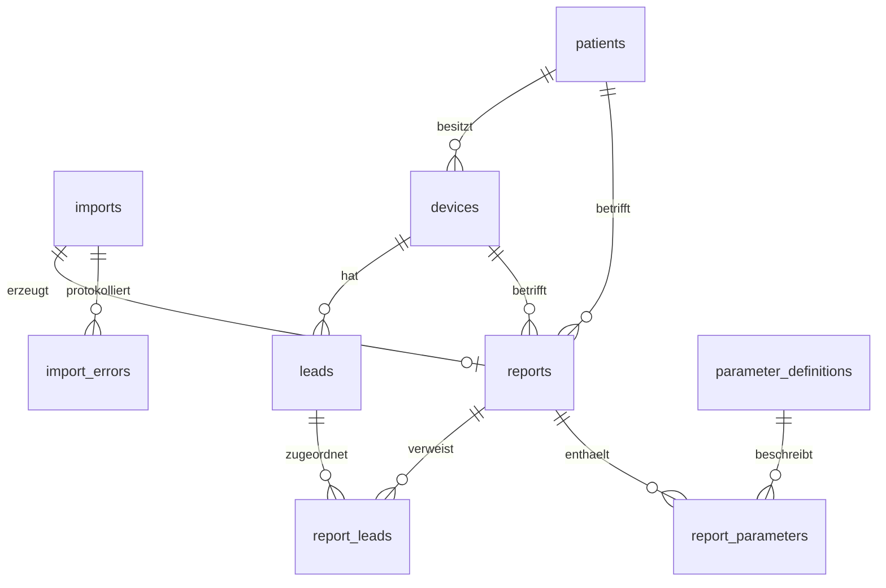

# HSM2Med – Herzschrittmacher-Auslesedaten (Abbott/St. Jude Merlin)

HSM2Med ist eine vollständig offline lauffähige Webanwendung, die Exportdateien aus dem
Abbott/St. Jude **Merlin**-Programmiergerät importiert, strukturiert darstellt, als
unveränderliche Berichte in MySQL speichert und daraus PDF-Berichte erzeugt – auch für
historische Auslesungen, ausschließlich aus der Datenbank.

> **Wichtig:** Die Anwendung führt **keine medizinische Bewertung** durch. Alle Werte werden
> exakt so angezeigt und gespeichert, wie sie in der Quelldatei stehen. Diagnose- und
> Therapieentscheidungen sind ausschließlich Aufgabe des ärztlichen Personals.


## Inhalt

1. [Funktionsumfang](#funktionsumfang)
2. [Installation](#installation)
3. [Konfiguration (.env)](#konfiguration-env)
4. [Start, Stopp, Aktualisierung](#start-stopp-aktualisierung)
5. [Offline-Betrieb](#offline-betrieb)
6. [Bedienung der Weboberfläche](#bedienung-der-weboberfläche)
7. [Patientenausweis erstellen](#patientenausweis-erstellen)
8. [Kommandozeile (CLI)](#kommandozeile-cli)
9. [Importformat](#importformat)
10. [Parserverhalten und Fehlerbehandlung](#parserverhalten-und-fehlerbehandlung)
11. [Datenmodell, Snapshots und Versionierung](#datenmodell-snapshots-und-versionierung)
12. [PDF-Berichte](#pdf-berichte)
13. [Parameterzuordnung erweitern](#parameterzuordnung-erweitern)
14. [Sicherheitskonzept](#sicherheitskonzept)
15. [Datenschutz](#datenschutz)
16. [Tests](#tests)
17. [Screenshots für die Dokumentation](#screenshots-für-die-dokumentation)
18. [Backup und Wiederherstellung](#backup-und-wiederherstellung)
19. [Fehlerbehebung](#fehlerbehebung)
20. [Projektstruktur](#projektstruktur)

## Funktionsumfang

- Upload von Merlin-Exportdateien (`.txt`/`.log`) mit Prüfung **vor** dem Speichern
  (Vorschau mit Patient, Gerät, Sonden, Kategorien, Warnungen und Fehlern).
- Verlustfreier Parser: Feldtrenner ist ausschließlich ASCII 0x1C (File Separator);
  Werte, leere Felder, Einheiten, Dezimalzahlen und Datumsangaben bleiben unverändert.
- Speicherung jedes Imports als **unveränderlicher Bericht** (Snapshot) in MySQL in
  einer einzigen Transaktion – bei Fehlern vollständiger Rollback.
- Dublettenerkennung per SHA-256 (erneuter Import nur nach expliziter Bestätigung).
- Berichtsübersicht mit Suche (Freitext, Patient, Patienten-ID, Seriennummer, Modell,
  Dateiname, Zeitraum), Importprotokoll und Systemstatus.
- PDF-Berichte (eigene, abhängigkeitsfreie PDF-Erzeugung) – optional mit
  Rohdatenanhang, jederzeit reproduzierbar aus der Datenbank.
- **Patientenausweis** (zwei Seiten DIN A4) aus einem importierten Bericht: Assistent in sechs
  Schritten, Identitätsprüfung über Nachname + Vorname + Geburtsdatum, Konfliktentscheidung je
  Feld, zwei ausdrückliche Bestätigungen, unveränderliche PDF-Snapshots und Historie.
- Globale Stammdaten für den Ausweis (Logo, Nachsorgezentrum, Hinweis- und
  Flugsicherheitstexte) mit eigener Fassung je Ausweis.
- CLI für Import, PDF-Export, Migrationen und Schema-Erzeugung.
- Keine externen Abhängigkeiten zur Laufzeit: kein CDN, keine Webfonts, keine Composer-Pakete.

Technik: PHP 8.5 (nativ, `strict_types`, PDO), MySQL 9.7, Apache, Docker Compose.

## Installation

Voraussetzungen: Docker Engine mit Docker Compose v2.

```sh
git clone <repository> hsm2med
cd hsm2med
cp .env.example .env          # danach Passwörter in .env ändern!
docker compose up -d --build
```

Die Oberfläche ist anschließend unter <http://127.0.0.1:8080> erreichbar
(standardmäßig **nur lokal**, siehe `WEB_BIND_ADDRESS`). Beim Start des Web-Containers
werden ausstehende Datenbankmigrationen automatisch ausgeführt.

Statusprüfung: `curl http://127.0.0.1:8080/health` → `{"status":"ok","database":"ok"}`.

Alternativ kann das Schema ohne Migrator eingespielt werden:
`docker compose exec -T db sh -c 'exec mysql -u root -p"$MYSQL_ROOT_PASSWORD" hsm2med' < database/schema.sql`.
`database/schema.sql` wird mit `php bin/build-schema.php` aus den Migrationen erzeugt
(ein Test stellt sicher, dass beide identisch sind).

## Konfiguration (.env)

| Variable | Standard | Bedeutung |
|---|---|---|
| `DB_HOST`, `DB_PORT` | `db`, `3306` | Datenbankserver |
| `DB_DATABASE`, `DB_USERNAME` | `hsm2med` | Datenbank und Anwendungsbenutzer |
| `DB_PASSWORD` | – (Pflicht) | Passwort des Anwendungsbenutzers |
| `DB_ROOT_PASSWORD` | – (Pflicht) | MySQL-Root-Passwort (Initialisierung, Backups) |
| `APP_ENV` | `production` | `production`, `development` oder `testing`; Fehlerdetails nur außerhalb von `production` |
| `APP_TIMEZONE` | `Europe/Berlin` | Zeitzone für Zeitstempel |
| `UPLOAD_MAX_SIZE` | `5M` | Maximale Uploadgröße (Bytes oder `K`/`M`/`G`); PHP-Limits werden beim Start daraus abgeleitet |
| `PDF_RAW_APPENDIX_DEFAULT` | `0` | Rohdatenanhang im PDF standardmäßig anfügen |
| `SESSION_SECURE_COOKIE` | `0` | `1` setzen, wenn ein HTTPS-Reverse-Proxy vorgeschaltet ist |
| `WEB_BIND_ADDRESS`, `WEB_PORT` | `127.0.0.1`, `8080` | Adresse/Port auf dem Host |

`.env` enthält Zugangsdaten und darf nicht eingecheckt werden (steht in `.gitignore`).

## Start, Stopp, Aktualisierung

```sh
docker compose up -d            # starten
docker compose ps               # Status (inkl. Healthcheck)
docker compose logs -f web      # Protokolle
docker compose down             # stoppen (Daten bleiben in den Volumes erhalten)
docker compose up -d --build    # nach einer Aktualisierung neu bauen; Migrationen laufen automatisch
```

Persistente Daten liegen in Docker-Volumes:

| Volume | Inhalt |
|---|---|
| `hsm2med_mysql_data` | MySQL-Datenbank (Berichte, Parameter, Importprotokoll) |
| `hsm2med_import_data` | Archiv der Originaldateien (`<sha256>.txt`, schreibgeschützt) |
| `hsm2med_application_data` | Anwendungsprotokoll, Sessions, zwischengespeicherte Uploads |

## Offline-Betrieb

Zur Laufzeit wird kein Internetzugang benötigt: Alle Assets (CSS/JS) liegen lokal, PDFs
nutzen die PDF-Standardschriften, es gibt keine externen Aufrufe. Das Datenbanknetz
(`backend`) ist als `internal` konfiguriert.

Installation auf einem Rechner ohne Internet:

```sh
# auf einem Rechner mit Internet
docker compose build
docker pull mysql:9.7
docker save -o hsm2med-images.tar hsm2med-web:latest mysql:9.7
# Datei und Projektverzeichnis auf den Zielrechner kopieren, dort:
docker load -i hsm2med-images.tar
cp .env.example .env   # Passwörter setzen
docker compose up -d   # ohne --build
```

## Bedienung der Weboberfläche

| Bereich | Beschreibung |
|---|---|
| **Dashboard** | Kennzahlen und zuletzt importierte Berichte |
| **Import** | Datei wählen → *Datei prüfen* → Vorschau → *Import endgültig speichern* oder *Verwerfen* |
| **Berichte** | Liste und Suche; Detailansicht mit Patient, Gerät, Sonden, Kategorien, Importprotokoll und Originaldaten |
| **Importprotokoll** | Alle Importe inkl. fehlgeschlagener, mit Warnungen/Fehlern je Datensatz |
| **Systeminformationen** | Versionen, Datenbank- und Migrationsstatus, Limits |

**1. Upload und Prüfung** – die Datei wird validiert und analysiert, aber noch nicht gespeichert:


**2. Dubletten und ungültige Dateien** – eine bereits importierte Datei kann nur nach
ausdrücklicher Bestätigung erneut importiert werden; Dateien ohne Merlin-Format werden abgelehnt:


**3. Berichte** – Übersicht mit Suchfiltern und Detailansicht mit den Schaltflächen
*PDF anzeigen*, *PDF herunterladen* und *PDF mit Rohdatenanhang*:


**4. Importprotokoll und Systemstatus:**


## Patientenausweis erstellen

Der Patientenausweis ist ein zweiseitiges DIN-A4-PDF („Schrittmacher - Patientenausweis" /
„Patient Identification Card"), das aus einem bereits importierten Nachsorgebericht erzeugt
wird. Es werden **keine** medizinischen Bewertungen abgeleitet oder ergänzt: übernommen werden
nur Patient, Gerät, Sonden, Mess- und Nachsorgeangaben aus dem Bericht sowie die Angaben, die
im Assistenten erfasst werden.

### Ablauf

**1. Stammdaten pflegen** (`/patient-cards/settings`) – Logo (PNG/JPEG, max. 1 MiB und
2000 px Kantenlänge), Nachsorgezentrum mit Anschrift sowie die drei Texte (Hinweise,
Achtung Flugsicherheit auf Deutsch, Attention Airline Security auf Englisch). Jede Speicherung
erzeugt eine neue, unveränderliche Fassung; das Logo wird über seinen SHA-256 erkannt und nicht
mehrfach gespeichert. Die Texte sind nicht im PDF-Generator hinterlegt, sondern werden je
Ausweis mitgespeichert.


**2. Bericht wählen** (`/patient-cards/new` bzw. Schaltfläche *Patientenausweis erstellen* in
der Berichtsansicht):


**3. Assistent in sechs Schritten** (`/patient-cards/reports/{id}`) – Schritt 1 Patient
identifizieren, 2 Patientendaten ergänzen, 3 Notfallkontakt, 4 Hausarzt, 5 Nachsorge und
Kontrolle, 6 Zusammenfassung und Bestätigung:


Ohne JavaScript sind alle sechs Abschnitte gleichzeitig sichtbar und absendbar; mit
JavaScript wird je Schritt umgeschaltet. Verbindlich ist immer die serverseitige Prüfung:
bei Fehlern antwortet der Server mit HTTP 422 und springt zu dem Schritt, in dem der erste
Fehler steht.

**4. Zusammenfassung und zwei Bestätigungen** – der Ausweis wird nur erzeugt, wenn beide
Häkchen ausdrücklich gesetzt sind („Ja, dies ist der richtige Patient." **und** „Ich
bestätige, dass die angezeigten Daten zum richtigen Patienten gehören und zusammengeführt
werden dürfen."):


**5. Konflikte** – stimmen bereits gespeicherte Angaben nicht mit den neuen Eingaben überein,
zeigt der Assistent beide Werte nebeneinander und verlangt für **jedes** Feld eine
Entscheidung (*neuer Wert* oder *gespeicherter Wert*). Nichts wird stillschweigend
überschrieben; ohne Entscheidung wird nichts gespeichert:


**6. Ergebnis** – Ausweisdetail mit Download von Ausweis-PDF und Ausgangsbericht, plus
Ausweisübersicht, Patientensicht und Ausweisübersicht am Bericht:


### Identität des Patienten

Ein Patient wird ausschließlich über **Nachname + Vorname + Geburtsdatum** zugeordnet
(`patients.identity_key`). Seriennummer, Patienten-ID, Import-ID oder Berichts-ID dienen nie
als alleiniges Merkmal. Ergebnis: kein Treffer → neuer Patient, ein Treffer → dieser Patient
wird verwendet, mehrere Treffer → der Benutzer muss den Patienten ausdrücklich auswählen.

### Unveränderliche Ausweise und Historie

- Das PDF wird als Blob mit SHA-256 und Größe im Datensatz gespeichert und danach nur noch
  ausgeliefert – es wird nie neu berechnet.
- Jeder Ausweis verweist auf die beim Erzeugen gültige Stammdatenfassung. Spätere Änderungen an
  Logo, Nachsorgezentrum, Hinweistexten, Patientendaten oder weiteren Importen verändern
  bestehende Ausweise nicht.
- Für jeden Bericht können mehrere Ausweisfassungen existieren (`card_version`); jede Fassung
  bleibt erhalten. Die Berichtsansicht listet alle Fassungen mit PDF-Link und Verlauf, die
  Patientensicht zusätzlich alle Nachsorgeuntersuchungen des Patienten (Seite 2 des Ausweises,
  gespeist aus den unveränderlichen Bericht-Snapshots; die aktuelle Untersuchung ist immer
  enthalten).
- Dateiname: `Patientenausweis_<Nachname>_<Vorname>_<Datum>[_Nr<laufende Nummer>].pdf`.

### Routen

| Methode | Pfad | Zweck |
|---|---|---|
| GET | `/patient-cards` | Übersicht mit Suche (Patient, Dateiname, Seriennummer) |
| GET | `/patient-cards/new` | Bericht für einen neuen Ausweis wählen |
| GET | `/patient-cards/reports/{id}` | Assistent (Schritt über `?step=1..6`) |
| POST | `/patient-cards/reports/{id}` | Ausweis erzeugen (CSRF, beide Bestätigungen) |
| GET | `/patient-cards/{id}` | Ausweisdetail mit Verlauf |
| GET | `/patient-cards/{id}/pdf` | Ausweis-PDF (inline, `?download=1` als Download) |
| GET | `/patient-cards/patients/{patient}` | Alle Ausweise und Nachsorgeuntersuchungen |
| GET | `/patient-cards/settings` | Stammdaten (Logo, Nachsorgezentrum, Texte) |
| POST | `/patient-cards/settings` | Stammdaten speichern (neue Fassung) |
| GET | `/patient-cards/settings/logo` | Hinterlegtes Logo ausliefern |

### PDF-Seiten


Seite 1: Kopfbereich mit Logo, Ausweistitel, Patientendaten (Identitätsangaben), Notfallkontakt,
Hausarzt, betreuendem Nachsorgezentrum, Implantate-/Elektroden-Tabellen (Modell, Impl.Ort bzw.
Lokalisation, Impl.Datum), Hinweis- und Flugsicherheitstexten (deutsch/englisch) sowie dem
Abschlussblock „Sonstiges/Bemerkung/Arzt/Nächste Kontrolle in“ mit Code-39-Barcode der
Patient-ID. Aufbau, Reihenfolge und Beschriftungen folgen der Vorlage `.reference/idcard_ann.png`
(Schwarz auf Weiß, ohne rotes Achtung-Feld).


Seite 2: medizinisch-technische Angaben aus dem Bericht sowie „Nachsorgeuntersuchungen" mit
Datum und – soweit ableitbar – Bericht, Arzt und Zentrum aus den gespeicherten Snapshots. Die
aktuelle Untersuchung (der Bericht, auf dem der Ausweis beruht) steht immer an erster Stelle,
danach folgen die früheren Untersuchungen des Patienten. Reicht der Platz nicht, bricht die
Erzeugung mit einer klaren Meldung ab, statt Inhalte abzuschneiden; die Ausgabe erfolgt
ausschließlich über den eigenen, abhängigkeitsfreien PDF-Writer.

## Kommandozeile (CLI)

Alle Befehle laufen im Web-Container. Als Benutzer `www-data` ausführen, damit Archiv- und
Protokolldateien die richtigen Eigentümer erhalten. Dateien müssen im Container liegen:

```sh
# Import (Datei zuerst in den Container kopieren)
docker compose cp ./MERLIN_export.log web:/tmp/export.log
docker compose exec -u www-data web php bin/import.php /tmp/export.log --dry-run   # nur prüfen
docker compose exec -u www-data web php bin/import.php /tmp/export.log             # importieren
docker compose exec -u www-data web php bin/import.php /tmp/export.log --force     # Dublette erzwingen

# PDF-Export eines gespeicherten Berichts (nur aus der Datenbank)
docker compose exec -u www-data web php bin/export-pdf.php 1 /tmp/bericht-1.pdf --raw
docker compose cp web:/tmp/bericht-1.pdf ./bericht-1.pdf

# Migrationen manuell ausführen
docker compose exec -u www-data web php bin/migrate.php
```

Exit-Codes `import.php`: `0` Erfolg, `1` Import fehlgeschlagen, `2` Aufruffehler, `3` Dublette.

## Importformat

Merlin-Exportdateien bestehen aus Datensätzen mit vier Feldern, die jeweils mit dem
Steuerzeichen **0x1C** (ASCII File Separator, „FS“) abgeschlossen werden:

```
<Parameter-ID>FS<Bezeichnung>FS<Wert>FS<Einheit>FS<Zeilenumbruch>
```

Beispiel (FS als `␜` dargestellt):

```
202␜Device Serial Number␜5809481␜␜
302␜Base Rate␜60␜bpm␜
2431␜Patient Date of Birth␜10/21/1938 00:00:00␜␜
```

- Parameter-IDs sind Ziffernfolgen des **Merlin-Quellformats**. Sie sind **keine**
  standardisierten Codes (z. B. IEEE 11073 oder LOINC); eine Zuordnung zu Standards wird
  nicht behauptet und nur bei expliziter Dokumentation in `standard_codes` hinterlegt.
- Datumswerte liegen im US-Format `MM/DD/YYYY hh:mm:ss` vor. Angezeigt wird zusätzlich
  `TT.MM.JJJJ`; gespeichert bleibt immer der Originaltext.
- Unterstützte Kodierungen: UTF-8 (mit/ohne BOM), UTF-16 mit BOM, sonst Windows-1252 bzw.
  ISO-8859-1 (Fallback mit Warnung). Zeilenumbrüche CRLF, LF und CR werden akzeptiert.

## Parserverhalten und Fehlerbehandlung

- Getrennt wird **ausschließlich** an 0x1C; Tabulatoren, Semikolons, Kommas usw. sind
  normale Zeichen. Werte werden nicht gerundet, konvertiert oder getrimmt (lediglich
  Zeilenumbrüche vor der ID werden entfernt).
- Leere Werte und Einheiten bleiben leere Zeichenketten (niemals `NULL` oder `0`).
- Unbekannte Parameter werden vollständig übernommen (Kategorie „Sonstige / Nicht kategorisiert“).
- Mehrfach vorkommende IDs werden alle gespeichert (Warnung `duplicate_parameter_id`).
- Fehlerhafte Datensätze werden protokolliert und übersprungen; gültige Datensätze werden
  importiert (Status `completed_with_errors`).

| Code | Art | Bedeutung |
|---|---|---|
| `empty_file` | Fehler (blockiert) | Datei ist leer |
| `no_separator` | Fehler (blockiert) | Kein 0x1C enthalten – kein Merlin-Export |
| `invalid_parameter_id` | Fehler | ID ist keine Ziffernfolge – Datensatz übersprungen |
| `incomplete_record` | Fehler | Datensatz hat weniger als vier Felder |
| `unterminated_record` | Fehler | Unvollständiger Rest am Dateiende |
| `missing_final_separator` | Warnung | Letzter Trenner fehlt |
| `empty_parameter_name` | Warnung | Leere Bezeichnung |
| `line_break_in_field`, `nul_in_field` | Warnung | Steuerzeichen im Feld |
| `encoding_fallback` | Warnung | Kein gültiges UTF-8, Fallback-Kodierung genutzt |
| `duplicate_parameter_id` | Warnung | ID mehrfach vorhanden |
| `missing_device_serial`, `missing_patient`, `unparsed_date` | Warnung | Stammdaten fehlen bzw. Datum nicht erkannt |

Importstatus: `completed`, `completed_with_warnings`, `completed_with_errors`, `failed`.
Fehlgeschlagene Importe werden mit Grund im Importprotokoll gespeichert.

## Datenmodell, Snapshots und Versionierung



- **reports** enthält Snapshots aller Kopfdaten (Patient, Gerät, Zeitstempel als Original
  und normalisiert) sowie `summary_snapshot` (JSON) mit Patienten-, Geräte- und Sondendaten
  zum Importzeitpunkt.
- **report_parameters** speichert jeden Datensatz unverändert (ID, Bezeichnung, Wert,
  Einheit, Rohdatensatz, Position) **inklusive** der Kategorie zum Importzeitpunkt.
- **patients/devices/leads** sind Stammdaten zur Verknüpfung; sie werden nur ergänzt,
  nie überschrieben. Historische Berichte verwenden ausschließlich ihre Snapshots.
- Alle Fremdschlüssel verwenden `ON DELETE RESTRICT`; Berichte werden nicht gelöscht.
- Jeder Bericht speichert `report_version`, `parser_version` und `mapping_version`.
  Die PDF-Erzeugung wählt das Layout anhand der `report_version`. Eine Änderung der
  Zuordnung erzeugt eine neue `mapping_version` und betrifft nur künftige Importe.
- `parameter_count` wird beim Laden geprüft: Abweichungen führen zu einem Fehler statt
  zu einem unvollständigen Bericht.
- Schemaänderungen erfolgen ausschließlich über neue Dateien in `database/migrations/`
  (eine Prüfsumme verhindert nachträgliche Änderungen angewendeter Migrationen); danach
  `php bin/build-schema.php` ausführen.

## PDF-Berichte

| Seite 1 | Seite 2 |
|---|---|
|  |  |

- Inhalt: Titel mit Hinweis „keine medizinische Bewertung“, Berichtsdaten, Patient, Gerät,
  Sonden, alle Parameter nach Kategorien (ID, Parameter, Wert, Einheit), Importprotokoll,
  optional Rohdatenanhang (Originaldatensätze in Dateireihenfolge, fehlerhafte markiert).
- Kopfzeile ab Seite 2 mit Bericht, Patient und Gerät; Fußzeile mit „Seite X von Y“,
  Erstellungszeitpunkt und Berichtsversion; Tabellenköpfe werden auf Folgeseiten wiederholt.
- Zeichen außerhalb von Windows-1252 werden als `[U+XXXX]`, Steuerzeichen als `[0xNN]`
  dargestellt – nichts wird stillschweigend entfernt.
- Erzeugung ausschließlich aus der Datenbank; die Originaldatei wird nicht benötigt.
- Dateiname: `Bericht_<Nr>_<Datum>_SN<Seriennummer>.pdf`.
- Aufruf: `/reports/<id>/pdf` (`?raw=1` mit Rohdatenanhang, `?download=1` als Download).

## Parameterzuordnung erweitern

Die Zuordnung steht in `config/parameter_mapping.php`:

- `categories` – Kategorien mit Bezeichnung und Sortierung.
- `by_id` – Zuordnung Merlin-ID → Kategorie (höchste Priorität).
- `by_name` / `name_patterns` – Zuordnung über Bezeichnung bzw. reguläre Ausdrücke.
- `fields` / `lead_fields` – welche IDs Kopf- und Sondendaten liefern.
- `standard_codes` – nur **explizit dokumentierte** Zuordnungen zu Standardcodes (leer).

Nach jeder inhaltlichen Änderung `version` erhöhen und den Web-Container neu bauen
(`docker compose up -d --build`). Bestehende Berichte bleiben unverändert.

## Sicherheitskonzept

- **Netz:** standardmäßig nur an `127.0.0.1` gebunden; Datenbank nur im internen Netz.
  Für Zugriff im Praxisnetz einen Reverse-Proxy mit TLS vorschalten und
  `SESSION_SECURE_COOKIE=1` setzen. Die Anwendung enthält **keine Benutzerverwaltung** –
  der Zugriff ist über Netzwerk bzw. Proxy (z. B. Basic-Auth, Client-Zertifikate) zu beschränken.
- **Uploads:** Größenlimit, nur `.txt`/`.log`, Inhaltsprüfung (Magic Bytes, MIME-Typ,
  0x1C-Pflicht, NUL-Anteil), bereinigte Dateinamen; Uploads werden außerhalb des Webroots
  unter zufälligem Token zwischengespeichert (Gültigkeit 1 h), das Archiv ist schreibgeschützt.
- **Web:** CSRF-Token für alle POST-Anfragen, Session-Cookies `HttpOnly`/`SameSite=Strict`,
  regelmäßige Erneuerung der Session-ID, strikte Content-Security-Policy ohne
  Inline-Skripte, `X-Frame-Options: DENY`, `nosniff`, `no-referrer`, kein Caching.
- **Daten:** ausschließlich vorbereitete Statements, strikter SQL-Modus, Ausgabe-Escaping
  aller Werte, nur lokale Weiterleitungen.
- **Fehler:** in `production` keine technischen Details im Browser, nur eine Referenz-ID;
  Details stehen im Anwendungsprotokoll (`/var/www/storage/logs/app.log`).

## Datenschutz

Die verarbeiteten Daten sind Gesundheitsdaten (Art. 9 DSGVO). Betreiber sind verantwortlich
für Zugriffsschutz, Verschlüsselung von Datenträgern und Backups, Lösch- und
Aufbewahrungsfristen sowie das Verzeichnis der Verarbeitungstätigkeiten.
Die Anwendung überträgt keine Daten nach außen. Für Tests und Screenshots wird
ausschließlich die anonymisierte Beispieldatei (`tests/fixtures/merlin_sample.log`) verwendet.
Protokolldateien enthalten technische Meldungen, aber keine Parameterwerte.

## Tests

```sh
docker compose --profile test run --rm tests                            # alle Tests
docker compose --profile test run --rm tests php tests/run.php Parser   # nur passende Testklassen
docker compose --profile test down                                      # Testdatenbank entfernen
```

Die Tests verwenden einen eigenen Testrunner (`tests/run.php`) und eine separate,
flüchtige MySQL-Instanz (`db-test`, Daten im RAM). Abgedeckt sind u. a.:

- **Parser (1–12):** Normalformat, 0x1C als einziger Trenner, leere Werte/Einheiten,
  Dezimal- und Prozentwerte, Datumswerte, Sonderzeichen, unbekannte Parameter,
  fehlerhafte Datensätze, lange Bezeichnungen, Zeilenumbrüche, Referenzdatei.
- **Datenbank (13–18):** erfolgreicher Import, Rollback, Fremdschlüssel,
  vollständige und unveränderte Parameter, Neuladen, Unveränderlichkeit historischer
  Berichte, außerdem Dubletten, Suche, Schema und Migrationen.
- **PDF (19–24):** Erzeugung, Mehrseitigkeit, Sonderzeichen, lange Tabellen, unbekannte
  Parameter, PDF aus der Datenbank ohne Originaldatei.
- Zusätzlich: Zuordnung/Zusammenfassung, Uploadprüfung, Escaping, Weiterleitungen,
  Upload-Zwischenspeicher, Konfiguration.
- **Patientenausweis:** Namenszerlegung und Identitätsschlüssel, Eingabeprüfung,
  Logo-Prüfung, PDF-Layout (Seitenzahl, Seitenumbruch), Erzeugung aus einem Bericht,
  Konflikterkennung, Unveränderlichkeit bestehender Ausweise.
- **Oberflächen (Integration):** Die Templates werden mit den echten Controllern gerendert
  (`tests/Integration/PatientCardViewTest.php`). Damit fallen Fehler in der HTML-Schicht
  (fehlende Template-Variablen, unbekannte Klassen, unvollständige Formulare, fehlende
  CSRF-Felder) im Test auf – `php -l` erkennt sie nicht.

## Screenshots für die Dokumentation

Die Bilder in `docs/screenshots/` werden automatisiert mit Docker erzeugt
(Playwright/Chromium für die Weboberfläche, `pdftoppm` für die PDF-Seiten). Dabei läuft
eine eigene, flüchtige Instanz (`db-docs`, `web-docs`); Produktivdaten werden nicht berührt:

```sh
docker compose --profile docs run --rm screenshots
docker compose --profile docs down
```

Das Skript liegt in `docs/screenshots/capture.py`. Es legt Beispieldaten an (Import der
Testdatei, Stammdaten mit Beispiel-Logo, Patientenausweis) und erzeugt daraus die Bilder
`01`–`22`, darunter Assistent, Konfliktdialog und beide Seiten des Ausweis-PDF. Der Build des
Screenshot-Images benötigt einmalig Internetzugang; für den Betrieb der Anwendung ist er nicht
erforderlich. `web-docs` bindet das Projektverzeichnis nicht ein – nach Änderungen an
Templates oder `src/` ist `docker compose build web` erforderlich.

## Backup und Wiederherstellung

Zu sichern sind die **Datenbank** und das **Importarchiv** (optional die Anwendungsdaten).

```sh
# Datenbank (konsistent, ohne Sperren)
docker compose exec -T db sh -c 'exec mysqldump -u root -p"$MYSQL_ROOT_PASSWORD" --single-transaction --routines --triggers --default-character-set=utf8mb4 --databases hsm2med' > backup-hsm2med-$(date +%F).sql

# Importarchiv und Anwendungsdaten
docker run --rm -v hsm2med_import_data:/data:ro -v "$PWD":/backup alpine tar czf /backup/import_data-$(date +%F).tar.gz -C /data .
docker run --rm -v hsm2med_application_data:/data:ro -v "$PWD":/backup alpine tar czf /backup/application_data-$(date +%F).tar.gz -C /data .
```

Wiederherstellung:

```sh
docker compose up -d db
docker compose exec -T db sh -c 'exec mysql -u root -p"$MYSQL_ROOT_PASSWORD"' < backup-hsm2med-JJJJ-MM-TT.sql
docker run --rm -v hsm2med_import_data:/data -v "$PWD":/backup alpine sh -c 'tar xzf /backup/import_data-JJJJ-MM-TT.tar.gz -C /data && chown -R 33:33 /data'
docker compose up -d
```

Backups enthalten Gesundheitsdaten: verschlüsselt ablegen und die Wiederherstellung
regelmäßig testen. Achtung: `docker compose down -v` löscht **alle** Volumes und damit
sämtliche Daten.

## Fehlerbehebung

| Problem | Lösung |
|---|---|
| `DB_PASSWORD muss in .env gesetzt sein` | `.env` aus `.env.example` anlegen |
| Web-Container startet nicht / „unhealthy“ | `docker compose logs web db`; die Datenbank braucht beim ersten Start länger |
| `exec ... entrypoint.sh: no such file or directory` | Zeilenenden: Repository mit LF auschecken (`.gitattributes`), Image neu bauen |
| „Migration wurde nach dem Anwenden verändert“ | Angewendete Migrationen nie ändern – neue Migration anlegen |
| Upload abgelehnt (Größe) | `UPLOAD_MAX_SIZE` erhöhen, Container neu starten |
| Upload abgelehnt (Format) | Datei muss 0x1C-Trenner enthalten und auf `.txt`/`.log` enden |
| „Ungültiges Sicherheitstoken“ | Seite neu laden (Session abgelaufen) |
| Fehlerseite mit Referenz | Referenz in `docker compose exec web cat /var/www/storage/logs/app.log` suchen |
| Port belegt | `WEB_PORT` in `.env` ändern |

## Projektstruktur

```
bin/                 CLI: import, export-pdf, migrate, build-schema, php-limits
config/              parameter_mapping.php (Kategorien, Feldzuordnung)
database/            migrations/ (maßgeblich) und schema.sql (generiert)
docker/              Apache-/PHP-Konfiguration, Entrypoint
docs/screenshots/    Screenshots und Erzeugungsskript (Playwright)
public/              Webroot: index.php, assets/ (CSS, JS)
src/                 Anwendungscode (Namespace App\)
  Http/              Kernel, Router, Controller, View
  Import/            Parser, Validierung, ImportService, Archiv
  Mapping/           Parameterzuordnung
  Report/            Berichtsdaten, Zusammenfassung, PDF (Pdf/)
  Repository/        Datenbankabfragen
  Security/          Session, CSRF, Uploadprüfung
templates/           PHP-Templates (HTML)
tests/               Testrunner, Unit-/Integrationstests, Fixtures
```
