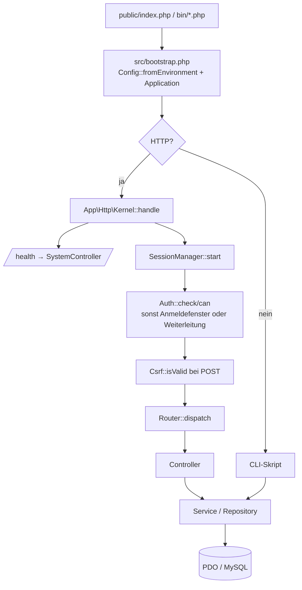
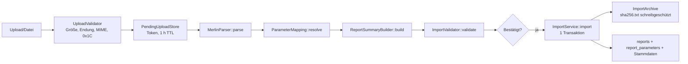

# agentsindex.md – Übersicht für Coding-Agenten

> **Zweck:** Dieser Index gibt Coding-Agenten (und neuen Entwicklern) einen vollständigen,
> strukturierten Überblick über Funktionen, Architektur und Workflow dieses Repositorys,
> damit sie schnell und korrekt Änderungen vornehmen können. Alle Pfadangaben sind relativ
> zum Repository-Root.

---

## 0. Schnellüberblick (Überblock)

**HSM2Med** ist eine vollständig offline lauffähige Webanwendung, die Exportdateien von
Herzschrittmachern/ICDs importiert – Abbott/St. Jude **Merlin** (`.txt`/`.log`, 0x1C-getrennt)
und **Biotronik** als XML nach IEEE 11073-10103 (`.xml`) – verlustfrei in MySQL als unveränderlichen
Bericht-Snapshot speichert und daraus PDF-Berichte erzeugt – ausschließlich aus der Datenbank.

| Frage | Antwort |
|---|---|
| Sprache/Stack | PHP 8.5 (nativ, `strict_types`), PDO/MySQL, Apache, Vanilla CSS/JS |
| Datenbank | MySQL 9.7, InnoDB, utf8mb4 – Schema in `database/migrations/` |
| Frameworks | **keine** – kein Composer-Paket, kein npm, kein CDN, keine Webfonts |
| Einstiegspunkt Web | `public/index.php` → `src/bootstrap.php` → `App\Http\Kernel` |
| Einstiegspunkt CLI | `bin/*.php` → jeweils `require src/bootstrap.php` |
| Namensraum | `App\` → `src/` (PSR-4, zusätzlich eigener Fallback-Autoloader) |
| Start | `cp .env.example .env` (Passwörter setzen) → `docker compose up -d` |
| Anmeldung | Pflicht für jede Seite; Gruppen *Admin*/*MFA*/*Arzt*, Rechte je Gruppe (`App\User\Permission`) |
| Administrator | `ADMIN_USERNAME`/`ADMIN_PASSWORD` aus `.env`, gesetzt von `bin/seed-admin.php` |
| Test | `docker compose --profile test run --rm tests` |
| Screenshots | `docker compose --profile docs run --rm screenshots` |
| Log | `storage/logs/app.log` (Volume `hsm2med_application_data`) |
| Healthcheck | `GET /health` → `{"status":"ok","database":"ok"}` |

**Harte Regeln – nie brechen:**

1. **Keine medizinische Bewertung.** Werte werden nie interpretiert, gerundet, konvertiert
   oder normalisiert – sie werden exakt so gespeichert und angezeigt wie in der Quelldatei.
2. **Merlin: Trenner ist ausschließlich 0x1C** (ASCII File Separator). Nie an Tab, Semikolon,
   Komma oder Zeilenumbruch trennen. Biotronik-XML wird über `<value>`-Knoten gelesen – die
   Trennerprüfung entfällt dort (`.xml` + Wurzelelement `<biotronik-ieee11073-export>`).
3. **Leere Werte/Einheiten bleiben `''`**, niemals `NULL` oder `0`.
4. **Berichte sind unveränderlich.** Historische Berichte nie umschreiben; Layout-Änderungen
   laufen über `report_version`, Zuordnungs-Änderungen über `mapping_version`.
5. **Angewendete Migrationen nie ändern** (Prüfsumme). Immer neue Datei in
   `database/migrations/` + `php bin/build-schema.php`.
6. **Keine neuen Laufzeit-Abhängigkeiten** (kein Composer-/npm-Paket, kein CDN).
7. **Keine Zugangsdaten im Code** – Konfiguration ausschließlich über Umgebungsvariablen.
8. Alle POST-Anfragen brauchen ein gültiges CSRF-Token; alle Ausgaben über `$e(...)` escapen.
9. **Patientenidentität nur über Nachname + Vorname + Geburtsdatum** (`patients.identity_key`).
   Seriennummer, Patienten-ID, Import-ID und Berichts-ID sind nie alleiniges Merkmal; bei
   mehreren Treffern entscheidet der Benutzer.
10. **Ausweise und Stammdatenfassungen sind unveränderlich.** Bestehende Ausweis-PDFs werden nie
    neu berechnet; jede Änderung erzeugt eine neue `card_version` bzw. Stammdatenfassung.
11. **Briefe betten ihre Vorlage ein.** Der Snapshot eines Briefes (`letter_version` 2) enthält die
    vollständige Vorlagenfassung (`template.content`); gerendert wird nur daraus, nie aus der
    aktuellen Vorlage. Vorlagenfassungen (`letter_template_versions`) werden nie geändert –
    Speichern legt immer eine neue Fassung an. Briefe der Fassung 1 laufen über
    `LegacyLetterPdfGenerator` und behalten ihren Aufbau.
12. **Jede Anfrage ist angemeldet und berechtigt.** Neue Routen bekommen in `Kernel::router()`
    ein Recht aus `App\User\Permission`; die Oberfläche leitet dasselbe Recht über
    `View::permitted()` ab, damit Sperre und Anzeige nie auseinanderlaufen. Kennwörter liegen
    **nur** als `password_hash()` in der Datenbank; der Administrator kommt ausschließlich aus
    `ADMIN_USERNAME`/`ADMIN_PASSWORD` (`.env`), nie aus dem Quelltext.
13. **Ausweise betten ihre Vorlage ein.** Der Snapshot eines Ausweises enthält die vollständige
    Ausweisvorlagenfassung (`snapshot.template.content`) und `patient_cards.template_version_id`;
    `PatientCardPdfGenerator` rendert nur daraus, nie aus der aktuellen Vorlage. Fassungen
    (`patient_card_template_versions`) werden nie geändert – Speichern legt immer eine neue an.
    Ausweise ohne Vorlage (vor Migration 014) behalten ihren festen Aufbau.

---

## 1. Was ist das Projekt?

HSM2Med verarbeitet Auslesedaten von Herzschrittmachern/ICDs aus dem Abbott/St. Jude
**Merlin**-Programmiergerät und aus **Biotronik**-XML-Exporten (IEEE 11073-10103,
`BioICSConverter`). Funktionsumfang:

- **Import** von Exportdateien mit Prüfung **vor** dem Speichern:
  Upload → Analyse → Vorschau (Patient, Gerät, Sonden, Kategorien, Warnungen, Fehler) →
  endgültiges Speichern oder Verwerfen. Erkannt werden Merlin-Textexporte (`.txt`/`.log`)
  und Biotronik-XML (`.xml`, Dateiname beginnt mit `BIOIEEE_`); die Parserwahl übernimmt
  `App\Import\ParserChain`.
- **Verlustfreier Parser**: Merlin als 0x1C-getrennte Datensätze, Biotronik über
  `<value>`-Knoten; Originalwerte bleiben unverändert.
- **Unveränderliche Snapshots**: jeder Import wird in einer einzigen Transaktion als Bericht
  gespeichert (bei Fehlern vollständiger Rollback); Dublettenerkennung per SHA-256.
- **Berichtsübersicht und -detail** mit Suche (Freitext, Patient, Patienten-ID, Seriennummer,
  Modell, Dateiname, Zeitraum).
- **Importprotokoll** (inkl. fehlgeschlagener Importe) und **Systeminformationen**.
- **PDF-Berichte** über eine eigene, abhängigkeitsfreie PDF-Erzeugung, optional mit
  Rohdatenanhang, jederzeit reproduzierbar nur aus der Datenbank.
- **Patientenausweis** (zweiseitiges DIN-A4-PDF) aus einem importierten Bericht: Assistent in
  sechs Schritten, Identitätsprüfung über Nachname + Vorname + Geburtsdatum, Konfliktentscheidung
  je Feld, zwei ausdrückliche Bestätigungen, unveränderliche PDF-Snapshots, Historie; globale
  Stammdaten (Logo, Nachsorgezentrum, Hinweis- und Flugsicherheitstexte) mit eigener Fassung je
  Ausweis.
- **CLI** für Import, PDF-Export, Migrationen und Schema-Erzeugung.
- **Anmeldung und Benutzerverwaltung**: Die gesamte Anwendung ist durch ein Anmeldefenster
  geschützt, das als Overlay über der abgedunkelten und unscharfen Oberfläche erscheint.
  Benutzerkonten und Gruppen werden in der Oberfläche gepflegt; vorgegeben sind die Gruppen
  *Admin*, *MFA* und *Arzt*, deren Rechte als Matrix (Gruppe × Bereich) einstellbar sind.
- **Parameterzuordnung** über `config/parameter_mapping.php` (Kategorien, Feld-/Sondenzuordnung).

> **Wichtig:** Die Anwendung führt **keine medizinische Bewertung** durch. Diagnose- und
> Therapieentscheidungen sind ausschließlich Aufgabe des ärztlichen Personals.

---

## 2. Technologie-Stack

| Ebene | Technologie |
| --- | --- |
| Backend | PHP 8.5 (`declare(strict_types=1)` in jeder Datei), PDO |
| Datenbank | MySQL 9.7 LTS, InnoDB, utf8mb4 (`utf8mb4_0900_ai_ci`) |
| Web | Apache (Docker-Image `php:8.5-apache`), DocumentRoot `public/` |
| Frontend | Vanilla JavaScript + handgeschriebenes CSS (`public/assets/`) |
| PDF | eigene Implementierung (`src/Report/Pdf/`), PDF-Standardschriften |
| Betrieb | Docker Compose (`db`, `web`, Profil `test`: `db-test`/`tests`, Profil `docs`: `db-docs`/`web-docs`/`screenshots`) |
| Tests | eigener Runner `tests/run.php`, keine externen Testbibliotheken |
| Abhängigkeiten | **keine** – kein Composer-Paket, kein npm, kein CDN |

Benötigte PHP-Erweiterungen (`composer.json`): `mbstring`, `pdo`, `pdo_mysql`, `zlib`, `fileinfo`.

---

## 3. Schnellstart (Build, Start, Test)

### Docker (empfohlener Weg)

```sh
cp .env.example .env        # danach DB_PASSWORD und DB_ROOT_PASSWORD setzen!
docker compose up -d --build
curl http://127.0.0.1:8080/health
```

Beim Start des Web-Containers (`docker/entrypoint.sh`) werden Verzeichnisse angelegt,
PHP-Limits aus `UPLOAD_MAX_SIZE` abgeleitet und ausstehende Migrationen automatisch
ausgeführt (`bin/migrate.php --wait=120`). Mit `SKIP_MIGRATIONS=1` überspringbar.

### Tests ausführen

```sh
docker compose --profile test run --rm tests                          # alle Tests
docker compose --profile test run --rm tests php tests/run.php Parser # Filter auf Klassen/Methoden
docker compose --profile test down                                    # Testdatenbank entfernen
```

Der Testrunner lädt `tests/Unit/*Test.php` und `tests/Integration/*Test.php`, akzeptiert
einen optionalen Filter (Substring-Match auf `Klasse::Methode`) und liefert Exit-Code 0 nur
bei vollständigem Erfolg. Integrationstests überspringen sich selbst, wenn `DB_HOST`/
`DB_DATABASE` fehlen oder der Datenbankname nicht `test` enthält (Schutz vor Datenverlust).

### Syntaxprüfung

```sh
docker compose exec web sh -c 'find /var/www/html/src /var/www/html/bin -name "*.php" -exec php -l {} +'
```

### CLI-Werkzeuge (`bin/`)

| Skript | Zweck | Exit-Codes |
| --- | --- | --- |
| `import.php <datei> [--dry-run] [--force]` | Import (auch Prüfung/Erzwingen) | 0 Erfolg, 1 Fehler, 2 Aufruffehler, 3 Dublette |
| `export-pdf.php <id> <ziel.pdf> [--raw] [--no-raw] [--force]` | PDF aus der Datenbank | 0/1/2 |
| `migrate.php [--wait=SEKUNDEN]` | ausstehende Migrationen ausführen | 0/1 |
| `build-schema.php` | `database/schema.sql` aus den Migrationen erzeugen | 0/1 |
| `seed-admin.php [--force] [--wait=SEKUNDEN]` | Administrator aus `ADMIN_USERNAME`/`ADMIN_PASSWORD` anlegen bzw. Kennwort zurücksetzen | 0/1 |
| `php-limits.php` | PHP-Upload-Limits aus `UPLOAD_MAX_SIZE` ausgeben | 0/1 |

CLI-Befehle im Container als `www-data` ausführen, damit Archiv- und Protokolldateien die
richtigen Eigentümer erhalten:

```sh
docker compose cp ./MERLIN_export.log web:/tmp/export.log
docker compose exec -u www-data web php bin/import.php /tmp/export.log --dry-run
docker compose exec -u www-data web php bin/export-pdf.php 1 /tmp/bericht-1.pdf --raw
```

---

## 4. Architektur im Überblick

Es gibt **keinen Framework-Container und kein DI-System**, sondern einen einfachen,
lazy initialisierenden Service-Container `App\Application` (`src/Application.php`), der
Web und CLI gemeinsam versorgt.



**Import-Pipeline** (`ImportService`):



**PDF-Pipeline:** `ReportRepository` lädt den Snapshot → `ReportData` →
`PdfGenerator::generate` → `PdfDocument` (eigener PDF-Writer) → `Response` bzw. Datei.
`PdfGenerator` prüft `report_version` gegen `SUPPORTED_REPORT_VERSION` und bricht bei
unbekannter Version bewusst ab, statt einen unvollständigen Bericht zu erzeugen.

---

## 5. Verzeichnisstruktur

```
bin/                 CLI: import, export-pdf, migrate, build-schema, seed-admin, php-limits
config/              parameter_mapping.php (Kategorien, Feld-/Sondenzuordnung, Version)
database/            migrations/ (maßgeblich) + schema.sql (generiert)
docker/              Apache-/PHP-Konfiguration, entrypoint.sh
docs/screenshots/    Screenshots + Erzeugungsskript (Playwright/Chromium)
docs/editor-referenz.md  Technische Referenz des Vorlageneditors
public/              Webroot: index.php, assets/css/app.css, assets/js/app.js,
                     assets/{js,css}/template-editor.* (Vorlageneditor)
src/                 Anwendungscode (Namespace App\)
  Config/            Config.php (nur Umgebungsvariablen)
  Database/          Database.php (PDO), Migrator.php
  Http/              Kernel, Router, Request, Response, View, HttpException
    Controller/      Dashboard-, Import-, ImportLog-, Report-, System-,
                     PatientCard-, PatientCardSettingsController,
                     PatientCardTemplateController,
                     Letter-, LetterTemplateController,
                     Login-, Account-, UserController
  Import/            MerlinParser, ImportValidator, ImportService, ImportArchive,
                     PendingUploadStore, ImportAnalysis/Outcome, ImportIssue(n)
  Letter/            LetterService, LetterRepository, LetterPdfGenerator (DIN 5008),
                     LegacyLetterPdfGenerator (Fassung 1), LetterTemplate,
                     LetterTemplateRepository, LetterTemplateService, LetterSample,
                     LetterRecipient
  Mapping/           ParameterMapping, CategoryAssignment
  PatientCard/       PatientCardService, PatientCardInput, PatientCardRepository,
                     PatientCardSettingsService, PatientCardPdfGenerator,
                     PatientCardTemplate, PatientCardTemplateService,
                     PatientCardTemplateRepository, PatientCardSample,
                     PatientCardException, PatientName
  Report/            ReportService, ReportData, ReportSummary(Builder), PdfGenerator
    Pdf/             PdfDocument, ImageData, PngDecoder, font_metrics.php
  Repository/        ImportRepository, ReportRepository, UserRepository,
                     GroupRepository (nur vorbereitete Statements)
  Security/          Auth, Csrf, SessionManager, UploadValidator, ImageUploadValidator,
                     FileName, UploadException
  Support/           Clock/FixedClock/SystemClock, Logger, MerlinDate
  User/              User, UserInput, UserService, Permission, UserException, AuthException
templates/           PHP-Templates (layout.php + je Bereich; login/, users/, account/)
tests/               run.php, TestCase.php, Unit/, Integration/, Support/, fixtures/
storage/             Laufzeitdaten (Logs, Sessions, Pending) – nicht eingecheckt
.reference/          Referenz-Merlin-Export (nur lesen, nicht verändern)
```

---

## 6. Kernschichten

### `src/Http/`

| Klasse | Verantwortung |
| --- | --- |
| `Kernel` | Session, CSRF-Pflicht bei POST, Routing, Fehlerbehandlung (`/health` ohne Session) |
| `Router` | Registrierung von `get()`/`post()`-Routen mit `{parameter}`-Platzhaltern |
| `Request` | Methode, Pfad, Query, POST-Daten, Uploads |
| `Response` | HTML/Text/Datei, Status, Header, Weiterleitungen (nur lokal) |
| `View` | Templates mit `$e()`-Escaping, `$csrf()`, `raw()`, `dateTime()`; `permitted()` leitet die Rechte der angemeldeten Person aus `Permission::forPath()` ab und übergibt sie an Template und Layout |
| `Controller\Controller` | Basisklasse mit `id()`/`page()`-Helfern und Zugriff auf `Application` |

### `src/Import/`

| Klasse | Verantwortung |
| --- | --- |
| `MerlinParser` | Zerlegt die Datei an 0x1C in Datensätze mit 4 Feldern; erkennt Kodierung; sammelt Fehler/Warnungen |
| `ImportValidator` | Datei-/Stammdatenprüfung (blockierende Fehler vs. Warnungen) |
| `ImportService` | Analyse, Dublettenprüfung, atomarer Import, Stammdaten-Upsert, Parameter-Chunks (100) |
| `ImportArchive` | Originaldatei als `<sha256>.txt` schreibgeschützt ablegen |
| `PendingUploadStore` | Zwischenspeicher für geprüfte Uploads außerhalb des Webroots (Token, TTL 1 h) |
| `ImportAnalysis`/`ImportOutcome`/`ImportIssue` | Wertobjekte für Analyse, Ergebnis und Meldungen |

### `src/Report/`

| Klasse | Verantwortung |
| --- | --- |
| `ReportService` | Bericht laden, Suche/Liste, Daten für Übersicht |
| `ReportRepository` | Alle Leseabfragen inkl. Parameter, Sonden, Importprotokoll |
| `ReportSummaryBuilder` | Leitet Patient/Gerät/Sonden aus den Datensätzen ab (Snapshot) |
| `ReportData`/`ReportSummary` | Wertobjekte (inkl. `reportVersion()`) |
| `PdfGenerator` | Layout des PDF-Berichts, Versionsprüfung, Rohdatenanhang |
| `Pdf\PdfDocument` | Eigener PDF-Writer (Seiten, Tabellen, Schriften, Kompression, Bilder) |
| `Pdf\ImageData`/`Pdf\PngDecoder` | Bilddaten für XObjects (PNG dekodieren, JPEG direkt einbetten, SMask für Transparenz) |

### `src/PatientCard/`

| Klasse | Verantwortung |
| --- | --- |
| `PatientCardService` | Assistent, Identitätsprüfung (`patients.identity_key`), Konflikte, Zusammenführen, Erzeugen (eine Transaktion), Historie, `pdfFilename()` |
| `PatientCardInput` | Serverseitige Prüfung der Assistenteneingaben (`TEXT_FIELDS`, `MERGE_FIELDS`, Bestätigungen, Konfliktentscheidungen, Datums-/Telefon-/PLZ-Format) |
| `PatientCardRepository` | Alle Statements für Ausweise, Stammdaten, Fassungen und Logos |
| `PatientCardSettingsService` | Stammdaten laden/speichern (jede Speicherung = neue Fassung, Logo-Deduplizierung per SHA-256) |
| `PatientCardPdfGenerator` | Zweiseitiges DIN-A4-Layout aus `template.content` (Rückfall: Standardvorlage), prüft `SUPPORTED_CARD_VERSION`, bricht bei Platzmangel ab |
| `PatientCardTemplate` | Vorlagenschema des Ausweises: Zonen (`header`, `footer`, `general`), Bausteintypen mit fester Lage (`AREAS`), Platzhalter, `default()`, `normalize()`, `fill()`, `editorDefinition()` (`kind = patient_card`) |
| `PatientCardTemplateService` / `PatientCardTemplateRepository` | Versionierung: `current()` (legt bei Bedarf Fassung 1 an), `save()` (neue Fassung, Konflikt über `base_version`, unveränderter Inhalt abgelehnt), Fassungsliste |
| `PatientCardSample` | Beispieldaten für die PDF-Vorschau der Ausweisvorlage |
| `PatientCardException` | Validierungs-/Fachfehler mit Feldmeldungen (HTTP 422) |
| `PatientName` | Zerlegen/Anzeigen von `LASTNAME, FIRSTNAME`, `identityKey()` |

### `src/Letter/` (Briefe und Briefvorlage)

| Klasse | Verantwortung |
| --- | --- |
| `LetterService` | Assistent, Erzeugen (ein Brief je gewähltem Empfänger in einer Transaktion, Snapshot mit eingebetteter Vorlage), `reproducePdf()` (damalige Vorlage, nichts speichern), `regenerate()` (Neuausfertigung `original`/`current`, `current` nur mit Bestätigung), `previewPdf()` (Editor-Vorschau mit Beispieldaten) |
| `LetterTemplate` | Vorlagenschema: Zonen, Bausteintypen, Platzhalter, `default()`, `normalize()` (Prüfung mit Feldpfaden wie `blocks.3.texts.text`), `fill()`, `editorDefinition()` für den JS-Editor |
| `LetterTemplateService` / `LetterTemplateRepository` | Versionierung: `current()`, `save()` (neue Fassung, Konflikt über `base_version`, unveränderter Inhalt abgelehnt), Fassungsliste |
| `LetterPdfGenerator` | DIN-5008-Form-B-Layout aus `template.content`; leitet `letter_version` 1 an `LegacyLetterPdfGenerator` weiter |
| `LetterSample` | Beispieldaten für Editor-Vorschau |
| `LetterRecipient` | Empfängerarten `patient`, `family_doctor`, `referring_physician`, `generic`: Anschriftzeilen aus Stammdaten, Verfügbarkeit (Name/Praxis + PLZ + Ort), fehlende Angaben; der generische Arztbrief hat eine feste Anschrift und ist nur ohne Arztanschrift wählbar |

Der Editor wird von zwei Vorlagenarten genutzt: `templates/letter_templates/editor.php` (Briefe)
und `templates/patient_card_templates/editor.php` (Patientenausweise). Beide sind eigenständige
Seiten ohne Layout, CSP-konform ohne Inline-Skript, und lesen ihre Daten aus dem JSON-Block
`#template-editor-data`; die Logik liegt vollständig in `public/assets/js/template-editor.js`
(Drag and Drop, Live-Vorschau, Speichern per `fetch`). Die Art unterscheidet das Skript an
`definition.kind` (`letter` oder `patient_card`). Genaue Referenz zu Aufbau, Datenmodell,
Invarianten und Erweiterung: **`docs/editor-referenz.md`** – vor Änderungen am Editor oder
Vorlagenschema lesen.

### `src/Security/`

`Auth` (angemeldeter Benutzer je Anfrage, `check()`/`user()`/`can()`, Anmelde- und
Abmeldezeitpunkt, gleitende Ruhezeit aus `AUTH_IDLE_MINUTES`, Rechte werden bei jeder Anfrage
frisch aus der Datenbank gelesen), `Csrf` (Token je Session), `SessionManager` (Start,
ID-Erneuerung, Flash-Nachrichten, `HttpOnly`/`SameSite=Strict`), `UploadValidator` (Größe,
Endung, MIME, verbotene Signaturen, 0x1C-Pflicht, NUL-Anteil), `ImageUploadValidator` (Logo:
PNG/JPEG, max. 1 MiB, max. 2000 px, prüft `is_uploaded_file()`),
`FileName::sanitize()`/`downloadName()`, `UploadException`.

### `src/User/`

| Klasse | Verantwortung |
| --- | --- |
| `Permission` | Rechtematrix: `CATALOG` (14 Bereiche = Kennungen des Funktionsbandes + `letter_templates` + `patient_card_templates` + `users`), `DESCRIPTIONS`, `forPath()` (bindende Reihenfolge: spezielle Pfade vor Präfixen, `/account*` → `null`), `normalize()` |
| `User` | Angemeldete Person: Kennung, Anzeigename, Gruppen, Rechte; `hasPermission()`, `mayManageUsers()`, `groupText()` |
| `UserInput` | Serverseitige Prüfung (Benutzername kleingeschrieben, Kennwortlänge, Anzeigename, Gruppen, Aktiv-Kennzeichen) |
| `UserService` | Anmelden (`authenticate()` mit Sperre nach `MAX_FAILED_ATTEMPTS = 5` für `LOCK_MINUTES = 15`), Benutzer anlegen/ändern/`setPassword()`, eigenes Kennwort, Gruppen und Rechte-Matrix, `seedAdmin()`; Regel „der letzte Benutzerverwalter kann sich nicht aussperren“ |
| `UserException` / `AuthException` | Feldmeldungen (HTTP 422) bzw. Anmeldefehler; Meldungstext ist immer „Bitte die markierten Angaben prüfen.“, die Gründe stehen in `fieldErrors()` |

### `src/Support/`

`Clock` (Interface) mit `SystemClock`/`FixedClock` (Tests), `Logger` (Referenz-IDs,
keine Parameterwerte), `MerlinDate` (US-Format `MM/DD/YYYY` ↔ Anzeige `TT.MM.JJJJ`).

---

## 7. Routing-Tabelle

Alle Routen werden in `Kernel::router()` registriert und erhalten dort ein Recht aus
`App\User\Permission`. Vor dem Routing prüft der Kernel die Anmeldung (`Auth::check()`); ohne
Sitzung liefert ein `GET`/`HEAD` das Anmeldefenster über der abgedunkelten Oberfläche
(HTTP 200), andere Methoden leiten mit Hinweis auf `/login` um. Ohne Recht führt eine
angemeldete Anfrage mit Hinweis zurück auf `/`.

| Methode | Pfad | Controller-Aktion | Zweck | Recht |
| --- | --- | --- | --- | --- |
| GET | `/health` | `SystemController::health` | Healthcheck (ohne Session/CSRF) | – (immer frei) |
| GET | `/login` | `LoginController::form` | Anmeldefenster (`?weiter=`) | – (frei) |
| POST | `/login` | `LoginController::login` | Anmeldung prüfen | – (frei) |
| POST | `/logout` | `LoginController::logout` | Abmelden | – (frei) |
| GET | `/account/password` | `AccountController::form` | Eigenes Kennwort ändern | – (jede angemeldete Person) |
| POST | `/account/password` | `AccountController::change` | Eigenes Kennwort speichern | – (jede angemeldete Person) |
| GET | `/` | `DashboardController::index` | Kennzahlen und letzte Berichte | `dashboard` |
| GET | `/import` | `ImportController::form` | Upload-Formular (Patientenvorgang) | `import` |
| POST | `/import` | `ImportController::upload` | Datei prüfen und zwischenspeichern (Patientenvorgang) | `import` |
| GET | `/import/{token}` | `ImportController::preview` | Vorschau des geprüften Imports | `import` |
| POST | `/import/{token}/commit` | `ImportController::commit` | Import endgültig speichern | `import` |
| POST | `/import/{token}/cancel` | `ImportController::cancel` | Zwischenspeicher verwerfen | `import` |
| GET | `/reports` | `ReportController::index` | Berichtsübersicht + Suche | `reports` |
| GET | `/reports/{id}` | `ReportController::show` | Berichtsdetail | `reports` |
| GET | `/reports/{id}/pdf` | `ReportController::pdf` | PDF (`?raw=1`, `?download=1`) | `reports` |
| GET | `/imports` | `ImportLogController::index` | Importprotokoll | `imports` |
| GET | `/imports/{id}` | `ImportLogController::show` | Importdetail | `imports` |
| GET | `/patients` | `PatientController::index` | Patientenübersicht + Suche | `patients` |
| GET | `/patients/new` | `PatientController::newForm` | Patient anlegen | `patients` |
| POST | `/patients` | `PatientController::create` | Patient speichern (setzt ihn als aktiven Patienten) | `patients` |
| POST | `/patients/select/clear` | `PatientController::clearActive` | Patientenauswahl aufheben | `patients` |
| POST | `/patients/{id}/select` | `PatientController::select` | Patientenauswahl setzen | `patients` |
| GET | `/patients/{id}/edit` | `PatientController::editForm` | Stammdaten bearbeiten | `patients` |
| POST | `/patients/{id}` | `PatientController::update` | Stammdaten speichern | `patients` |
| GET | `/patients/{id}/records/{slug}` | `PatientController::recordForm` | Baustein (Anamnese, Vormedikation, Befund, Epikrise …) | `patients` |
| POST | `/patients/{id}/records/{slug}` | `PatientController::saveRecord` | Baustein speichern (neue Fassung) | `patients` |
| POST | `/patients/{id}/records/{slug}/prefill` | `PatientController::prefillRecord` | Baustein aus einem Bericht vorbelegen | `patients` |
| GET | `/patients/{id}` | `PatientController::show` | Patientenakte | `patients` |
| GET | `/patient-cards` | `PatientCardController::index` | Ausweisübersicht + Suche | `patient_cards` |
| GET | `/patient-cards/new` | `PatientCardController::selectReport` | Bericht für neuen Ausweis wählen (Patientenvorgang) | `patient_cards` |
| GET | `/patient-cards/settings` | `PatientCardSettingsController::index` | Stammdaten (Logo, Zentrum, Texte) | `patient_card_settings` |
| GET | `/patient-cards/settings/logo` | `PatientCardSettingsController::logo` | Logo ausliefern | `patient_card_settings` |
| POST | `/patient-cards/settings` | `PatientCardSettingsController::save` | Stammdaten speichern (neue Fassung) | `patient_card_settings` |
| GET | `/patient-cards/patients/{patient}` | `PatientCardController::patient` | Ausweise + Nachsorge je Patient (Patientenvorgang) | `patient_cards` |
| GET | `/patient-cards/reports/{id}` | `PatientCardController::wizard` | Assistent (`?step=1..6`, Patientenvorgang) | `patient_cards` |
| POST | `/patient-cards/reports/{id}` | `PatientCardController::generate` | Ausweis erzeugen (Patientenvorgang) | `patient_cards` |
| GET | `/patient-cards/{id}` | `PatientCardController::show` | Ausweisdetail + Verlauf | `patient_cards` |
| GET | `/patient-cards/{id}/pdf` | `PatientCardController::pdf` | Ausweis-PDF (`?download=1`) | `patient_cards` |
| GET | `/letters` | `LetterController::index` | Briefübersicht + Suche | `letters` |
| GET | `/letters/new` | `LetterController::newLetter` | Brief-Assistent starten (Patientenvorgang) | `letters` |
| POST | `/letters` | `LetterController::create` | Brief(e) erzeugen (Patientenvorgang) | `letters` |
| GET | `/letters/patients/{patient}` | `LetterController::patient` | Briefe eines Patienten (Patientenvorgang) | `letters` |
| GET | `/letters/{id}` | `LetterController::show` | Briefdetail | `letters` |
| GET | `/letters/{id}/pdf` | `LetterController::pdf` | Brief-PDF | `letters` |
| GET | `/letters/{id}/reproduce` | `LetterController::reproduce` | PDF mit damaliger Vorlage neu erzeugen | `letters` |
| POST | `/letters/{id}/regenerate` | `LetterController::regenerate` | Neuausfertigung (`template=original\|current`) | `letters` |
| GET | `/system` | `SystemController::index` | Systeminformationen (Link zum Vorlageneditor) | `system` |
| GET | `/system/logs` | `SystemController::logs` | Fehlerprotokoll mit Suche | `logs` |
| GET | `/system/settings` | `SystemSettingsController::index` | Praxis-Informationen und Logo | `system_settings` |
| GET | `/system/settings/logo` | `SystemSettingsController::logo` | Logo ausliefern | `system_settings` |
| POST | `/system/settings` | `SystemSettingsController::save` | Praxis-Informationen speichern (neue Fassung) | `system_settings` |
| GET | `/system/letter-templates` | `LetterTemplateController::editor` | Vorlageneditor | `letter_templates` |
| POST | `/system/letter-templates` | `LetterTemplateController::save` | Neue Vorlagenfassung (JSON, 422 mit `errors`) | `letter_templates` |
| POST | `/system/letter-templates/preview` | `LetterTemplateController::preview` | PDF-Vorschau einer ungespeicherten Vorlage | `letter_templates` |
| GET | `/system/letter-templates/source` | `LetterTemplateController::source` | Vorlagenquellen als JSON | `letter_templates` |
| GET | `/system/letter-templates/versions/{id}` | `LetterTemplateController::version` | Fassung als JSON | `letter_templates` |
| GET | `/system/patient-card-templates` | `PatientCardTemplateController::editor` | Vorlageneditor des Patientenausweises | `patient_card_templates` |
| POST | `/system/patient-card-templates` | `PatientCardTemplateController::save` | Neue Ausweisvorlagenfassung (JSON, 422 mit `errors`) | `patient_card_templates` |
| POST | `/system/patient-card-templates/preview` | `PatientCardTemplateController::preview` | PDF-Vorschau einer ungespeicherten Ausweisvorlage | `patient_card_templates` |
| GET | `/system/patient-card-templates/versions/{id}` | `PatientCardTemplateController::version` | Fassung als JSON | `patient_card_templates` |
| GET | `/system/users` | `UserController::index` | Benutzerverwaltung (Konten und Gruppen) | `users` |
| GET | `/system/users/new` | `UserController::newForm` | Benutzer anlegen | `users` |
| POST | `/system/users` | `UserController::create` | Benutzer speichern | `users` |
| GET | `/system/users/groups` | `UserController::groups` | Gruppenübersicht | `users` |
| POST | `/system/users/groups` | `UserController::createGroup` | Gruppe anlegen | `users` |
| GET | `/system/users/groups/{id}` | `UserController::groupForm` | Gruppe mit Rechtematrix | `users` |
| POST | `/system/users/groups/{id}` | `UserController::saveGroup` | Gruppe und Rechte speichern | `users` |
| POST | `/system/users/groups/{id}/delete` | `UserController::deleteGroup` | Gruppe löschen (Systemgruppen sind geschützt) | `users` |
| GET | `/system/users/{id}/edit` | `UserController::editForm` | Benutzer bearbeiten | `users` |
| POST | `/system/users/{id}/password` | `UserController::setPassword` | Kennwort setzen | `users` |
| POST | `/system/users/{id}` | `UserController::update` | Benutzer speichern | `users` |

**Reihenfolge beachten:** Die festen Pfade (`/patient-cards/new`, `/patient-cards/settings`,
`/patient-cards/reports/{id}`, `/patient-cards/patients/{patient}`, `/system/users/new`,
`/system/users/groups`) sind in `Kernel::router()` **vor** ihren `{id}`-Gegenstücken
registriert, damit sie nicht als Kennung interpretiert werden. `Permission::forPath()` prüft in
derselben bindenden Reihenfolge (`/imports` vor `/import`, `/patient-cards/settings` vor
`/patient-cards`, `/system/<bereich>` vor `/system`).

Unbekannte Pfade → 404, falsche Methode → 405, abgelaufenes CSRF-Token → 400, fehlende
Anmeldung → Anmeldefenster bzw. Weiterleitung auf `/login`, fehlendes Recht → Hinweis und
Weiterleitung auf `/`.
**Neue Route:** Controller-Aktion anlegen → in `Kernel::router()` mit Recht registrieren →
Template in `templates/` ergänzen → Navigation in `templates/layout.php` über
`$permitted(...)` prüfen → `tests/Unit/PermissionTest.php` (Katalog = Funktionsband) anpassen.

---

## 8. Datenbankschema

Maßgeblich sind die Dateien in `database/migrations/` (001 bis 013);
`database/schema.sql` ist **generiert** (`php bin/build-schema.php`). Ein Test stellt sicher,
dass beide identisch sind.

| Tabelle | Zweck |
| --- | --- |
| `patients` | Stammdaten Patient (Name, ID, Geburtsdatum) – nur ergänzt, nie überschrieben |
| `devices` | Stammdaten Gerät (Seriennummer, Modell, Hersteller), FK → `patients` |
| `leads` | Stammdaten Sonden (Position/Kammer, Modell, Seriennummer), FK → `devices` |
| `imports` | Jeder Importversuch inkl. Status, SHA-256, Archivdatei, `parser_version`, Fehlern |
| `import_errors` | Einzelne Fehler/Warnungen je Import (Code, Art, Datensatzposition, Meldung) |
| `parameter_definitions` | Bekannte Quellparameter (ID, Name, Kategorie, `mapping_version`) |
| `reports` | Unveränderlicher Bericht-Snapshot inkl. Kopfdaten, `summary_snapshot` (JSON), `report_version`, `parser_version`, `mapping_version`, `parameter_count` |
| `report_leads` | Zuordnung Bericht ↔ Sonden |
| `report_parameters` | Unveränderlicher Snapshot je Parameter (ID, Name, Wert, Einheit, Kategorie, Position, Rohdatensatz) |
| `patient_card_logos` | Hochgeladene Logos (SHA-256 eindeutig, MIME, Maße, Inhalt) |
| `patient_card_settings` | Aktuelle Stammdaten (genau eine Zeile `id=1`): Zentrum, Anschrift, drei Texte, `logo_id` |
| `patient_card_settings_versions` | Unveränderliche Fassung je Speicherung; jeder Ausweis verweist auf seine Fassung |
| `patient_card_master_data` | Zusammengeführte Angaben je Patient (Adresse, Notfallkontakt, Hausarzt, Kontrolle), eindeutig je Patient |
| `patient_card_template_versions` | Unveränderliche Fassung der Ausweisvorlage (`version_no`, `name`, `comment`, `schema_version`, `content` als JSON, `content_sha256`); die höchste Nummer ist die aktuelle Vorlage |
| `patient_cards` | Erzeugter Ausweis: Patient/Bericht, `sequence_no`, `card_version`, `settings_version_id`, `template_version_id`, Snapshot (JSON, inkl. eingefrorener Vorlage), PDF als Blob mit SHA-256 und Größe, Dateiname |
| `users` | Benutzerkonten: `username` (ascii_bin, eindeutig), Anzeigename, `password_hash` (niemals Klartext), `is_active`, `failed_attempts`, `locked_until`, `last_login_at`, `password_changed_at` |
| `user_groups` | Gruppen (Rollen) mit `code`, `label`, `is_system` (nicht löschbar), `sort_order`; vorgegeben: `admin` (10), `mfa` (20), `arzt` (30) |
| `user_group_members` | Zuordnung Benutzer ↔ Gruppe (`ON DELETE CASCADE`, trägt keine fachlichen Daten) |
| `user_group_permissions` | Rechtematrix Gruppe × Bereichskennung; fehlt eine Zeile, ist der Bereich für die Gruppe gesperrt |

Migration 013 legt die drei vorgegebenen Gruppen mit ihren Startrechten an: *Admin* erhält alle
13 Bereiche, *MFA* Dashboard, Import, Berichte, Importprotokoll, Patientenakte, Ausweise und
Briefe, *Arzt* zusätzlich Ausweis-Stammdaten, Briefvorlagen, Systeminformationen und
Fehlerprotokoll. Benutzer werden **nie gelöscht**, sondern deaktiviert.

Grundsätze:

- Fremdschlüssel durchgängig `ON DELETE RESTRICT`; Berichte werden **nicht gelöscht**.
- `patients.last_name`/`first_name` und `patients.identity_key` (generiert, `Nachname|Vorname|Geburtsdatum`,
  `utf8mb4_bin`) tragen die Identitätsregel des Patientenausweises; `idx_patients_identity` ist
  bewusst **nicht** eindeutig, damit mehrere Treffer erkannt und dem Benutzer vorgelegt werden können.
- Ausweise sind unveränderlich: `pdf_content` wird nie neu berechnet, jede Korrektur erzeugt eine
  neue `card_version` desselben Berichts; `patient_cards` ist eindeutig über `(patient_id, sequence_no)`.
- `NULL` bedeutet „Feld nicht vorhanden“, `''` bedeutet „Feld vorhanden, aber leer“.
- Beim Laden wird `parameter_count` gegen die tatsächliche Anzahl geprüft – Abweichung ist
  ein Fehler, kein unvollständiger Bericht.
- **Schemaänderung:** neue Datei `database/migrations/00N_*.sql` anlegen, `php bin/migrate.php`
  ausführen, danach `php bin/build-schema.php` und `database/schema.sql` mitcommitten.
  Angewendete Migrationen nie nachträglich ändern (Prüfsumme).

---

## 9. Konfiguration (.env)

`Config::fromEnvironment()` liest **ausschließlich** Umgebungsvariablen; `.env` ist
gitignored, `.env.example` ist die Vorlage.

| Variable | Standard | Bedeutung |
| --- | --- | --- |
| `DB_HOST`, `DB_PORT` | `db`, `3306` | Datenbankserver |
| `DB_DATABASE`, `DB_USERNAME` | `hsm2med` | Datenbank und Anwendungsbenutzer |
| `DB_PASSWORD` | – (Pflicht) | Passwort des Anwendungsbenutzers |
| `DB_ROOT_PASSWORD` | – (Pflicht) | MySQL-Root-Passwort |
| `APP_ENV` | `production` | `production`/`development`/`testing`; Fehlerdetails nur außerhalb `production` |
| `APP_TIMEZONE` | `Europe/Berlin` | Zeitzone (wird validiert) |
| `UPLOAD_MAX_SIZE` | `5M` | `5M`, `512K`, `1G` oder Bytes; PHP-Limits werden daraus abgeleitet |
| `PDF_RAW_APPENDIX_DEFAULT` | `0` | Rohdatenanhang im PDF standardmäßig anfügen |
| `SESSION_SECURE_COOKIE` | `0` | `1` bei vorgeschaltetem HTTPS-Proxy |
| `ADMIN_USERNAME` | `admin` | Anmeldename des Administrators der Erstinstallation |
| `ADMIN_PASSWORD` | `bitte-aendern-admin-passwort` | Kennwort des Administrators (Pflicht zur Änderung; `Config::adminPasswordIsDefault()` warnt) |
| `AUTH_IDLE_MINUTES` | `30` | Automatische Abmeldung nach dieser Ruhezeit (1–1440) |
| `WEB_BIND_ADDRESS`, `WEB_PORT` | `127.0.0.1`, `8080` | Host-Bindung der Weboberfläche |
| `APP_DATA_DIR` | `/var/www/storage` | Logs, Sessions, Pending-Uploads |
| `IMPORT_DATA_DIR` | `/data/imports` | Archiv der Originaldateien |
| `SKIP_MIGRATIONS` | `0` | `1` überspringt die Migrationen beim Containerstart |

Ungültige Werte (falsche Zeitzone, `APP_ENV`, `DB_PORT`, Größenangabe) führen zu einer
`InvalidArgumentException` – **fail fast**, keine stillen Standardwerte.

---

## 10. Domänenregeln: Importformat und Parser

Datensatzformat: `<Parameter-ID> FS <Bezeichnung> FS <Wert> FS <Einheit> <Zeilenumbruch>`,
wobei `FS` = ASCII **0x1C** ist. Beispiel (`␜` = 0x1C):

```
202␜Device Serial Number␜5809481␜␜
302␜Base Rate␜60␜bpm␜
2431␜Patient Date of Birth␜10/21/1938 00:00:00␜␜
```

- Parameter-IDs sind **Quellformat-IDs** des Merlin-Exports, **keine** IEEE-11073-/LOINC-Codes.
  Standardcodes nur explizit dokumentiert unter `standard_codes` (derzeit leer).
- Datumswerte im US-Format `MM/DD/YYYY hh:mm:ss`; gespeichert wird immer der Originaltext,
  zusätzlich wird `TT.MM.JJJJ` angezeigt.
- Kodierungen: UTF-8 (mit/ohne BOM), UTF-16 mit BOM, sonst Windows-1252/ISO-8859-1 mit
  Warnung `encoding_fallback`. Zeilenumbrüche CRLF/LF/CR werden akzeptiert.
- Mehrfach vorkommende IDs werden alle gespeichert (Warnung `duplicate_parameter_id`).
- Unbekannte Parameter werden vollständig übernommen (Kategorie „Sonstige / Nicht kategorisiert“).
- Fehlerhafte Datensätze werden protokolliert und übersprungen; gültige werden importiert
  (Status `completed_with_errors`).

| Code | Art | Bedeutung |
| --- | --- | --- |
| `empty_file`, `no_separator` | Fehler (blockierend) | Kein Merlin-Export |
| `invalid_parameter_id` | Fehler | ID ist keine Ziffernfolge |
| `incomplete_record` | Fehler | Weniger als vier Felder |
| `unterminated_record` | Fehler | Unvollständiger Rest am Dateiende |
| `missing_final_separator`, `empty_parameter_name` | Warnung | Formatauffälligkeit |
| `line_break_in_field`, `nul_in_field` | Warnung | Steuerzeichen im Feld |
| `encoding_fallback` | Warnung | Fallback-Kodierung verwendet |
| `duplicate_parameter_id` | Warnung | ID mehrfach vorhanden |
| `missing_device_serial`, `missing_patient`, `unparsed_date` | Warnung | Stammdaten/Datum |

Importstatus: `completed`, `completed_with_warnings`, `completed_with_errors`, `failed`.

**Parameterzuordnung erweitern** (`config/parameter_mapping.php`): `categories`, `by_id`
(höchste Priorität), `by_name`/`name_patterns`, `fields`, `lead_fields`, `standard_codes`.
Auflösungsreihenfolge: `by_id` → `by_name` → `name_patterns` → Fallback. Nach inhaltlichen
Änderungen **`version` erhöhen** (Format `x.y.z`, wird validiert) und neu bauen; bestehende
Berichte bleiben unverändert, weil Kategorie und Bezeichnung im Snapshot liegen.

---

## 11. PDF-Berichte

- Erzeugung **ausschließlich aus der Datenbank**; die Originaldatei wird nicht benötigt.
- Inhalt: Titel mit Hinweis „keine medizinische Bewertung“, Berichtsdaten, Patient, Gerät,
  Sonden, alle Parameter nach Kategorien, Importprotokoll, optional Rohdatenanhang
  (Originaldatensätze in Dateireihenfolge, fehlerhafte markiert).
- Kopfzeile ab Seite 2, Fußzeile mit „Seite X von Y“, Erstellungszeitpunkt und
  Berichtsversion; Tabellenköpfe werden auf Folgeseiten wiederholt.
- Zeichen außerhalb Windows-1252 erscheinen als `[U+XXXX]`, Steuerzeichen als `[0xNN]` –
  es wird nie stillschweigend etwas entfernt.
- Dateiname: `Bericht_<Nr>_<Datum>_SN<Seriennummer>.pdf`; Aufruf über `/reports/<id>/pdf`.
- `PdfGenerator::SUPPORTED_REPORT_VERSION` muss zu `ImportService::REPORT_VERSION` passen.
  Bei strukturellen Snapshot-Änderungen **beide** erhöhen und die Layout-Auswahl im
  `PdfGenerator` anhand der Version verzweigen, damit alte Berichte weiter erzeugbar bleiben.

### Patientenausweis (2 Seiten DIN A4)

- Eigener Generator `PatientCardPdfGenerator` (nicht `PdfGenerator`): Seite 1 Patientenausweis
  (Logo, Titel, Patientendaten, Notfallkontakt, Hausarzt, Nachsorgezentrum, Implantate- und
  Elektroden-Tabellen mit Modell/Impl.Ort/Lokalisation/Impl.Datum, Hinweise und
  Flugsicherheitstexte DE/EN, Abschlussblock mit Code-39-Barcode der Patient-ID), Seite 2
  Messwerttabelle mit den Werten der aktuellen Untersuchung und der bis zu sechs letzten
  früheren Untersuchungen aus den unveränderlichen Bericht-Snapshots (je Untersuchung eine
  Spalte, Kopfzeile mit dem Untersuchungsdatum; Aufbau und Zeilen 1:1 nach
  `config/patient_card_measurements.php`, aufgelöst über `App\PatientCard\MeasurementTemplate`).
- Aufbau, Reihenfolge und deutsche Beschriftungen von Seite 1 folgen der Vorlage
  `.reference/idcard_ann.png` (Schwarz auf Weiß, keine farbigen Felder). Geänderte Beschriftungen
  wirken sich auf `tests/Unit/PatientCardPdfTest.php` aus.
- Neue Messzeilen oder geänderte Zuordnungen **nur** in `config/patient_card_measurements.php`
  ergänzen (nicht im Generator); `version` der Vorlage erhöhen. Zeilen ohne Quelle und Zellen
  ohne Wert bleiben leer. Alte Ausweise bleiben unverändert, weil die aufgelöste Tabelle im
  Snapshot (`measurements`) gespeichert wird.
- Stammdatentexte und Logo kommen aus den Fassungstabellen, **nicht** aus dem Generator.
- Reicht der Platz nicht, bricht die Erzeugung mit klarer Meldung ab – Inhalte werden nie
  abgeschnitten. `SUPPORTED_CARD_VERSION` prüft `patient_cards.card_version`.
- Das erzeugte PDF wird als Blob mit SHA-256 und Größe gespeichert und nur noch ausgeliefert;
  Stammdaten- oder Patientendatenänderungen verändern bestehende Ausweise nicht.
- Dateiname: `Patientenausweis_<Nachname>_<Vorname>_<Datum>[_Nr<n>].pdf`.

---

## 12. Sicherheits- und Datenschutzmodell

- **Netz:** standardmäßig nur `127.0.0.1`; das Datenbanknetz `backend` ist `internal`.
  Für Zugriff im Praxisnetz Reverse-Proxy mit TLS vorsehen und `SESSION_SECURE_COOKIE=1`
  setzen.
- **Anmeldung:** Jede Anfrage außer `/health`, `/login` und `/logout` setzt eine gültige
  Sitzung voraus. Ohne Sitzung liefert ein `GET`/`HEAD` die Oberfläche mit dem Anmeldefenster
  als Overlay (Hintergrund abgedunkelt und unscharf gefiltert, HTTP 200); alle anderen Methoden
  werden mit Hinweis auf `/login` umgeleitet. Die Sitzung läuft nach `AUTH_IDLE_MINUTES` ohne
  Bedienung ab (gleitendes Fenster, `Auth::check()`). `Auth::login()`/`logout()` leeren
  `$_SESSION` vollständig und erneuern die Session-ID; Sitzungsdaten (aktiver Patient,
  Uploads) dürfen nie eine Abmeldung überleben. Der Rahmen zeigt den aktiven Patienten nur
  bei `auth()->check()`. Nach eigener Kennwortänderung `Auth::refreshCredential()` aufrufen
  (sonst endet auch die eigene Sitzung). Weiterleitungen nur über `Response::redirect()` /
  `Response::isLocalPath()`.
- **Rechte:** Rechtematrix Gruppe × Bereich (`user_group_permissions`), geprüft in
  `Kernel::accessDenied()` über `Auth::can()`; die Rechte werden bei jeder Anfrage frisch
  gelesen, damit Änderungen sofort wirken. Ohne Recht: Hinweis und Weiterleitung auf `/`
  (kein 403, um keine Rückschlüsse zu erlauben).
- **Kennwörter:** ausschließlich `password_hash()`/`password_verify()` (bcrypt), keine
  Klartextspalte, kein Kennwort in Logs. Das Administratorkennwort kommt aus
  `ADMIN_USERNAME`/`ADMIN_PASSWORD` und wird von `bin/seed-admin.php` gesetzt. Anmeldeversuche
  sind auf 5 Fehlversuche begrenzt (danach 15 Minuten Sperre); unbekannter Benutzer und falsches
  Kennwort liefern dieselbe Meldung und laufen über einen Dummy-Hash (keine Zeitunterschiede).
- **Uploads:** Größenlimit, nur `.txt`/`.log`, MIME-/Magic-Byte-Prüfung, 0x1C-Pflicht,
  bereinigte Dateinamen, Zwischenspeicher außerhalb des Webroots mit Zufallstoken (1 h),
  Archiv schreibgeschützt.
- **Web:** CSRF für alle POST, `HttpOnly`/`SameSite=Strict`-Cookies, Session-ID-Erneuerung,
  strikte CSP ohne Inline-Skripte, `X-Frame-Options: DENY`, `nosniff`, `no-referrer`,
  kein Caching.
- **Daten:** ausschließlich vorbereitete Statements, strikter SQL-Modus, Escaping über
  `View::escape()`/`$e()`, nur lokale Weiterleitungen.
- **Fehler:** in `production` keine technischen Details im Browser, nur eine Referenz-ID
  (Details in `storage/logs/app.log`).
- **Webserver:** DocumentRoot ist `public/`; nur `public/index.php` darf als PHP ausgeführt
  werden (`FallbackResource /index.php`, alle anderen `.php`-Dateien sind gesperrt). Neue
  Endpunkte deshalb **immer** als Route + Controller anlegen, nie als PHP-Datei in `public/`.
- **Zugriffslog:** ohne Query-String (`LogFormat ... "%m %U %H"`), damit Suchbegriffe keine
  Patientendaten in Logs schreiben.
- **Datenschutz:** Gesundheitsdaten (Art. 9 DSGVO). Protokolle enthalten **keine**
  Parameterwerte; Tests und Screenshots nutzen ausschließlich
  `tests/fixtures/merlin_sample.log` (anonymisiert). `.reference/` enthält reale
  Referenzdaten – **nur lesen**, niemals in Tests/Doku/Screenshots verwenden oder committen
  von Änderungen daran.

---

## 13. Wichtige Workflows

### Container-Start (`docker/entrypoint.sh`)

1. Verzeichnisse anlegen (`APP_DATA_DIR` + `logs`, `sessions`, `pending`, `IMPORT_DATA_DIR`),
   `chown www-data`, `chmod 0750`.
2. `php bin/php-limits.php` → `zz-hsm2med-limits.ini` (Upload-/POST-Limits).
3. Bei `apache2-foreground` und `SKIP_MIGRATIONS != 1`: `runuser -u www-data -- php bin/migrate.php --wait=120`.
4. `runuser -u www-data -- php bin/seed-admin.php` legt den Administrator aus
   `ADMIN_USERNAME`/`ADMIN_PASSWORD` an (idempotent; ein bestehendes Kennwort wird nicht
   überschrieben).
5. `exec docker-php-entrypoint "$@"`.

### Import über die Weboberfläche

`GET /import` (Formular + CSRF) → `POST /import` (Validierung, `PendingUploadStore`) →
`GET /import/{token}` (Vorschau, Dublettenhinweis) → `POST /import/{token}/commit`
(Transaktion, Archivierung) oder `POST /import/{token}/cancel`.

### Dubletten

`ImportService::findImportsByHash()` sucht per SHA-256. Ohne `--force` bzw. ausdrückliche
Bestätigung wird der Import abgelehnt (CLI-Exit-Code 3, Web: Hinweisseite).

### Tests erweitern

Neue Testklasse in `tests/Unit/` oder `tests/Integration/` anlegen, von `Tests\TestCase`
bzw. `Tests\Integration\DatabaseTestCase` erben und `test*`-Methoden schreiben. Assertions
stammen aus `TestCase` (`assertSame`, `assertTrue`, `assertContains`, …). Datenbanktests
erhalten über `DatabaseTestCase` ein frisch migriertes, leeres Schema und `FixedClock`
für deterministische Zeitstempel. Fixtures in `tests/Support/Fixtures.php`,
PDF-Textauswertung in `tests/Support/PdfText.php`, GD-freie Bildfixtures in
`tests/Support/Images.php`, Ausweis-Snapshots in `tests/Support/PatientCardFactory.php`.

**Template-Tests:** `php -l` prüft Templates nicht auf Laufzeitfehler. Neue oder geänderte
Templates deshalb in `tests/Integration/PatientCardViewTest.php` über den echten Controller
und `new View(dirname(__DIR__, 2) . '/templates')` rendern lassen und Inhalt (Überschriften,
CSRF-Feld, Formularfelder, Links) sowie den Statuscode prüfen. Das Test-Container-Image hat
**kein GD** – Bildfixtures müssen ohne GD erzeugt werden; `ImageUploadValidator` verlangt
`is_uploaded_file()`, Logos werden in Tests daher über `PatientCardRepository::insertLogo()`
eingesetzt.

### Screenshots erzeugen

`docker compose --profile docs run --rm screenshots` startet eine eigene flüchtige Instanz
(`db-docs`, `web-docs`) und ruft `docs/screenshots/capture.py` (Playwright/Chromium,
`pdftoppm`) auf. Produktivdaten werden nicht berührt. Das Skript legt selbst Beispieldaten an
(Import der Testdatei, Stammdaten inkl. Beispiel-Logo, Patientenausweis) und erzeugt die Bilder
`01`–`62`. Es meldet sich zuerst über das Anmeldefenster an (Zugangsdaten der
Dokumentationsinstanz: `ADMIN_USERNAME=docs-admin`, `ADMIN_PASSWORD=docs-screenshot-kennwort`,
siehe `docker-compose.yml`) und bricht ab, wenn die Oberfläche ohne Anmeldung erreichbar wäre.
Der Image-Build braucht einmalig Internetzugang, der Betrieb der Anwendung nicht.
`web-docs` bindet das Projektverzeichnis **nicht** ein: nach Änderungen an Templates oder
`src/` zuerst `docker compose build web`, sonst entstehen Bilder aus altem Code
(mit `--build` im Screenshot-Lauf geht beides in einem Schritt).

---

## 14. Konventionen und Coding-Standards

- **Jede** PHP-Datei beginnt mit `<?php` + `declare(strict_types=1);`; keine schließende
  `?>`-Marke in reinen PHP-Dateien.
- `final` für konkrete Klassen, `readonly` für unveränderliche Eigenschaften,
  Constructor Property Promotion, typisierte Signaturen und `array<...>`-Docblocks.
- Deutsche Kommentare und Meldungen (Umlaute im Quelltext erlaubt, Dateien UTF-8);
  Bezeichner und Klassennamen englisch.
- Templates sind reine PHP-Dateien ohne Logik; **jede** Ausgabe über `$e(...)`,
  Rohdaten über `$view->raw()`/`View::raw()`.
- SQL ausschließlich als vorbereitete Statements in `src/Repository/`.
- Zeit über `App\Support\Clock` beziehen (nie `time()`/`date()` direkt in Services), damit
  Tests deterministisch bleiben.
- Keine neuen Abhängigkeiten; eigene Utilities unter `src/Support/`.
- Logging über `Logger` mit Referenz-ID; keine Patienten-/Parameterwerte loggen.
- Öffentliche Methoden mit kurzem Zweck-Kommentar, wo das Verhalten nicht offensichtlich ist.

---

## 15. Häufige Änderungsaufgaben

| Aufgabe | Vorgehen |
| --- | --- |
| Neuen Parameter kategorisieren | `config/parameter_mapping.php` (`by_id`/`by_name`/`name_patterns`) anpassen, `version` erhöhen, `docker compose up -d --build` |
| Neue Kategorie einführen | `categories` ergänzen (Label + `sort`), Zuordnungen anpassen, `version` erhöhen |
| Schema ändern | neue Datei `database/migrations/00N_*.sql`, `php bin/migrate.php`, `php bin/build-schema.php`, `database/schema.sql` mitcommitten |
| Neue Seite/Route | Controller in `src/Http/Controller/`, Route in `Kernel::router()` **mit Recht**, Template in `templates/`, Link in `templates/layout.php` über `$permitted(...)` (niemals eine PHP-Datei in `public/` – nur `index.php` wird ausgeführt) |
| Neues Parser-Fehlerkennzeichen | in `MerlinParser`/`ImportValidator` erzeugen, Code + Art in README-Tabelle und in `templates/import/preview.php` ergänzen, Test in `tests/Unit/MerlinParserTest.php` |
| PDF-Layout ändern | `PdfGenerator` anpassen; bei strukturellen Snapshot-Änderungen `REPORT_VERSION` und `SUPPORTED_REPORT_VERSION` erhöhen und Versionszweig ergänzen |
| Ausweis-Layout ändern | `PatientCardPdfGenerator` anpassen (Vorlage `.reference/idcard_ann.png` beachten); bei strukturellen Snapshot-Änderungen `PatientCardService::CARD_VERSION` und `PatientCardPdfGenerator::SUPPORTED_CARD_VERSION` erhöhen; bestehende Ausweise bleiben unverändert |
| Messzeile auf Ausweis-Seite 2 ergänzen | `config/patient_card_measurements.php` (`sections` → `groups` → `rows` mit `label`, `chamber`, `sources.ids`/`sources.names`, `glue`) anpassen, `version` erhöhen; Generator und Tests bleiben unberührt, bestehende Ausweise unverändert |
| Briefvorlage erweitern (neuer Baustein/Text/Platzhalter) | `LetterTemplate` (Definition + `default()`), Darstellung in `LetterPdfGenerator`, Editor-Vorschau in `template-editor.js`; bestehende Vorlagenfassungen müssen weiterhin `normalize()` bestehen; Tests in `tests/Unit/LetterTemplateTest.php` |
| Brief-Layout strukturell ändern | `LetterService::LETTER_VERSION` und `LetterPdfGenerator::SUPPORTED_LETTER_VERSION` erhöhen, alten Zweig erhalten (wie `LegacyLetterPdfGenerator`) |
| Ausweisvorlage erweitern (neuer Baustein/Text/Platzhalter) | `PatientCardTemplate` (Definition + `default()`), Darstellung in `PatientCardPdfGenerator`, Editor-Vorschau in `template-editor.js`; bestehende Vorlagenfassungen müssen weiterhin `normalize()` bestehen; Tests in `tests/Unit/PatientCardTemplateTest.php` |
| Template ändern | Rendering im Browser **und** über `tests/Integration/PatientCardViewTest.php` (echter Controller + `View`) prüfen – `php -l` erkennt Template-Fehler nicht |
| Neues CLI-Werkzeug | `bin/<name>.php` mit `require __DIR__ . '/../src/bootstrap.php'`, `PHP_SAPI !== 'cli'`-Guard, definierte Exit-Codes, README-Abschnitt aktualisieren |
| Neuer Bereich/Recht | Konstante + `CATALOG` + `DESCRIPTIONS` in `src/User/Permission.php` (Schlüssel **muss** dem Funktionsband entsprechen), `forPath()` ergänzen, Routen in `Kernel::router()` mit dem Recht registrieren, Links mit `$permitted(...)` schützen, Rechte in Migration/`seed-admin`-Startgruppen bedenken, `tests/Unit/PermissionTest.php` |
| Neue Benutzerverwaltungs-Seite | `UserController` + Template in `templates/users/`, Route mit `Permission::USERS`, Regel „der letzte Benutzerverwalter kann sich nicht aussperren“ (`UserService::guardUserAdministration()`) beachten, `tests/Integration/LoginViewTest.php` |
| Kennwort-/Anmeldelogik ändern | `src/User/UserService.php` (`MAX_FAILED_ATTEMPTS`, `LOCK_MINUTES`, `authenticate()`), `src/Security/Auth.php` (Ruhezeit), `tests/Integration/AuthTest.php` und `tests/Integration/UserServiceTest.php` |
| Konfigurationsvariable | `Config` (+ Validierung), `docker-compose.yml`, `.env.example` und README-Tabelle ergänzen |
| Neuer Test | Klasse in `tests/Unit`/`tests/Integration`, `docker compose --profile test run --rm tests php tests/run.php <Filter>` |

**Nach jeder Änderung mindestens:** `php -l` auf die geänderten Dateien und
`docker compose --profile test run --rm tests` (bzw. den passenden Filter) ausführen.

---

## 16. Referenzdokumente

| Dokument | Inhalt |
| --- | --- |
| `README.md` | Vollständige Betriebs-, Installations- und Bedienungsdokumentation (Quelle der Wahrheit für Nutzerverhalten) |
| `database/migrations/001_initial.sql` | Maßgebliches Schema inkl. Kommentaren zu Snapshot-Grundsätzen |
| `database/migrations/002_patient_card.sql` | Schema des Patientenausweises (Identitätsschlüssel, Stammdaten und -fassungen, Logos, Ausweise mit PDF-Blob) |
| `database/migrations/013_users_and_groups.sql` | Schema der Benutzerverwaltung (Benutzer, Gruppen, Mitgliedschaften, Rechtematrix) inkl. der vorgegebenen Gruppen *Admin*, *MFA* und *Arzt* |
| `database/migrations/014_patient_card_templates.sql` | Versionierte Ausweisvorlagen (`patient_card_template_versions`), `patient_cards.template_version_id`, Recht `patient_card_templates` |
| `database/schema.sql` | Generiertes Gesamtschema (muss zu den Migrationen passen) |
| `config/parameter_mapping.php` | Kategorien und Zuordnungsregeln inkl. `version` |
| `docker-compose.yml` | Dienste, Profile (`test`, `docs`), Netze, Volumes |
| `Dockerfile`, `docker/` | Image-Aufbau, Apache-/PHP-Konfiguration, Entrypoint |
| `docs/screenshots/capture.py` | Automatisierte Erzeugung der Dokumentationsbilder |
| `docs/editor-referenz.md` | Technische Referenz des Vorlageneditors (Dateien, Routen, Datenmodell, Versionierung, JS-Aufbau, Erweiterung) |
| `tests/fixtures/merlin_sample.log` | Anonymisierte Beispieldatei für Tests und Screenshots |
| `.reference/MERLIN__ANN_5809481.log` | Reale Referenzdatei – nur lesen, nie in Tests/Doku verwenden |
