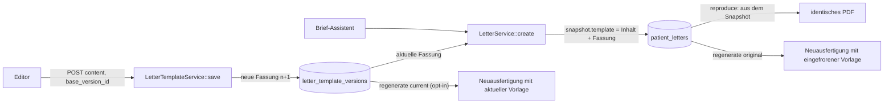

# Referenz: Vorlageneditor für Briefe (DIN 5008)

Technische Referenz für Entwickler und Agenten. Sie beschreibt Aufbau, Datenmodell, Datenfluss,
Regeln und Erweiterungspunkte des Vorlageneditors. Die Bedienung für Anwender steht im
[README](../README.md) (Abschnitt Briefe).


## 1. Überblick

| Aspekt | Umsetzung |
| --- | --- |
| Zweck | Aufbau (Reihenfolge der Bausteine) und **alle festen Texte** der Briefe bearbeiten |
| Norm | DIN 5008, Form B (Anschriftfeld 45 mm von oben, Bezugszeichen rechts ab 125 mm) |
| Aufruf | System → *Briefvorlage bearbeiten* (Kopf der Systemseite und Funktionsband), öffnet `target="_blank"` |
| Technik | Eigenständige Seite, Vanilla JS ohne Bibliotheken, CSP-konform (keine Inline-Skripte/-Styles) |
| Speicherung | Jede Speicherung = neue, unveränderliche **Fassung** (`letter_template_versions`) |
| Wirkung | Nur auf **neu** erstellte Briefe; bestehende Briefe tragen ihre Vorlage eingefroren im Snapshot |
| Prüfung | Verbindlich serverseitig in `LetterTemplate::normalize()`; der Editor prüft nur zur Bedienhilfe |

## 2. Dateien

| Datei | Rolle |
| --- | --- |
| `src/Letter/LetterTemplate.php` | **Single Source of Truth**: Zonen, Bausteine, Platzhalter, Grenzen, Standardvorlage, `normalize()`, `encode()`, `fill()` |
| `src/Letter/LetterTemplateService.php` | Aktuelle Fassung (legt bei Bedarf Fassung 1 an), Fassungsliste, `save()` mit Konfliktprüfung |
| `src/Letter/LetterTemplateRepository.php` | SQL; Fassungen werden nur eingefügt, nie geändert |
| `src/Http/Controller/LetterTemplateController.php` | Editor-Seite, Speichern (JSON), PDF-Vorschau, Fassung laden (JSON) |
| `templates/letter_templates/editor.php` | Markup (Titelleiste, Funktionsband, drei Bereiche, Statusleiste, Dialoge), JSON-Datenblock |
| `public/assets/js/template-editor.js` | Gesamte Bedienung: Zustand, Darstellung, Drag and Drop, Server-Zugriffe |
| `public/assets/css/template-editor.css` | Layout des Editors; nutzt `app.css` und `office.css` (Design der Hauptanwendung) |
| `src/Letter/LetterPdfGenerator.php` | Setzt die Vorlage in das PDF um (Brief-Fassung 2) |
| `src/Letter/LegacyLetterPdfGenerator.php` | Fester Aufbau für Briefe der Brief-Fassung 1 (vor der Vorlage) |
| `src/Letter/LetterSample.php` | Beispieldaten für die PDF-Vorschau |
| `src/Letter/LetterService.php` | Friert die Vorlage beim Erstellen ein; Neuausfertigung (Original-/aktuelle Vorlage) |
| `database/migrations/007_letter_templates.sql` | Tabelle `letter_template_versions`; `patient_letters.template_version_id`, `source_letter_id` |
| `tests/Unit/LetterTemplateTest.php` | Standardvorlage, `normalize()`, Platzhalter, PDF folgt Reihenfolge und Texten |
| `tests/Integration/LetterViewTest.php` | `testTemplateEditorEndpoints` (Seite, Speichern, Konflikt, Vorschau, Fassung) |
| `tests/Integration/LetterTest.php` | `testRegenerateWithOriginalOrCurrentTemplate`, `testLegacyLetterIsRegeneratedWithLegacyLayout` |

## 3. Routen

Alle Routen liegen hinter der Anmeldung; POST verlangt das CSRF-Token (`_csrf`).

| Methode | Pfad | Controller | Antwort |
| --- | --- | --- | --- |
| GET | `/system/letter-templates` | `editor()` | HTML-Seite (ohne Funktionsband der Hauptanwendung) |
| POST | `/system/letter-templates` | `save()` | JSON `{ok, message, current, versions}`; Fehler: 422 `{ok:false, message, errors}` |
| POST | `/system/letter-templates/preview` | `preview()` | PDF (inline, neuer Tab); Fehler: 422-HTML-Seite mit Feldfehlern |
| GET | `/system/letter-templates/versions/{id}` | `version()` | JSON `{version}`; 404 bei unbekannter Fassung |
| POST | `/letters/{id}/regenerate` | `LetterController::regenerate()` | Neuausfertigung, Feld `template=original|current`, für `current` zusätzlich `confirm_current_template=1` |

Request-Felder für Speichern/Vorschau: `content` (Vorlage als JSON-Text, max. 512 KiB, Tiefe 32),
`comment` (Änderungsnotiz, max. 500 Zeichen, nur Speichern), `base_version_id` (Fassung, auf der
die Bearbeitung beruht, nur Speichern).

## 4. Datenmodell der Vorlage (Schema 1)

```json
{
  "schema": 1,
  "name": "Standardvorlage",
  "zones": {
    "recipient": { "options": { "source": "text" }, "texts": { "remark": "", "text": "An die …" } },
    "…": {}
  },
  "blocks": [
    { "id": "subject", "type": "subject", "enabled": true, "options": {}, "texts": { "title": "…", "line2": "…" } },
    { "id": "text-2", "type": "text", "enabled": true, "options": {}, "texts": { "heading": "", "text": "…" } }
  ]
}
```

### 4.1 Zonen (feste Lage nach DIN 5008, nicht verschiebbar)

| Schlüssel | Bezeichnung | Optionen | Texte |
| --- | --- | --- | --- |
| `letterhead` | Briefkopf | `show_logo` | `extra` (mehrzeilig) |
| `return_address` | Rücksendeangabe | `show` | `text` |
| `recipient` | Anschriftfeld (Empfänger) | `source` (`text` \| `patient`) | `remark`, `text` (mehrzeilig) |
| `info_block` | Informationsblock | – | `label_reference`, `label_patient`, `label_birth`, `label_identifier`, `label_sequence`, `label_settings`, `label_reissue`, `label_date` (leer = Zeile ausgeblendet) |
| `footer` | Fußzeile und Seitenränder | `fold_marks` | `disclaimer` (mehrzeilig), `page_label` (erlaubt `{page}`, `{pages}`), `continuation` |
| `appendix` | Anhang | `show` | `heading`, `intro`, `column_parameter`, `column_value`, `notes_heading` |
| `general` | Allgemein | – | `empty` (Ersatztext für fehlende Angaben) |

**Anschriftfeld:** Wählt der Brief-Assistent einen Empfänger (Patient, Hausarzt, Überweisender
Arzt; `LetterRecipient`), steht dessen Anschrift in `snapshot.recipient.lines` und hat Vorrang.
`source`/`text` gelten nur ohne Auswahl (Briefe vor Migration 008, PDF-Vorschau). Der Vermerk
(`remark`) wird immer gedruckt.

### 4.2 Bausteine des Brieftextes (frei sortierbar)

| Typ | Bezeichnung | eindeutig | Optionen | Texte |
| --- | --- | --- | --- | --- |
| `subject` | Betreff | ja | – | `title`, `line2` |
| `salutation` | Anrede | ja | – | `text` |
| `patient` | Patientendaten | ja | – | `heading`, `label_name`, `label_birth`, `label_identifier`, `label_address`, `label_phone` |
| `anamnesis` | Anamnese | ja | `show_meta` | `heading` |
| `premedication` | Vormedikation | ja | `show_meta` | `heading`, `col_substance`, `col_dose`, `col_schedule`, `col_reason`, `col_period` |
| `report` | Befund (Bericht) | ja | `show_meta` | `heading` |
| `epicrisis` | Epikrise | ja | `show_meta` | `heading` |
| `closing` | Grußformel | ja | – | `text`, `signature` (mehrzeilig) |
| `text` | Freier Textbaustein | **nein** | – | `heading`, `text` (mehrzeilig) |

Standardreihenfolge: `subject, salutation, patient, anamnesis, premedication, report, epicrisis, closing`.
Eindeutige Bausteine lassen sich aus-, aber nicht löschen (`enabled: false`). Freie Textbausteine
können beliebig oft ergänzt und gelöscht werden.

### 4.3 Platzhalter

Erlaubt in allen Texten: `{center_name}`, `{center_address_line}`, `{patient_name}`,
`{first_name}`, `{last_name}`, `{date_of_birth}`, `{patient_identifier}`, `{document_number}`,
`{letter_date}`, `{sequence_no}`. Nur in `footer.page_label`: `{page}`, `{pages}`
(Definition-Flag `page: true`).

Gefüllt werden sie ausschließlich aus dem Snapshot des Briefes
(`LetterPdfGenerator::placeholderValues()`); `LetterTemplate::fill()` lässt unbekannte
Platzhalter sichtbar stehen. Beim Speichern lehnt `normalize()` unbekannte Platzhalter ab.

### 4.4 Grenzen und Normalisierung (`LetterTemplate::normalize()`)

| Regel | Wert |
| --- | --- |
| Schema | muss `1` sein (`LetterTemplate::SCHEMA`) |
| Name | Pflicht, max. 200 Zeichen |
| Bausteine | Liste, max. 40 (`MAX_BLOCKS`); unbekannte Typen und doppelte eindeutige Typen sind Fehler |
| Baustein-ID | `^[a-z0-9_-]{1,40}$`, eindeutig; sonst neu vergeben (`text`, `text-2`, …) |
| Texte | einzeilig max. 300, mehrzeilig max. 4000 Zeichen; einzeilig: Umbrüche → Leerzeichen; Steuerzeichen entfernt; CRLF → LF |
| Optionen | `bool` wird hart gecastet; `select` nur Werte aus `choices` |
| Fehlende Werte | mit Standardwerten ergänzt; unbekannte Schlüssel verworfen |

Fehler kommen als `LetterException` mit Feldpfaden, z. B. `name`, `blocks`, `blocks.3`,
`zones.footer.texts.page_label`, `blocks.0.options.show_meta`. Der Editor markiert damit Felder
und Bausteine. `encode()` erzeugt die stabile JSON-Form; ihr SHA-256 steht in
`content_sha256`. Eine unveränderte Vorlage wird nicht erneut gespeichert.

## 5. Versionierung und Briefe



- **Tabelle `letter_template_versions`:** `version_no` fortlaufend und eindeutig; `content` (JSON),
  `content_sha256`, `schema_version`, `comment`, `created_at`. Die aktuelle Vorlage ist die
  Fassung mit der höchsten Nummer. Gibt es keine, legt `current()` die Standardvorlage als
  Fassung 1 an.
- **Konfliktschutz:** `save()` vergleicht `base_version_id` mit der aktuellen Fassung. Ist
  inzwischen eine neuere gespeichert, lehnt es mit dem Feldfehler `base_version` ab. Bei
  gleichzeitigem Einfügen greift der eindeutige Schlüssel (SQLSTATE 23000), ebenfalls
  `base_version`. Es gibt keine stillen Überschreibungen.
- **Wiederherstellen** einer alten Fassung = in den Editor laden und als neue Fassung speichern.
- **Einfrieren:** `LetterService::create()` schreibt Fassungs-ID, -nummer, Name, Prüfsumme und
  den vollständigen Inhalt in `snapshot.template` und setzt `patient_letters.template_version_id`.
  `letter_version` (Brief-Fassung) ist `2`.
- **Reproduzieren** (`/letters/{id}/reproduce`, `LetterService::reproducePdf()`) erzeugt das
  PDF allein aus dem Snapshot neu. `LetterTest::testReproduceYieldsIdenticalPdf` sichert ab, dass
  es dem gespeicherten PDF entspricht.
- **Neuausfertigung** (`regenerate`) erstellt einen *neuen* Brief mit der Datengrundlage des
  alten (`source_letter_id`):
  - `original`: die eingefrorene Vorlage. Briefe der Brief-Fassung 1 erhalten den damaligen
    festen Aufbau (`LegacyLetterPdfGenerator`).
  - `current`: die aktuelle Vorlage. Nur mit ausdrücklicher Bestätigung
    (`confirm_current_template=1`).
  - Der Empfänger des Ausgangsbriefes bleibt erhalten.
- **PDF-Generator:** `LetterPdfGenerator::generate()` wählt anhand `letter_version` den Generator.
  Er normalisiert die eingefrorene Vorlage erneut und rendert die Zonen an fester Lage und die
  Bausteine in Listenreihenfolge (`body()`, `match` über `type`; ausgeblendete werden
  übersprungen).

## 6. Aufbau der Editor-Seite


| Bereich | Markup (`data-*`) | Inhalt |
| --- | --- | --- |
| Titelleiste | `data-te-title`, `data-te-state` | Name und Fassung; Zustand *Gespeichert* / *Ungespeicherte Änderungen* |
| Funktionsband (Reiter *Vorlage*) | `data-te-action="…"` | Gruppen *Speichern* (`save`, `discard`), *Bausteine* (`add-text`, `reset`), *Ansicht* (`preview`, `versions`), *Editor* (`help`, `close`) |
| Meldungen | `data-te-message` | Erfolg, Hinweis, Fehler (schließbar) |
| Links: *Aufbau* | `data-te-name`, `data-te-zones`, `data-te-blocks` | Vorlagenname, feste Bereiche (Klick wählt), Bausteinliste (Drag and Drop, ↑/↓, Ein-/Ausblenden, Löschen bei Textbausteinen) |
| Mitte: *Seitenvorschau* | `data-te-paper` | Vereinfachte A4-Seite im Maßstab (mm wie im PDF) mit Beispieldaten; Klick wählt, Bausteine auch hier ziehbar |
| Rechts: *Eigenschaften* | `data-te-props` | Beschreibung, Optionen, Textfelder mit Zeichenzähler und *Standard*-Link, Platzhalter-Chips |
| Statusleiste | `data-te-status-version`, `data-te-status-blocks` | Grundlage (Fassung, Datum), Zahl der Bausteine |
| Dialoge | `data-te-save-dialog`, `data-te-versions-dialog`, `data-te-help-dialog` | Speichern mit Änderungsnotiz, Fassungsliste mit *In Editor laden*, Kurzanleitung |
| Vorschau-Formular | `data-te-preview-form` | Unsichtbares POST-Formular mit `target="_blank"` für die PDF-Vorschau |
| Daten | `<script type="application/json" id="template-editor-data">` | Startdaten (siehe unten) |

Startdaten (`LetterTemplateController::editor()`):

```text
definition  LetterTemplate::editorDefinition()  (zones, blocks, placeholders, pagePlaceholders,
            maxBlocks, limits, default)
current     aktuelle Fassung {id, version_no, name, comment, created_at, content_sha256, content}
versions    [{id, version_no, name, comment, created_at, letter_count}]
csrf        CSRF-Token
urls        {save, preview, version}
settings    {center_name, center_address, has_logo}  (Ausweis-Stammdaten für die Vorschau)
```

Der Datenblock wird mit `JSON_HEX_TAG|AMP|APOS|QUOT` kodiert, so dass `</script>` nicht
ausbrechen kann.

## 7. JavaScript (`template-editor.js`)

Ein IIFE ohne globale Symbole. Abschnitte im Quelltext:

| Abschnitt | Wichtige Funktionen |
| --- | --- |
| Zustand | `state = {base, baseContent, content, versions, selected:{kind,key}, errors, lastField, busy}` |
| Hilfen | `prepare()` (Vorlage in vollständige Definitionsform, feste Schlüsselreihenfolge), `serialize()`, `isDirty()` (Vergleich der serialisierten Form), `h()` (DOM-Erzeugung **nur über textContent**, kein `innerHTML`), `uniqueId()` |
| Beispieldaten | `sample`, `fill()` – Platzhalter für die Seitenvorschau |
| Darstellung | `render()` → `renderStatus()`, `renderZones()`, `renderBlocks()`, `renderPaper()`, `renderProps()` |
| Eigenschaften | `textField()`, `placeholderPanel()`, `insertPlaceholder()` (fügt an der Cursorposition des zuletzt fokussierten Feldes ein; Seiten-Platzhalter nur in `page`-Feldern) |
| Änderungen | `softChanged()` (beim Tippen, Vorschau verzögert, Fokus bleibt), `changed()`, `select()`, `move()`, `moveBy()`, `addTextBlock()`, `removeBlock()`, `remapErrors()` |
| Drag and Drop | `bindDrag()` – HTML5 DnD auf Listeneinträgen und Vorschau-Bausteinen; Einfügemarke vor/nach anhand der Mausposition (`is-drop-before/after`) |
| Server | `postForm()` (fetch, `same-origin`, CSRF), `save()`, `preview()`, `openVersions()`, `loadVersion()` |
| Aktionen | Objekt `actions` (Schlüssel = `data-te-action`), ein delegierter Klick-Handler |

Verhalten im Detail:

- **Sortieren:** Ziehen (Liste oder Vorschau), Schaltflächen ↑/↓ oder Tastatur
  (**Alt+↑/↓** auf dem fokussierten Listeneintrag). Verschiebungen werden über eine
  `aria-live`-Region angesagt.
- **Neuer Textbaustein:** nach dem gewählten Baustein, sonst vor der Grußformel, sonst am Ende.
- **Fehler:** Feldpfade beziehen sich auf Positionen beim Speichern. `rememberErrorBlocks()` und
  `remapErrors()` führen sie beim Verschieben mit.
- **Speichern:** Strg/Cmd+S oder Schaltfläche → Dialog mit Notiz → POST.
  - Erfolg: neue Grundlage; der Zustand wird zurückgesetzt.
  - 422: Fehler markieren. Bei `base_version` gibt es einen Link *Fassungen anzeigen*.
  - 403: Sitzung abgelaufen.
- **Ungespeicherte Änderungen:** `beforeunload`-Warnung. Rückfragen bei *Verwerfen*,
  *Standard laden*, *Fassung laden* und *Schließen*. *Schließen* versucht `window.close()`,
  sonst geht es zurück zu `/system`.
- **Seitenvorschau:** `PAGE`-Geometrie (mm) entspricht `LetterPdfGenerator`. Die Darstellung ist
  vereinfacht; verbindlich ist die **PDF-Vorschau** (`LetterSample`).

## 8. Erweiterung (Checkliste)

**Neuer fester Text in bestehender Zone oder bestehendem Baustein**
1. Eintrag in `zoneDefinitions()` bzw. `blockDefinitions()` unter `texts`, mit `label`,
   `multiline` und `default`.
2. Im `LetterPdfGenerator` verwenden (`zoneText()` bzw. `blockValue()`, Platzhalter mit
   `LetterTemplate::fill()`).
3. Optional in `renderPaper()`/`blockPreview()` der Seitenvorschau zeigen.
4. Tests in `LetterTemplateTest` ergänzen.

Bestehende Fassungen müssen nicht migriert werden: `normalize()` ergänzt den Standardwert.

**Neue Option:** wie oben unter `options`, mit `type: 'bool'` oder `type: 'select'` und `choices`.
Der Editor erzeugt das Steuerelement automatisch.

**Neuer Bausteintyp**
1. In `blockDefinitions()` eintragen; `unique` festlegen.
2. Optional in `DEFAULT_ORDER` aufnehmen. Das ändert die Standardvorlage, aber keine
   gespeicherten Fassungen.
3. Im `match` in `LetterPdfGenerator::body()` umsetzen.
4. Vorschau in `blockPreview()` (JS).
5. Daten, die der Baustein braucht, müssen im Snapshot stehen (`LetterService::DATA_PARTS`),
   sonst ist der Brief nicht reproduzierbar.

**Neuer Platzhalter:** in `PLACEHOLDERS` aufnehmen, in `LetterPdfGenerator::placeholderValues()`
aus dem Snapshot füllen und im JS-Objekt `sample` einen Beispielwert ergänzen.

**Unverträgliche Änderung des JSON-Aufbaus:** `SCHEMA` erhöhen und in `normalize()` alte Schemata
überführen. Eingefrorene Briefe müssen weiter erzeugbar bleiben. Gegebenenfalls eine neue
Brief-Fassung (`LETTER_VERSION`) mit eigenem Generator einführen, wie bei
`LegacyLetterPdfGenerator`.

## 9. Invarianten (nicht brechen)

1. Gespeicherte Fassungen und erstellte Briefe werden **nie verändert** (nur INSERT).
2. Das PDF eines Briefes hängt nur von seinem Snapshot ab (Vorlage, Daten, Empfänger,
   Stammdatenfassung). Es greift nicht auf die aktuelle Vorlage oder aktuelle Stammdaten zu.
3. Die serverseitige Prüfung (`normalize()`) ist maßgeblich. Der Editor darf nichts speichern,
   was der Server nicht erneut prüft.
4. Die Neuausfertigung mit aktueller Vorlage ist **opt-in** (`confirm_current_template`).
5. CSP: kein Inline-JS/-CSS. Maße setzt das Skript über `element.style`; Texte nur per
   `textContent`.
6. Die UI folgt dem Design der Hauptanwendung (Titelleiste, Funktionsband, Statusleiste aus
   `office.css`).

## 10. Tests ausführen

```bash
export DB_PASSWORD=unused DB_ROOT_PASSWORD=unused
docker compose -p hsm2med-test --profile test run --rm tests        # gesamte Suite
docker compose -p hsm2med-test --profile test down -v
docker compose -p hsm2med-docs --profile docs run --rm screenshots  # Screenshots 51–53 (Editor)
docker compose -p hsm2med-docs --profile docs down -v
```
